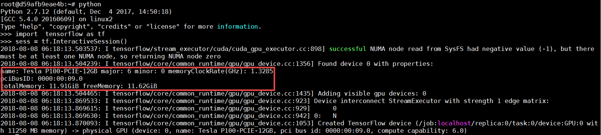
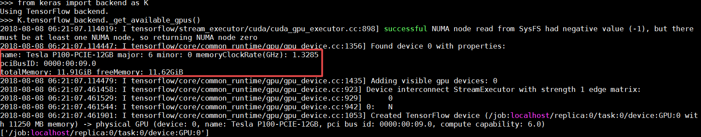
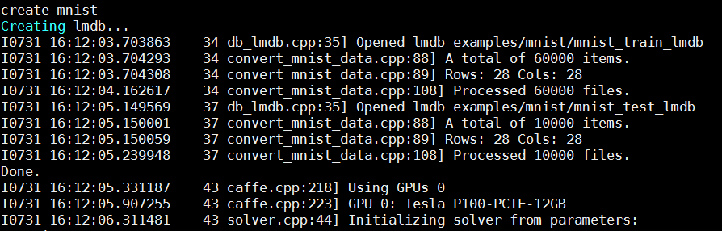

- 在容器或主机中运行 nvidia-smi 查看 GPU 设备是否正常，也可以使用 `watch -n 0.5 nvidia-smi` 动态的查看 GPU 的使用情况。

- 查看 TensorFlow 是否可以正常使用 GPU

```shell
import  tensorflow as tf
sess = tf.InteractiveSession()
```



- 查看 Keras 是否可以正常使用 GPU

```shell
from keras import backend as K
K.tensorflow_backend._get_available_gpus()
```



- 查看 Caffe 是否可以正常使用 GPU

```shell
cd /root/caffe
sh data/mnist/get_mnist.sh
sh examples/mnist/create_mnist.sh
sed -i "s/solver_mode: CPU/solver_mode: GPU/g" examples/mnist/lenet_solver.prototxt
sh examples/mnist/train_lenet.sh
```



- 查看 PyTorch 是否可以正常使用 GPU

```shell
import torch
torch.cuda.is_available()
torch.cuda.current_device()
torch.cuda.device(0)
torch.cuda.device_count()
torch.cuda.get_device_name(0)
```


