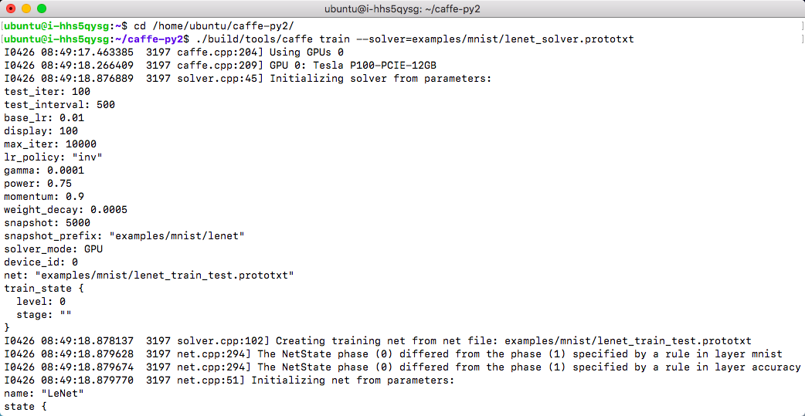
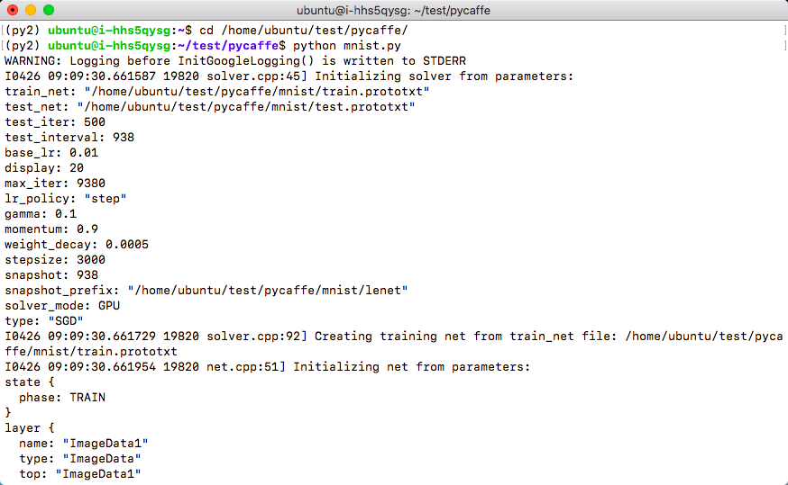

Caffe 支持 Python 接口，深度学习平台已经提供，目前不支持多机分布式训练，详情请见 [Caffe 文档](http://caffe.berkeleyvision.org)。(GPU 和 CPU 版本App分别内置了不同版本的 Caffe ，请依据硬件情况选择需要部署的版本。)

## 单机

### caffe 单机示例

```shell
cd /home/ubuntu/caffe-py2
./build/tools/caffe train --solver=examples/mnist/lenet_solver.prototxt
```

### Caffe 训练过程



### Caffe 训练结果


### PyCaffe 单机示例：

```shell
source /home/ubuntu/workspaces/py2/bin/activate
cd /home/ubuntu/test/pycaffe
python mnist.py
```

### PyCaffe 训练过程



### PyCaffe 训练结果


查看 GPU 使用情况，可以使用如下命令：

```shell
nvidia-smi
```

**GPU 使用情况**


#### 单任务使用双 GPU

PyCaffe 目前不支持多 GPU 训练，多GPU训练只能通过[Caffe的C/C++途径实现](https://github.com/BVLC/caffe/blob/master/docs/multigpu.md)

##### 非容器版

```shell
cd /home/ubuntu/caffe-py2 && build/tools/caffe train --solver=models/bvlc_alexnet/solver.prototxt --gpu=0,1
```

##### 容器版

```shell
cd ~/caffe && build/tools/caffe train --solver=models/bvlc_alexnet/solver.prototxt --gpu=0,1
```


