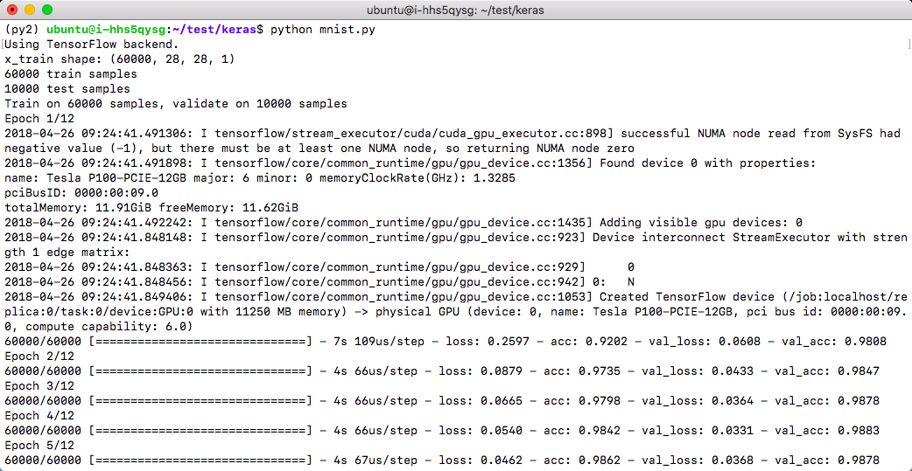
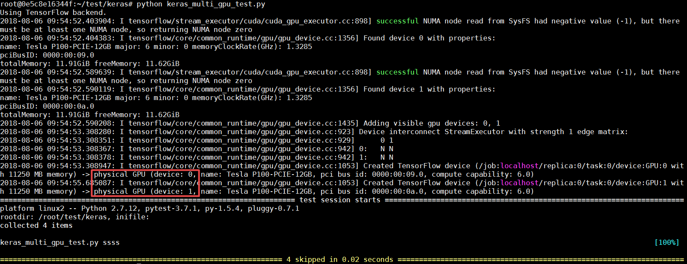

Keras 默认使用 TensorFlow 来计算，目前青云平台上也只支持 TensorFlow 作为其计算框架。详情请见 [Keras 文档](https://keras.io)

## 单机

```shell
cd /home/ubuntu/keras
python mnist.py
```

### Keras 训练过程



### Keras 训练结果


##  jupyter notebook

为了方便开发，非容器版和容器版环境中都配有 jupyter notebook，用户可以交互式编程，并能直观展现实时计算结果。

1. 老版本 jupyter notebook 启动命令：

```shell
cd /home/ubuntu/test/keras
jupyter notebook
```

2. 新版本的 jupyter notebook，需要在启动时配置 IP 地址参数，读取 eth0 的 IP 地址并设置到 jupyter notebook，才能接收远程浏览器客户端的访问，非容器版的 jupyter 启动命令如下：

```shell
cd /home/ubuntu/test/keras
jupyter notebook --ip=`ifconfig eth0 2>/dev/null|awk '/inet addr:/ {print $2}'|sed 's/addr://'`
```

3. 容器版的 jupyter 启动命令如下：

   **GPU 容器版：**

   ```shell
   sudo nvidia-docker run -it --rm --net host -v /home/ubuntu/test:/root/test qingcloud/deeplearning:1.0-py27-cu91-cudnn7.1 /bin/bash
   jupyter notebook --ip='your_host_eth0_ip' --allow-root
   ```

   **CPU 容器版：**

   ```shell
   sudo docker run -it --rm --net host -v /home/ubuntu/test:/root/test qingcloud/deeplearning:1.0-py27-cpu /bin/bash
   jupyter notebook --ip='your_host_eth0_ip' --allow-root
   ```


jupyter notebook 默认端口号为 `8888`，启动上述命令后会输出 token 信息，这个信息在下面访问 notebook 时候需要。

> **说明**
>
> 如果需要通过公网访问这些信息您需要先申请一个公网 IP 绑定在路由器上，在路由器上设置端口转发，同时打开防火墙相应的下行端口。为了方便使用 jupyter notebook，也可参考[VPN 隧道指南](https://docs.qingcloud.com/product/network/vpn#vpn) 配置 VPN。

jupyter notebook 开发环境浏览项目代码


jupyter notebook 开发环境运行项目


### 单任务使用双 GPU 训练

##### 非容器版

```shell
pip install pytest
wget https://github.com/QingCloudAppcenter/DeepLearning/raw/master/examples/keras_multi_gpu_test.py
python keras_multi_gpu_test.py
```

##### 容器版

```shell
cd /root/test/keras && pip install pytest && python keras_multi_gpu_test.py
```


