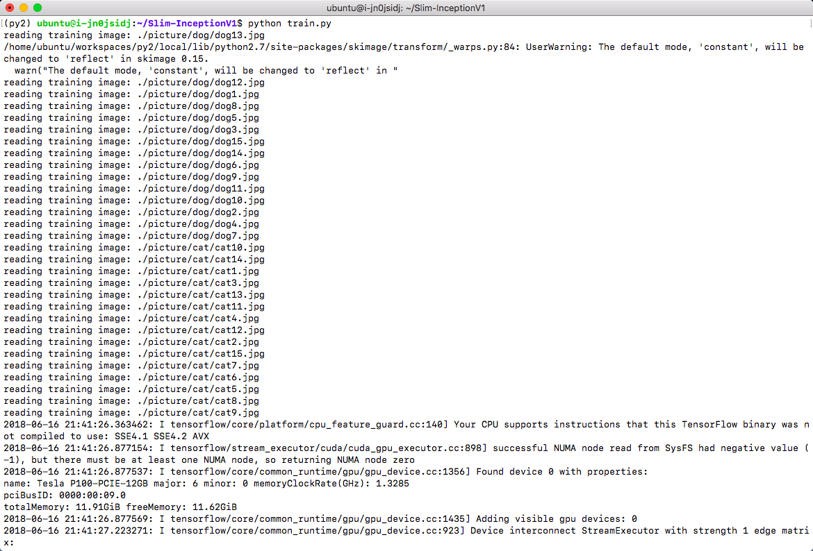
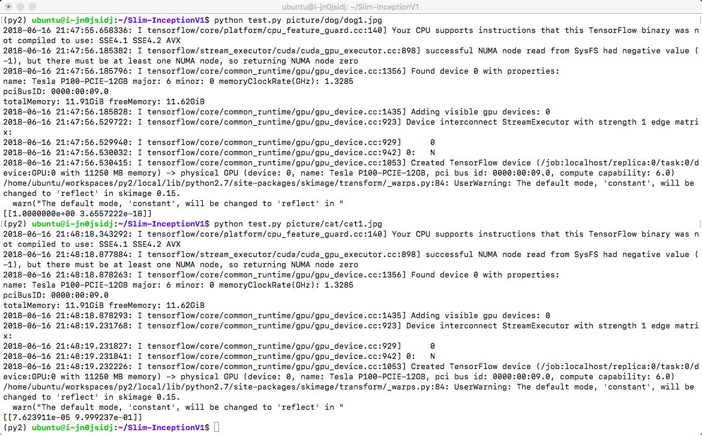
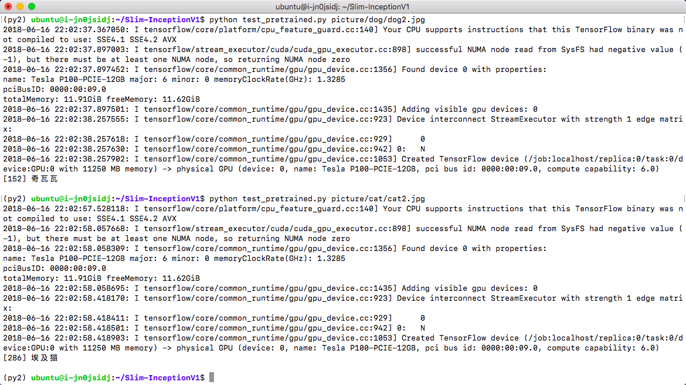
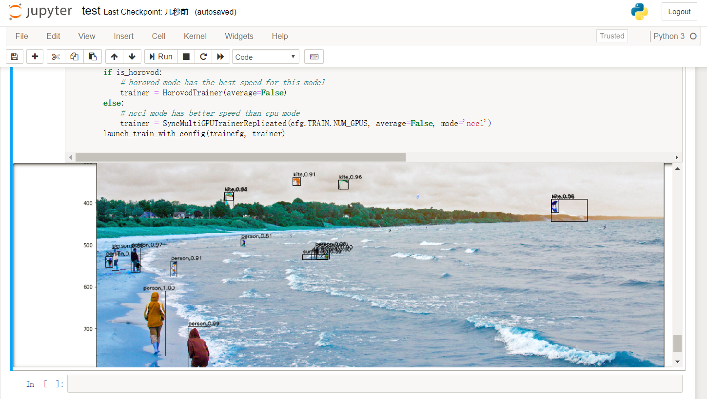
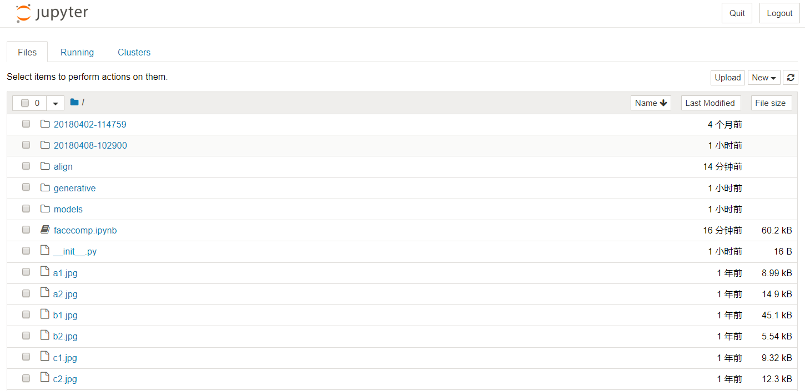
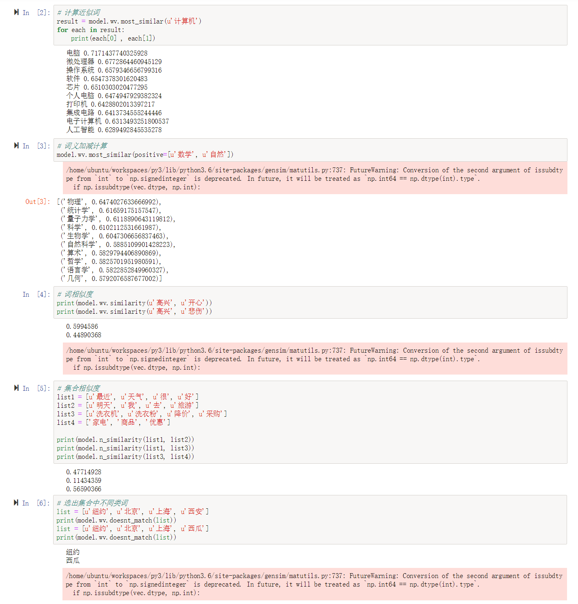

## 图像分类

### Inception V1的训练和测试

为了方便用户测试和使用，我们选择了 Google 的 Inception v1(GoogLeNet)，对30幅猫和狗的图片进行简要的训练和推理测试(因为只使用30幅图片进行快速演示，所以未设置验证和测试图片，使用训练图片进行推理，简明验证权重和 BatchNormalization 等参数的保存)，能够在几分钟内完成从头训练 (Train from scratch)，保存权重，加载训练的权重进行推理等整个流程环节。并使用相同的代码，加载 Google 发布在 TensorFlow 工程中的预训练权重，测试对图片的推理。用户通过这个示例，能够快速了解平台并部署自己的深度学习模型。

测试步骤如下：

1. 下载测试代码并解压

```shell
cd /home/ubuntu
wget https://appcenter-deeplearning.sh1a.qingstor.com/models/Slim-InceptionV1.tar
tar xvf Slim-InceptionV1.tar
cd Slim-InceptionV1
```

2. 激活 VirtualEnv

```shell
source /home/ubuntu/workspaces/py2/bin/activate
```

3. 训练30幅图片的猫狗2分类

```shell
python train.py
```

4. 训练在 GPU 上会在1分钟内完成，如下

#### Inception v1 训练过程



#### Inception v1 训练结果


使用刚才训练的权重对图片进行推理

```shell
python test.py picture/dog/dog1.jpg
python test.py picture/cat/cat1.jpg
```

从结果可以看出，保存的权重对图片进行了较好的2分类。

#### Inception v1 推理



使用预训练权重对图片进行推理

刚才使用的只是2分类的自己训练的权重，也可以直接使用 Google 发布在 TensorFlow 工程中使用 ImageNet 训练的1000分类预训练权重，或者基于这个预训练结果进行迁移学习。这里简要演示使用预训练权重推理的过程

1. 下载并解压预训练权重

```shell
wget https://appcenter-deeplearning.sh1a.qingstor.com/models/TensorFlow-Slim%20image%20classification/inception_v1_2016_08_28.tar.gz
tar xvf inception_v1_2016_08_28.tar.gz
```

2. 使用预训练权重进行推理

```shell
python test_pretrained.py picture/dog/dog2.jpg
python test_pretrained.py picture/cat/cat2.jpg
```

这里加载了 ImageNet 的标签文本，并依据 softmax 结果输出标签值，所以可以显示出图像分类的文本结果

**Inception v1 使用预训练权重推理**



## 目标检测

### FasterRCNN 目标检测

源代码来自[https://github.com/tensorpack/tensorpack](https://github.com/tensorpack/tensorpack)， 修改部分代码以使用 COCO 2017 数据集进行训练，并使用 ImageNet-R50 Backbone 网络和 COCO 2017 数据集训练了 300000 iterations，保存对应的 checkpoint ，增加 jupyter notebook 版测试程序，显示初步训练的结果，代码在对象存储[下载](https://appcenter-deeplearning.sh1a.qingstor.com/models/tensorpack.tar)。基于 Python 3.6.5，需要安装 opencv-contrib-python 、 tensorpack 、 pycocotools 包。

### FasterRCNN训练

激活 Python 3.6.5 环境，下载[文件](https://appcenter-deeplearning.sh1a.qingstor.com/models/tensorpack.tar)后解压，然后在 tensorpack/coco 目录下，下载 COCO 2017 数据集文件并解压（这里已经包含了 annotations 和 val2017 ，仅需下载 train2017 和 test2017 ）。

```shell
# 下载并解压
source /home/ubuntu/workspaces/py3/bin/activate
cd /data
wget https://appcenter-deeplearning.sh1a.qingstor.com/models/tensorpack.tar
tar xvf tensorpack.tar
# 下载 COCO 2017 数据集（数据集将占用27GB空间，请确保硬盘空间充足）
cd tensorpack/coco
wget https://appcenter-deeplearning.sh1a.qingstor.com/dataset/coco/train2017.zip
wget https://appcenter-deeplearning.sh1a.qingstor.com/dataset/coco/test2017.zip
tar xvf train2017.zip
tar xvf test2017.zip
# 从头开始训练
cd /data/tensorpack/examples/FasterRCNN
python train.py --config MODE_MASK=False MODE_FPN=True BACKBONE.WEIGHTS=/data/tensorpack/modelzoo/FasterRCNN/ImageNet-R50-AlignPadding.npz DATA.BASEDIR=/data/tensorpack/coco/
# 从保存的 checkpoint 开始训练（注意代码在开始训练时将清空train_log/maskrcnn文件夹，请在开始训练前将需要保存的数据转移到其他文件夹，示例中转移到了train_log/bak文件夹）
python train.py --load=/data/tensorpack/examples/FasterRCNN/train_log/bak/model-10000.index --config MODE_MASK=False MODE_FPN=True BACKBONE.WEIGHTS=/data/tensorpack/modelzoo/FasterRCNN/ImageNet-R50-AlignPadding.npz DATA.BASEDIR=/data/tensorpack/coco/
```

训练开始后，将显示训练进度并在每个 epoch 完成后保存一次 checkpoint（每次保存占用约500MB空间，长时间训练请关注硬盘空间），如下图所示


### FasterRCNN推理

激活 Python 3.6.5 环境，下载[文件](https://appcenter-deeplearning.sh1a.qingstor.com/models/tensorpack.tar)后解压，然后在 tensorpack/examples/FasterRCNN 目录下，运行 jupyter notebook。

```shell
# 下载并解压
source /home/ubuntu/workspaces/py3/bin/activate
cd /data
wget https://appcenter-deeplearning.sh1a.qingstor.com/models/tensorpack.tar
tar xvf tensorpack.tar
# 运行 jupyter notebook
cd tensorpack/examples/FasterRCNN
jupyter notebook --ip=`ifconfig eth0 2>/dev/null|awk '/inet addr:/ {print $2}'|sed 's/addr://'`
```

在浏览器中打开 jupyter notebook 的页面，打开 test.ipynb 并运行，将显示初步训练的权重对测试图片的目标检测结果。如下图所示



## 人脸识别

### FaceNet 人脸相似度计算

源代码来自[https://github.com/davidsandberg/facenet](https://github.com/davidsandberg/facenet)，将预训练权重一起打包，增加 jupyter notebook 版测试程序，用来演示基本的 jupyter notebook 运行、交互和图像显示等功能，在对象存储[下载](https://appcenter-deeplearning.sh1a.qingstor.com/models/facenet.tar)。基于 Python 3.6.5，需要安装 opencv-contrib-python 包。

激活 Python 3.6.5 环境，下载[文件](https://appcenter-deeplearning.sh1a.qingstor.com/models/facenet.tar)后解压，然后在 facenet/src 目录下，运行 jupyter notebook。

```shell
# 下载并解压
source /home/ubuntu/workspaces/py3/bin/activate
cd /home/ubuntu/
wget https://appcenter-deeplearning.sh1a.qingstor.com/models/facenet.tar
tar xvf facenet.tar
# 运行 jupyter notebook
cd facenet/src
jupyter notebook --ip=`ifconfig eth0 2>/dev/null|awk '/inet addr:/ {print $2}'|sed 's/addr://'`
```

在浏览器中打开 jupyter notebook 的页面，将看到如下内容



打开 facecomp.ipynb 并运行，在提示输入 model file path 时，输入预训练权重路径 20180408-102900 ；提示输入需要计算的照片时，输入 a1.jpg a2.jpg b1.jpg b2.jpg c1.jpg c2.jpg 。(这里随机选择了 VGGFace2 数据集中3个人6张照片作为示例)

将计算并显示6张人脸照片相互之间的距离，同一个人的照片，距离较近。如下图所示


用户可以使用对象存储中的 VGGFace2 或者自己的数据集，来训练 FaceNet，获得适用于自己业务的模型。

## 语音识别

### Kaldi 中文语音识别

[Kaldi](http://kaldi-asr.org) 是一个开源的语音识别工具箱，使用C++编写，在 Apache License v2.0 下发布，广泛用于语音识别研究者的研究工作，也用于一些工业语音识别系统的后台服务。
本示例演示 Kaldi 在青云 CPU 平台上的安装和配置，在配置 Kaldi 的基础上，使用 CVTE 公司在 [http://kaldi-asr.org](http://kaldi-asr.org) 上开源的普通话 TDNN chain 模型完成普通话的语音识别，帮助用户快速熟悉语音识别工具箱的应用。

操作流程：下载 Kaldi 工具箱，编译 CPU 版本，并调用 CVTE 模型，对中文语音文件进行语音识别。
Kaidi 库地址：[https://github.com/kaldi-asr/kaldi](https://github.com/kaldi-asr/kaldi)
CVTE 中文模型下载：[CVTE Mandarin Model 下载](http://kaldi-asr.org/models/2/0002_cvte_chain_model.tar.gz) 来自：[http://kaldi-asr.org](http://kaldi-asr.org)

Kaldi 库编译安装和中文语音识别测试步骤如下，这里以 /data 目录下的操作来讲解

```shell
# 下载并编译 Kaldi 库 CPU 版本
cd /data
git clone https://github.com/kaldi-asr/kaldi.git kaldi --origin golden
cd /data/kaldi/tools
make (注意这步不能用 -j 参数)
cd /data/kaldi/src
./configure --shared
make -j 8 (可以调整为实际 CPU 核数)

# 下载 CVTE 预训练模型并解压到 Kaldi example 文件夹
cd /data
wget http://kaldi-asr.org/models/2/0002_cvte_chain_model.tar.gz
tar xvf 0002_cvte_chain_model.tar.gz
mv cvte /data/kaldi/egs

# 下载推理测试脚本并测试语音识别
wget https://appcenter-deeplearning.sh1a.qingstor.com/models/kaldi_test.tar
tar xvf kaldi_test.tar
cd kaldi_test
./multi_test.sh
```

测试语音识别效果如下图


测试脚本说明：CVTE 预训练模型需要对特征(这里第一步选用的是 FBank 特征)进行 CMVN 预处理后，再送入 DNN + HMM 进行处理，才能得到较好的识别效果，所以这里的测试脚本有3步。如果要测试其他音频文件，修改 wav.scp 和 utt2spk 文件。封装其他服务请参考[Kaldi 开发文档](http://kaldi-asr.org/doc/index.html)，调用其 API 编写新的程序。

## NLP

Gensim 处理中文维基百科语料 Word2Vec

使用常用的 gensim 自然语言处理包，对中文维基百科进行 Word2Vec 处理，并测试处理结果。示例代码在对象存储[下载](https://appcenter-deeplearning.sh1a.qingstor.com/models/gensim.tar)。需要安装 gensim, jieba 包，以及 [OpenCC](https://github.com/BYVoid/OpenCC) 应用程序。

激活 Python 3.6.5 环境，下载[文件](https://appcenter-deeplearning.sh1a.qingstor.com/models/gensim.tar)后解压，然后在 gensim 目录下，进行如下操作

```shell
# 下载中文维基百科语料
wget https://appcenter-deeplearning.sh1a.qingstor.com/dataset/wiki/zhwiki-latest-pages-articles.xml.bz2
# 处理语料为文本格式(得到 wiki.zht.text 文件)
python process_wiki.py zhwiki-latest-pages-articles.xml.bz2 wiki.zht.text
# 繁体转简体(得到 wiki.zhs.text )
opencc -i wiki.zht.text -o wiki.zhs.text -c t2s.json
# 切词并过滤英文和数字(得到 wiki_seg.txt )
python segment.py
# 训练Word2Vec(在4核8G CPU 平台，训练时间约2小时)
python train.py
```

训练完成后，在 gensim 目录下，运行 jupyter notebook，浏览器打开并运行 test.ipynb，对训练结果进行测试(本示例也包含了预训练模型，可直接运行该测试)，测试效果如下图


