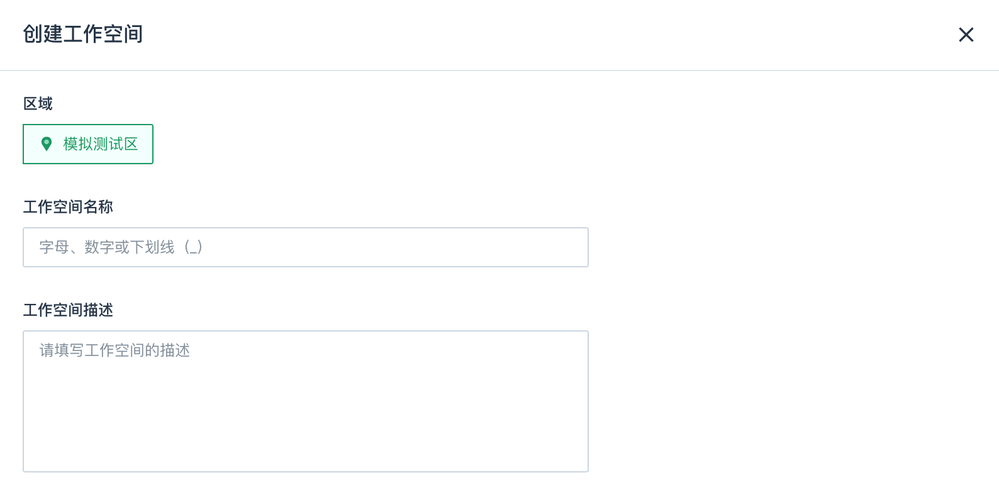
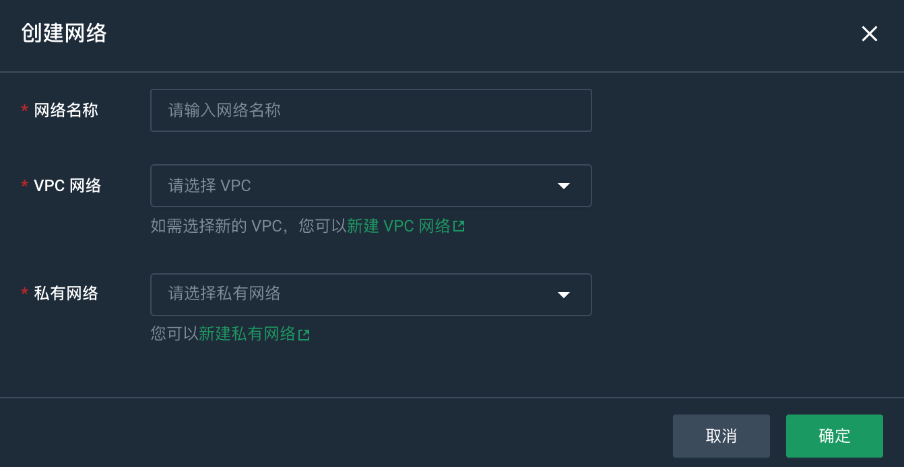

用于读取页面点击流日志，根据渠道、版本、地区、新老用户四个维度 统计独立访客数(uv)、页面访问数(pv)、页面进入次数(sv)、用户跳出次数(uj)、持续访问时间(du) 并按照窗口写入到clickhouse供后续的分析处理展示。


## 准备 ClickHouse 环境

1. [创建 ClickHouse 集群](/dwh_bi/clickhouse/quickstart/create_cluster/)。
2. [连接 ClickHouse](/dwh_bi/clickhouse/quickstart/access_clickhouse/)。
2. 连接成功后，执行以下命令，创建所需数据库表。

    ```sql
    create table visitor_stats
    (
        stt     DateTime,
        edt     DateTime,
        vc      String,
        ch      String,
        ar      String,
        is_new  String,
        uv_ct   UInt64,
        pv_ct   UInt64,
        sv_ct   UInt64,
        uj_ct   UInt64,
        dur_sum UInt64,
        ts      UInt64
    ) engine = ReplacingMergeTree(ts)
            PARTITION BY toYYYYMMDD(stt)
            ORDER BY (stt, edt, is_new, vc, ch, ar)
            SETTINGS index_granularity = 8192;
    ```

## 创建工作空间

1. 登录管理控制台。
2. 选择**产品与服务** > **大数据服务** > **大数据工作台**，进入大数据工作台概览页面。
3. 在左侧导航选择**工作空间**，进入工作空间页面。
4. 选择相应的区域，点击**创建工作空间**，填写工作空间名称和描述信息。
   
   

5. 点击**创建**，开始创建工作空间。    
   工作空间创建成功后，即可在工作空间页面查看相应内容。

## 配置网络

1. 在目标工作空间选择**数据开发** > **网络配置**，进入网络配置页面。
2. 点击**创建网络**，进入创建网络页面。
   
   

3. 填写网络名称，选择 VPC 网络和私有网络。
4. 点击**确定**，开始创建网络。

## 创建计算集群

1. 在目标工作空间选择**数据开发** > **计算集群**，进入计算集群列表页面。
2. 点击**创建集群**，进入创建计算集群页面。
3. 配置集群相关参数，参数详细介绍请参见[创建计算集群 > 参数说明](../../manual/data_development/flink_cluster/create_cluster/)。
4. 配置完成后，点击**确定**，开始创建计算集群。

## 上传 Jar 包

### 获取程序包

下载 [product-demo.zip](https://wiki.yunify.com/download/attachments/91871362/product-demo.zip?version=1&modificationDate=1638683201473&api=v2) 文件并解压。

flink-demo.jar 路径为：/product-demo/src/main/resources/flink-demo.jar

### 上传程序包

1. 登录管理控制台。
2. 选择**产品与服务** > **大数据服务** > **大数据工作台**，进入概览页面。
3. 在左侧导航选择**工作空间**，进入工作空间页面。
4. 在目标工作空间点击**数据开发** > **资源管理**，进入资源管理页面。
5. 点击**上传程序包**，进入上传程序包页面。
   
   

6. 输入程序包显示名称和描述信息后，点击**添加程序包**，选择 flink-demo.jar 文件。
7. 点击**上传**，开始上传程序包。

## 创建 Jar 作业

1. 在目标工作空间选择**数据开发** > **实时计算**，进入实时计算页面。
2. 点击**创建作业**，进入创建作业页面。
   
   

3. 选择 代码开发-Jar 模式。
4. 点击**下一步**，填写作业名称，并选择作业依赖的计算集群。
   
   

5. 配置完成后，点击**确定**，开始创建作业。

## 开发 Jar 作业

1. 点击作业名称，进入开发面板。
2. 配置 Jar 包作业的程序入口、程序所需要的参数。
   
   

   - 引用 Jar 包：选择已上传到资源管理的 Jar 程序包。
   - 运行函数入口：运行主类。
   - 运行参数：Kafka 的连接信息。

3. 配置完成后，点击**保存**保存配置。

## 调度配置

1. 选择已创建好的作业，点击右侧的**调度设置**，进入调度配置页面。    
   在该页面可以查看作业的基础属性，包括业务名称、业务 ID、业务描述。基础属性在调度配置页面均不可修改。
2. 设置调度策略。详细操作请参见[设置调度策略](../../manual/data_development/job/scheduling_job)。
3. 设置完成后，点击**确定**，完成调度设置操作。

## 发布作业

点击**发布**，发布作业。


