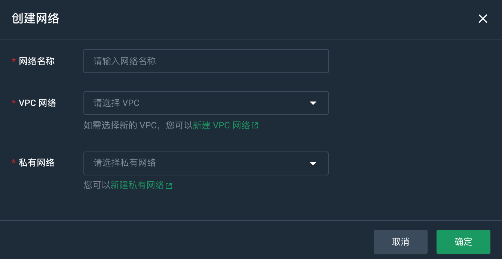

   
您可以在网络配置页面创建网络，查看该工作空间下所有的 VPC 网络，对网络进行修改、删除操作。

## 前提条件

- 已获取管理控制台登录账号和密码，且账号已实名认证。
- 已创建工作空间。

## 创建网络

1. 登录管理控制台。
2. 选择**产品与服务** > **大数据服务** > **大数据工作台**，进入大数据工作台概览页面。
3. 在左侧导航选择**工作空间**，进入工作空间页面。
4. 在目标工作空间单击**云上加工** > **网络配置**，进入网络配置页面。
5. 单击**创建网络**，进入创建网络页面。
   
   

6. 配置相关参数，参数详细说明请参见 [网络配置参数](#mysql-数据库配置参数)。
7. 单击**新建**，开始创建网络。

### 网络配置参数

| 参数           | 参数说明                                                     |
| :------------- | ------------------------------------------------------------ |
| 网络名称 |  创建的网络名称，您可以自定义。              |
| VPC 网络    |  选择 VPC 网络。<li>默认适配同区域已有的 VPC 网络。可在下拉框选择已有 VPC 网络。<li>若无可选 VPC 网络，可点击**新建VPC网络**，创建依赖网络资源。  |
| 私有网络    |  选择私有网络。<li>默认适配同区域已有的私有网络。可在下拉框选择已有私有网络。<li>若无可选私有网络，可点击**新建私有网络**，创建依赖网络资源。   |

## 修改网络

单击**修改**，在修改网络对话框中修改网络信息，修改完成后单击**确认**。

## 删除网络

单击删除工作空间，在删除工作空间对话框中输入 delete，单击**删除**。

> **注意**
> 
> 删除网络后，关联资源将受到影响，且操作无法撤销，请谨慎操作。