---
---

# Apache Storm on QingCloud AppCenter 用户手册

## 简介

Storm 是一个开源的分布式实时计算系统，通常被比作＂实时的 Hadoop＂。Storm 为实时计算提供了一些简单优美的原语，支持多种编程语言，并内建流式窗口 API 及分布式缓存 API，极大简化了流式数据处理过程。Storm 不仅高可靠、易扩展，而且处理速度极快，每个计算节点每秒能处理上百万条元组信息（Tuple），因此常被用于实时分析、在线机器学习、连续计算、分布式 RPC、ETL 等。 关于 Storm 更多的详细信息，请参阅 [Storm 官方网站](http://storm.apache.org/)，[Storm 官方中文文档](http://storm.apachecn.org/releases/cn/1.1.0/)。

Storm 具有如下特点：

- 编程简单：开发人员只需要关注应用逻辑，而且跟 Hadoop 类似，Storm 提供的编程原语也很简单。
- 高性能，低延迟：实时性在流式计算框架中最强。
- 可扩展：随着业务发展，数据量和计算量越来越大，系统可水平扩展。
- 容错：单个节点挂了不影响应用。
- 消息不丢失：保证消息处理。

除此之外 `Storm on QingCloud AppCenter` 将 Storm 通过云应用的形式在 QingCloud AppCenter 部署，具有如下特性:

- 版本升级到 1.1.1，相比较之前的版本，Storm 开始对 Streaming SQL 有了支持，加强了与 Kafka、HDFS、OpenTSDB、Druid 等大数据组件的集成，详情请参阅 [官方说明](http://storm.apache.org/2017/03/29/storm110-released.html)。
- 支持横向与纵向在线伸缩。
- 提供 Storm UI 高可用 vip, 更加方便的监控和管理 Storm。
- 系统自动运维，降低企业使用成本。
- 一键部署，开箱即用。
- 已经配置好基础环境的客户端节点，用于方便提交 Topology。

## 常用应用场景

- 求 TopN：相信大家对 TopN 类的业务需求也比较熟悉，在规定时间窗口内，统计数据出现的 TopN，该类处理在购物及电商业务需求中，比较常见。
- 实时推荐系统：例如电商业务中基于用户的历史行为、查询、点击、地理信息等信息获得，其中有很多实时数据，可以使用 Storm 进行处理，在此基础上进行精准的商品推荐和放置广告。
- 实时风控系统：使用 Storm 实时统计分析为规则引擎提供实时数据，可在毫秒延迟内检测、拦截潜在的风险行为。
- 分布式 RPC：Storm 有对 RPC 进行专门的设计，分布式 RPC 用于对 Storm 上大量的函数进行并行计算，最后将结果返回给客户端。
- 热度统计：热度统计实现依赖于 Storm 提供的 TimeCacheMap 数据结构，也推荐使用 RotatingMap，该结构能够在内存中保存近期活跃的对象。我们可以使用它来实现例如论坛中热帖排行计算等。
- 日志分析与处理：监控系统中的事件日志，使用 Storm 检查每条日志信息，把符合匹配规则的消息保存到数据库。一般从类 Kafka 的 MQ 或者基于 HBase 的 timetunnel 中读取实时日志消息，经过一系列处理，最终将处理结果写入到一个分布式存储中，提供给应用程序访问。

 除此之外，官方也列举出了很多公司使用 Storm 的场景，[官方场景参考](http://storm.apache.org/releases/current/Powered-By.html)。

## Storm on QingCloud 部署架构

Storm 集群采用的是 master/slave 架构，如下图所示，青云的 Storm 集群包括如下五种节点类：

- 主节点：运行了 Nimbus、DRPC、UI 和 Logviewer 服务，负责接收客户端提交的计算拓扑，并协调分派计算任务。
- 从节点：运行了 Supervisor 和 Logviewer 服务。其中，Supervisor 服务主要用于接收计算任务并弹性启动或停止工作进程（Worker），而 Logviewer 服务方便用户查看运行日志。
- RPC 节点：运行了 DRPC 和 Logviewer 服务，用于接收 RPC 请求，并将计算拓扑的处理结果返回给客户端。
- 客户端节点：配置好了　Storm 提交任务的环境，可以用于该集群提交计算拓扑。
- [ZooKeeper on QingCloud AppCenter](https://appcenter.qingcloud.com/apps/app-tg3lbp0a) 集群：用于协调 Storm 集群。

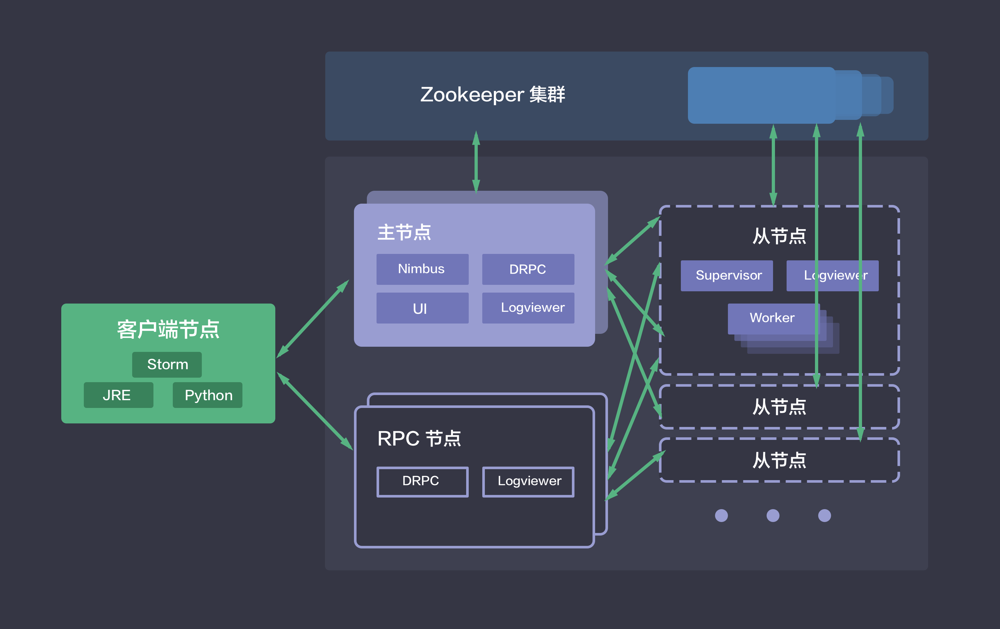

## 创建 Storm

创建 Storm 集群前，您需要先创建一个 VPC 网络，并在 QingCloud AppCenter 中创建一个 Zookeeper 集群,其他地方创建的 Zookeeper 集群识别不出来， 建议 Storm 与 Zookeeper 在一个私有网络中。

> 为了保障数据安全, Storm 集群需要运行在受管私有网络中。所以在创建一个 Storm 集群之前，需要创建一个 VPC 和一个受管私有网络，受管私有网络需要加入 VPC，并开启 DHCP 服务（默认开启）。

### 第一步：基本设置

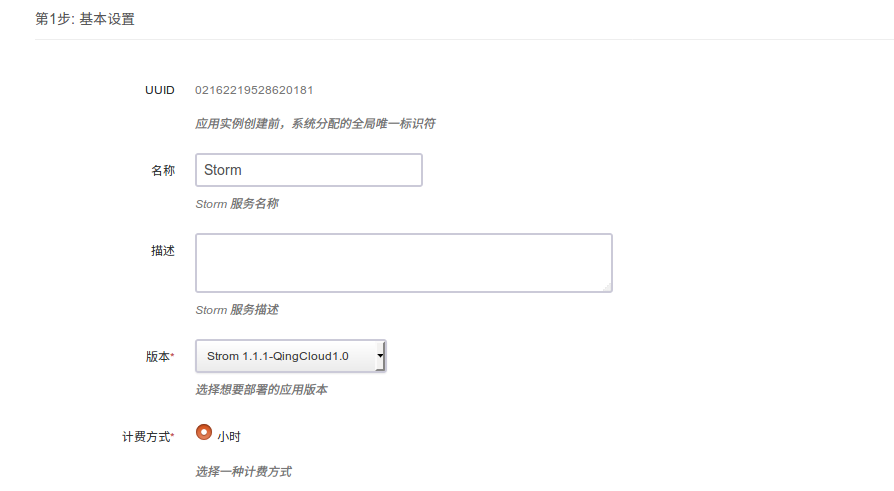

根据自己的需求填写 `名称` 和 `描述`，不影响集群的功能，版本一般建议选择最新版本。

### 第二步：主节点设置

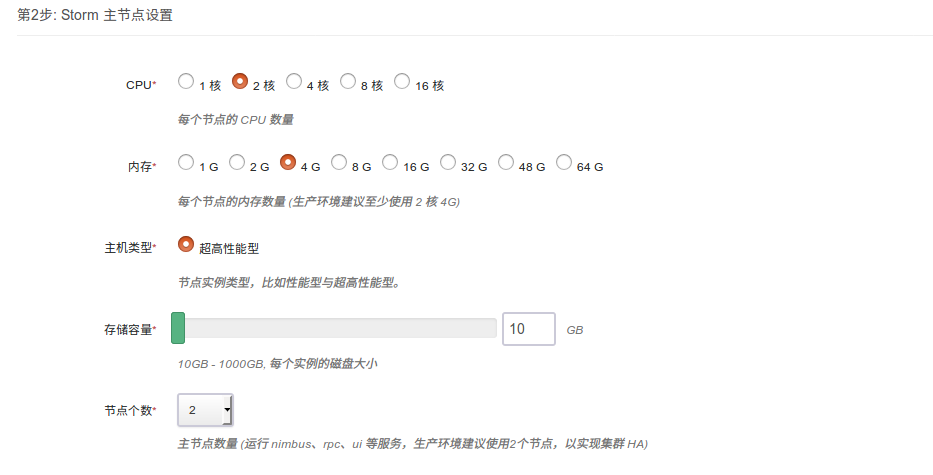

CPU，内存，节点数量，主机类型和磁盘大小根据自己实际需求进行选择即可，生产环境建议使用2核4g以上配置，建议使用两个节点，保证高可用。

### 第三步：从节点设置

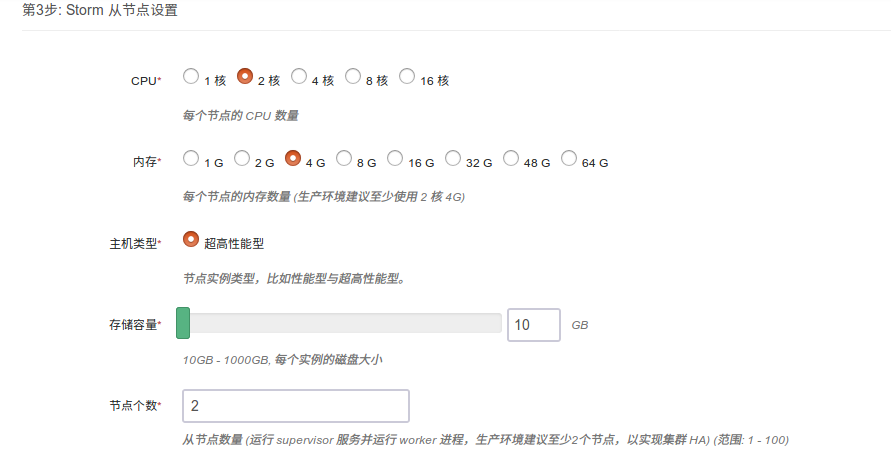

CPU，内存，节点数量，主机类型和磁盘大小根据自己实际需求进行选择即可，生产环境建议使用2核4g以上配置，建议使用两个节点以上，保证高可用。

### 第四步：rpc 节点设置

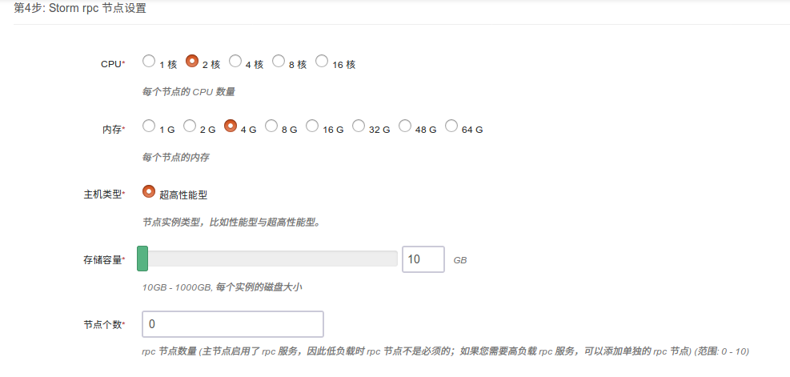

CPU，内存，节点数量，主机类型和磁盘大小根据自己实际需求进行选择即可，因为主节点已经开启 rpc　服务，因此　rpc　节点为非必须节点,主要用于在高负载下提供 rpc 服务。

### 第五步：客户端节点设置

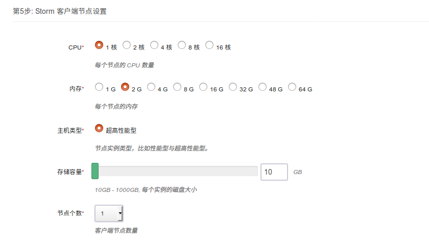

CPU，内存，节点数量，主机类型和磁盘大小根据自己实际需求进行选择即可，建议使用此节点，提交任务或者熟悉 Storm 。

配置完毕，可进行后续测试

### 第六步：网络设置

出于安全考虑，所有的集群都需要部署在私有网络中，选择自己创建的网络中,节点 ip 支持自动分配和手动指定。

### 第七步：依赖服务设置

选择您所依赖的 Zookeeper 集群。

### 第八步：参数设置

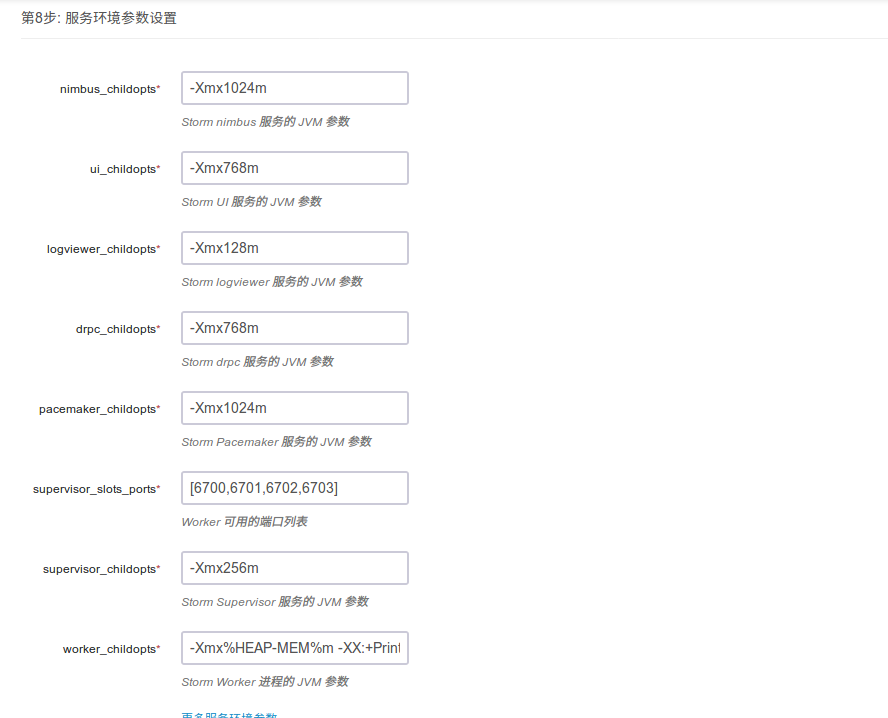

>一般情况下不需要修改参数，直接使用即可，当有特殊需求或者调优的时候可以按照自己的实际需求配置 Storm 参数。

### 第九步: 用户协议

阅读并同意青云 APP Center 用户协议之后即可开始部署应用。

### 创建成功

当 Storm 创建完成之后，您可以查看每个节点的节点状态和服务状态。 如图所示，当节点状态显示为“活跃”状态，表示该节点启动正常。 当每个节点都启动正常后 Storm 集群显示为“活跃”状态，服务状态会由“获取中”变为“活跃”状态， 表示您已经可以正常使用 Storm 服务了。

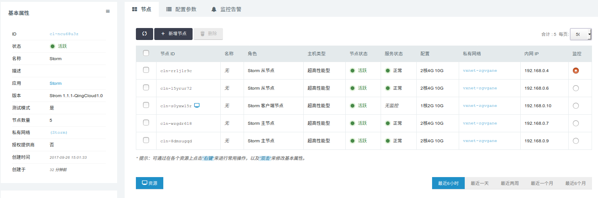

## Storm 集群测试

Storm 创建完成之后可以测试其可用性，由于 Storm 客户端节点已自动完成相关配置，可通过 Web 终端 登录直接使用，用户名：root，密码：storm

>测试需创建 Storm 客户端 节点，如创建集群时未创建该类型节点，可通过 新增节点 增加该节点

Storm 集群主节点上启动了 Storm UI 服务。Storm UI 服务是一个基于 Web 的监控服务，它不仅可以查看集群、配置、Topology 以及各组件（Spout 和 Bolt）等的信息和日志，还可以暂停、激活、删除 Topology，更是 Topology 运行时的重要调优工具。

为了方便测试,使用并熟悉 Storm UI，请查看客户端节点 /etc/hosts 目录下 host 文件配置，建议添加 Storm 节点 host 至本地开发环境的 host 文件中，这样可以更加方便的通过 Storm UI 在本地浏览器上查看日志，建议使用高可用 storm_ui_vip：8080 访问与使用 Storm UI,其中 storm_ui_vip 在您创建好集群后可以在集群左侧栏看到。

>本指南中所有的测试都是基于 Storm 官方自带的示例 storm-starter 进行的。

### 测试一：ExclamationTopology

ExclamationTopology 是一个非常简单的 Storm Topology 示例，它的 Bolt 会在每个单词后追加 !!!。

首先，在客户端节点上执行如下 storm jar 命令以提交计算拓扑。
>/opt/storm/bin/storm jar /opt/storm/examples/storm-starter/storm-starter-1.1.1.jar org.apache.storm.starter.ExclamationTopology ExclamationTopology

下图展示了 storm jar 命令的执行结果：
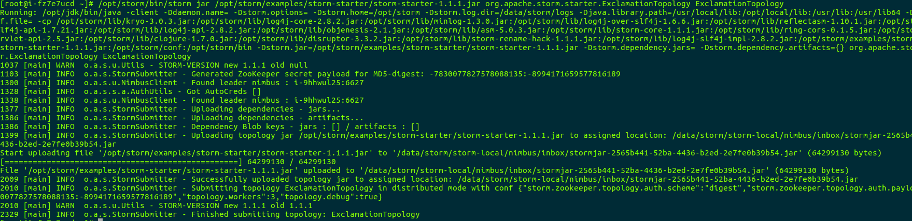

Topology 提交成功后，用户可以在 Storm UI 上看到 ExclamationTopology 的概要信息，例如状态、运行时间、worker 数量、任务总数等，具体如下图所示：

点击 ExclamationTopology 链接，可查看该 Topology 的各个组件：

点击 exclaim1 组件，可以查看运行该组件的 executors，如下图所示:

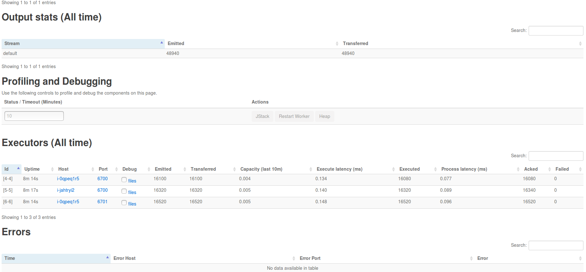

点击 executors 中的 Port 列中的端口号，可进一步查看相应的日志:

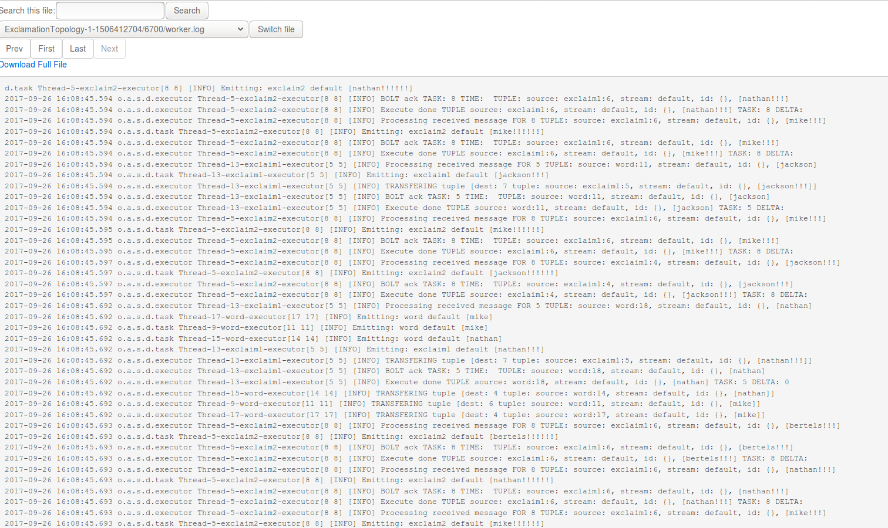

若需要删除 Topology，可以在 Storm UI 的 Topology actions 栏，点击 Kill 按钮，如下图所示：

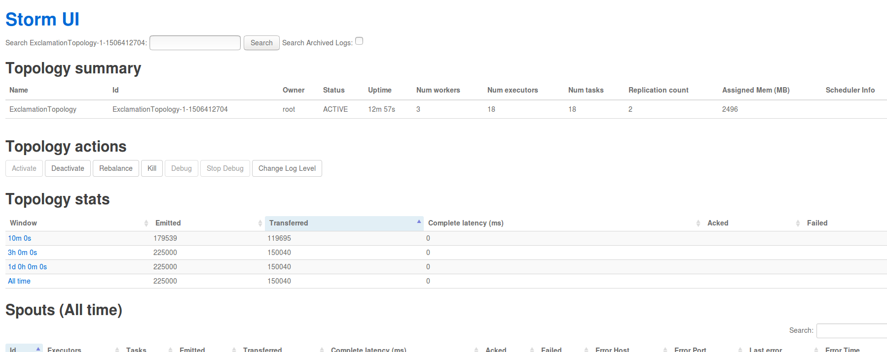

也可以通过执行如下 storm kill 命令来删除计算拓扑

> /opt/storm/bin/storm kill ExclamationTopology

### 测试二：ReachTopology

ReachTopology 基于 Storm 可实时计算 Twitter 网站上任意 URL 的 Reach 值，并通过 Storm 分布式 RPC 对外提供服务。

首先，在客户端节点上执行如下 storm jar 命令以提交 ReachTopology
>/opt/storm/bin/storm jar /opt/storm/examples/storm-starter/storm-starter-1.1.1.jar org.apache.storm.starter.ReachTopology ReachTopology remote

然后 Topology 成功提交运行后，接着创建用于发送 RPC 请求的客户端,为此，需创建一个基于 Maven 的 Java 工程，添加 storm-core 依赖包并创建 TestReachTopology 类,
该测试代码如下:

<pre name = "code" class = "java">
package com.qingcloud;

import org.apache.storm.utils.DRPCClient;
import org.apache.storm.utils.Utils;
import java.util.Map;

public class TestReachTopology {

 public static void main(String[] args) throws Exception {

     if (args.length < 1) {
         throw new IllegalArgumentException("Invalid parameter");
     }
     String host = args[0];
     Map conf = Utils.readStormConfig();
     DRPCClient client = new DRPCClient(conf, host, 3772);
     String[] urlsToTry = new String[]{ "foo.com/blog/1", "engineering.twitter.com/blog/5", "notaurl.com"   };
     for (String url : urlsToTry) {
         System.out.println("Reach of " + url + ": " + client.execute("reach", url));
     }
 }
}
</pre>  

用于测试的 jar 包已经打好放在客户端节点了，可以执行如下命令,该命令中 "i-9hhwul25" 为 master 节点的 leader 角色， 参数请使用的是任意一个 master 节点 host,可以直接在客户端节点 host 文件中找到

>java -cp /opt/storm/examples/storm-drpc-client/storm-example-1.1-SNAPSHOT.jar com.qingcloud.TestReachTopology  i-9hhwul25

>注意：官方这个测试用例较为复杂，需要请求 master 节点的 leader 角色，可以在 Storm UI 上查看到 leaer 角色的 host，当删除 leader 后，需要重新测试此流程。。

执行结果如下图所示：

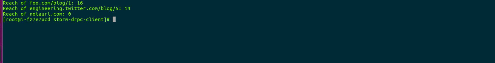

### 测试三：MultipleLoggerTopology

MultipleLoggerTopology 使用了很多 Logger，并持续地打印各种级别的日志。执行如下命令，可提交该 Topology
>/opt/storm/bin/storm jar /opt/storm/examples/storm-starter/storm-starter-1.1.1.jar org.apache.storm.starter.MultipleLoggerTopology MultipleLoggerTopology

通过 Storm UI 可查看其日志，日志中包含了 INFO、WARN、ERROR 等级别的信息，如下图所示：

不仅如此，Storm UI 还提供了动态设置 Log 级别的功能。

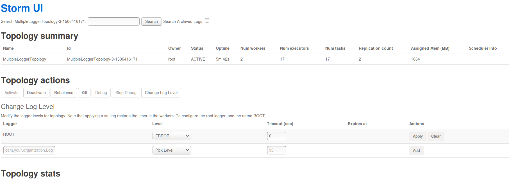

按上图设置完毕后，再次查看日志时只能看到 ERROR 级别的信息。

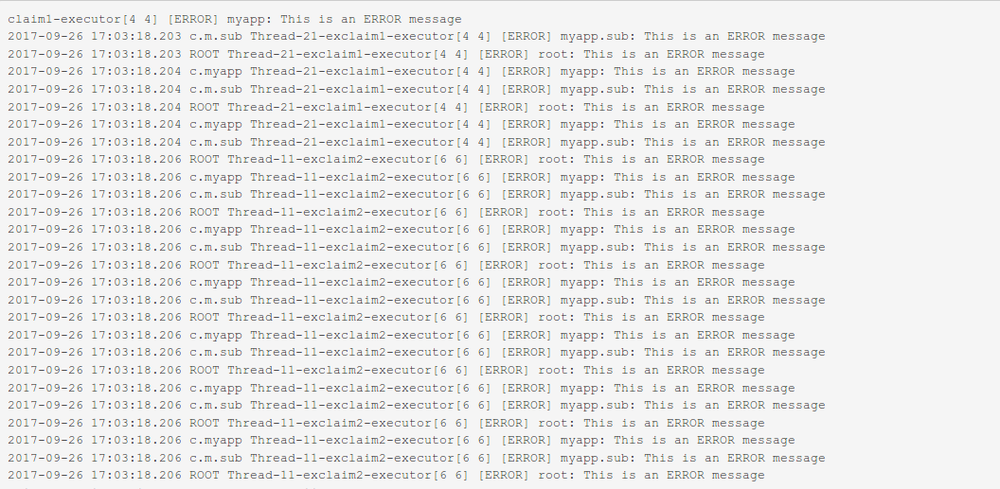

### 测试四：TridentWordCount

TridentWordCount 使用了 Storm Trident 接口，用于统计单词出现的次数。为了通过 Storm UI 查看 event，需要打开 event logging 功能。在配置组中的找到配置项 topology.eventlogger.executors，将其值设为 1，集群即可开启 event logging 功能，。接着执行如下命令以提交 TridentWordCount。
>/opt/storm/bin/storm jar /opt/storm/examples/storm-starter/storm-starter-1.1.1.jar org.apache.storm.starter.trident.TridentWordCount TridentWordCount

通过 Storm UI 打开 debug 功能。
然后就可以通过 worker port 链接到日志，找到 events.log 文件，点击 switch file 我们可以看到如下结果

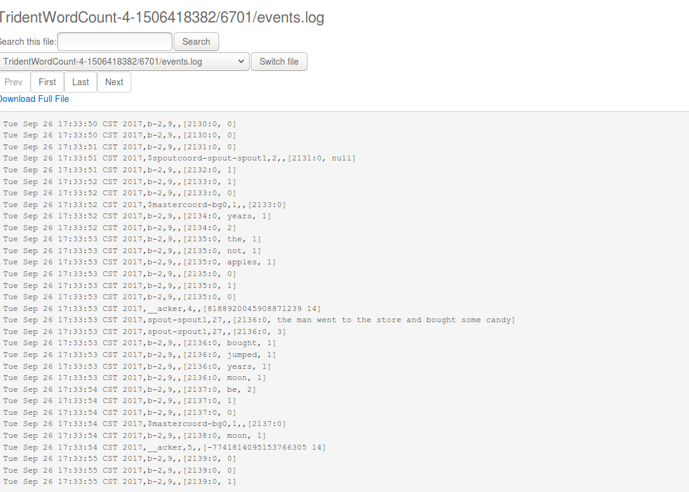

### 测试五：SlidingWindowTopology

Storm 提供了流式窗口 API，支持 Sliding Window 和 Tumbling Window。SlidingWindowTopology 展示了这两种窗口 API 的基本使用方法。请执行如下命令以提交 SlidingWindowTopology。
>/opt/storm/bin/storm jar /opt/storm/examples/storm-starter/storm-starter-1.1.1.jar org.apache.storm.starter.SlidingWindowTopology SlidingWindowTopology

通过 Storm UI 可以查看 tumblingavg 的输出，如下图所示：

除了自带的几个基本使用的例子之外,Storm 也可以很方便的与其他大数据组件整合:例如 HBase、Kafka、Elasticsearch、Druid、Redis等。详情可以参考[Storm 官网](http://storm.apache.org/releases/1.1.2/index.html)中的 Integration With External Systems, and Other Libraries。

## 在线伸缩

### 增加节点

您可以在 Storm 详情页点击 新增节点 按钮增加 Storm 角色节点，可以对每个新增节点指定 IP 或选择自动分配。

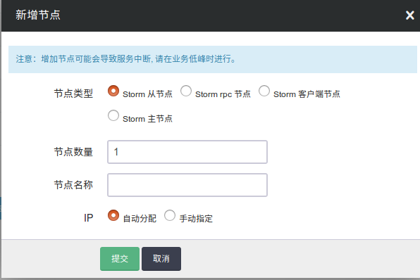

### 删除节点

您可以在 Storm 详情页选中需要删除的节点，然后点击 删除 按钮。

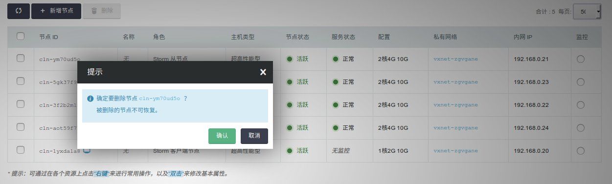

>Storm 主节点 和 Storm 从节点至少需要各保留一个。

### 纵向伸缩

由于不同类节点压力并不同，所以 Storm on QingCloud AppCenter 支持对 Storm 主节点 、 Storm 主节点 、 Storm rpc 节点 和 Storm 客户端 分别进行纵向伸缩。

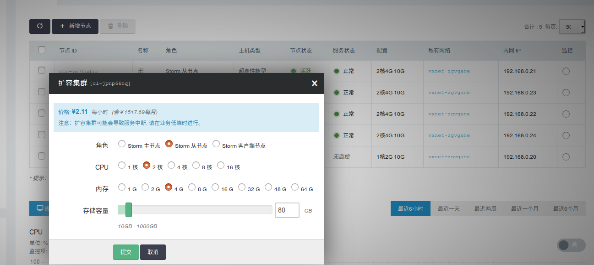

## 监控告警

我们对 Storm 集群的每个节点提供了资源的监控和告警服务，包括 CPU 使用率、内存使用率、硬盘使用率等，以帮助用户更好的管理和维护 Storm 集群。 同时，Storm 主节点上运行的 Storm UI 服务提供了丰富的集群监控信息，默认端口为8080。 此外，青云提供的 Storm 集群还在各个节点上运行了 Logviewer 服务，该服务允许用户访问各个节点上的日志。拨入到 VPN 网络后，可以访问以下 URL 来浏览 Storm UI 及节点日志：

    http://<Storm UI VIP>:8080
    http://<Storm 任意节点私有网络 IP>:8000/daemonlog?file=<log file name>

例如：

- http://storm_ui_vip:8080
- http://masternode_ip:8000/daemonlog?file=nimbus.log
- http://slavenode_hostname:8000/daemonlog?file=worker.log

## 配置参数

我们通过 `配置参数` 来管理 Storm 服务的配置。

### 修改配置参数

在 Storm 详情页，点击 配置参数 Tab 页，点击 修改属性，修改完后，我们需要进行 "保存"。如图所示：

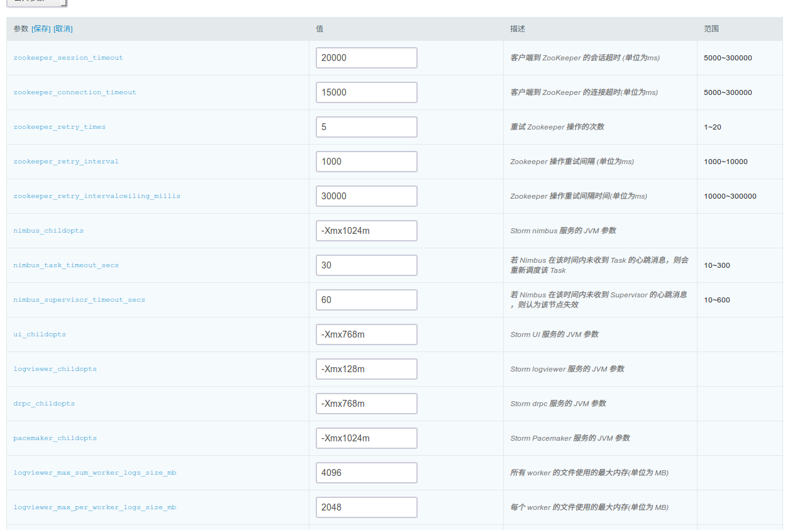

>注意:当配置发生变化时，将会重启对应的 Storm 服务。

### 常用配置项

- storm.zookeeper.session.timeout: Zookeeper客户端的 session 超时时间
- nimbus.childopts: Storm Nimbus 服务的 JVM 参数
- supervisor.childopts: Storm Supervisor 服务的 JVM 参数
- worker.childopts: Storm Worker 进程的 JVM 参数
- drpc.childopts: Storm DRPC 服务的 JVM 参数
- ui.childopts: Storm UI 服务的 JVM 参数
- logviewer.childopts: Storm Logviewer 服务的 JVM 参数
- worker.heap.memory.mb: Worker 进程默认堆内存大小
- nimbus.task.timeout.secs: 若 Nimbus 在该时间内未收到 Task 的心跳消息，则会重新调度该 Task
- nimbus.supervisor.timeout.secs: 若 Nimbus 在该时间内未收到 Supervisor 的心跳消息，则认为该节点失效
- nimbus.task.launch.secs: Task 启动时的超时时间
- supervisor.worker.timeout.secs: 若 Supervisor 在该时间内未收到 Worker 的心跳消息，则会重启该 Worker
- supervisor.slots.ports: Worker 可用的端口列表
- supervisor.worker.start.timeout.secs: Worker 启动时的超时时间
- topology.worker.max.heap.size.mb: 应用于 Topology，限定 Worker 最大可用堆内存
- topology.eventlogger.executors: Event Logger 的进程个数
- topology.acker.executors: Acker 的进程个数

>注意：通常不需要修改 Storm 默认参数配置即可，修改 JVM 参数的时候请按照 -Xmx768m 格式修改数字大小即可，修改 woker端口数的时候按照 [6700,6701,6702,6703] 格式。

配置项的详细解释请参见 [Storm 官方文档](http://storm.apache.org/releases/1.1.2/Configuration.html)。

## 几种流式计算框架对比分析

  >注意：Storm 支持 Storm Core 和 Storm Trident 两种编程模式

  |          | Flink    |  Spark Streaming  |  Storm  |  Kafka Stream  |
    | :----:   | :----:   | :----: | :----: |:----: |
    | 架构模式        | 主从      |   主从，依赖 Spark,每个 batch 处理都依赖主    |   主从，依赖 Zookeeper,处理过程中对主的依赖不大    |  安装 Kafka,Kafka 依赖 Zookeeper    |
    | 容错        |基于 distributed snapshots checkpoint 机制      |   基于 HDFS 做 checkpoint    |   Records Ack    |   高可用分区，状态存储和对乱序数据的处理能力    |
    | 处理模型与延迟        | 单条事件处理，毫秒级延迟      |   一个事件窗口的所有事件，秒级延迟    |   Storm Core 单条事件处理，毫秒级延迟，Storm Trident 为批处理，秒级延迟    | 单条事件处理，毫秒级延迟      |
    | 吞吐       | 高      |   高    |   Storm Core 低吞吐，Storm Trident 高吞吐    | 高      |
    | 数据处理保证        | exactly once      |   exactly once    |   Storm Core保证 at least once，Storm Trident 保证 exactly once    |0.11.0版本后 exactly once      |
    | 易用性        | 支持 SQL Streaming，Batch 和 Streaming 采用的统一编程框架      |   支持 SQL Streaming，Batch 和 Streaming 采用的统一编程框架    |   sql on Storm 发展中，还不成熟    |   自己的一套编程模型，KSQL 支持(Confluent 平台支持)  |
    | 成熟性        | 处于发展阶段，比较成熟      |   发展了很长时间，非常成熟    |   发展了很长时间，非常成熟    | 处于发展阶段，比较成熟      |
    |  分布式 RPC     | 不支持      |   不支持    |   支持    | 不支持      |

Flink 和 Kafka Stream 目前在生产环境中比较少见，主要针对 Storm 和 Spark Streaming 选型建议如下：

建议使用 Storm 场景：

- 需要很低延迟的，比如实时金融系统，要求纯实时进行金融交易和分析
- 要求可靠的事务机制和可靠性机制，即数据的处理完全精准无误的
- 需要针对高峰低峰时间段，动态调整实时计算程序的并行度，以最大限度利用集群资源（通常是在小型公司，集群资源紧张的情况），也可以考虑用 Storm
- 如果一个大数据应用系统，它就是纯粹的实时计算，不需要在中间执行 SQL 交互式查询、复杂的　transformation 算子等，那么用 Storm 是比较好的选择
- 分布式 RPC 服务场景

建议使用 Kafka Stream 场景

- 输入源为 Kafka,轻量级 ETL 场景

建议使用 Spark Streaming 场景

- 不要求纯实时，不要求强大可靠的事务机制，不需要动态调整并行度，那么可以考虑使用 Spark Streaming
- 如果一个项目除了实时计算之外，还包括了离线批处理、交互式查询等业务功能，而且实时计算中，可能还会牵扯到高延迟批处理、交互式查询等功能，那么可以选择 Spark 生态，用 Spark Core 开发离线批处理，用 Spark SQL 开发交互式查询，用 Spark Streaming 开发实时计算，三者可以无缝整合，给系统提供非常高的可扩展性
- 吞吐量很大，海量数据场景

>同时建议大数据场景下，使用混合架构可以更好的满足各种业务需求

至此，`Storm on QingCloud AppCenter` 的介绍到这里就告一个段落了。

在使用过程中如果遇到问题可以通过 `提交工单` 来获取帮助，我们将竭诚为您服务。

Have a nice day on QingCloud AppCenter !

## Storm Paas 文档

Storm Paas 文档请访问[这里](../storm.html)