---
---

# Storm 指南

Storm 是一个开源的分布式实时计算系统，通常被比作＂实时的 Hadoop＂。Storm 为实时计算提供了一些简单优美的原语，支持多种编程语言，并内建流式窗口 API 及分布式缓存 API，极大简化了流式数据处理过程。Storm 不仅高可靠、易扩展，而且处理速度极快，每个计算节点每秒能处理上百万条元组信息（Tuple），因此常被用于实时分析、在线机器学习、连续计算、分布式 RPC、ETL 等。 关于 Storm 更多的详细信息，请参阅 [Storm 官方网站](http://storm.apache.org) 。

## 系统部署架构

Storm 将实时计算逻辑包装成计算拓扑（Topology）。它类似 Hadoop 中的 Job，是一组由 Spouts 和 Bolts 通过 Stream Grouping 连接而成的图形结构，被部署到 Storm 集群中持续运行。Storm 集群采用的是 master/slave 架构，青云提供的 Storm 集群服务还包括在线伸缩、监控和告警等功能，帮助您更好地管理集群。如下图所示，青云的 Storm 集群包括如下五种节点类型：

*   **主节点**：运行了 Nimbus、DRPC、UI 和 Logviewer 服务，负责接收客户端提交的计算拓扑，并协调分派计算任务。
*   **从节点**：运行了 Supervisor 和 Logviewer 服务。其中，Supervisor 服务主要用于接收计算任务并弹性启动或停止工作进程（Worker），而 Logviewer 服务方便用户查看运行日志。
*   **RPC 节点**：运行了 DRPC 和 Logviewer 服务，用于接收 RPC 请求，并将计算拓扑的处理结果返回给客户端。
*   **客户端节点**：安装了 Python、JRE/JDK 和 Storm 软件，用于提交计算拓扑。
*   **Zookeeper 集群**：用于协调 Storm 集群。


## 创建 Storm

通常包括 Storm 在内的大数据平台的运维是非常繁琐的，在青云上，您可以在２到３分钟创建一个 Storm 集群。集群支持横向与纵向在线伸缩，还提供了监控告警等功能，使得管理集群异常方便。集群将运行于 100% 二层隔离的私有网络内，结合青云提供的高性能硬盘，在保障高性能的同时兼顾您的数据安全。

>注意：
>
>为了保障数据安全，Storm 集群需要运行在受管私有网络中。所以在创建一个 Storm 集群之前，至少需要一个路由器（或 VPC 网络）和一个受管私有网络，受管私有网络需要和路由器（或 VPC 网络）连接，并开启 DHCP 服务（默认开启）。

**第一步：选择基本配置**

在创建的对话框中，您需要选择 Storm 版本号、类型、名称、关联的配置组，然后点击下一步。

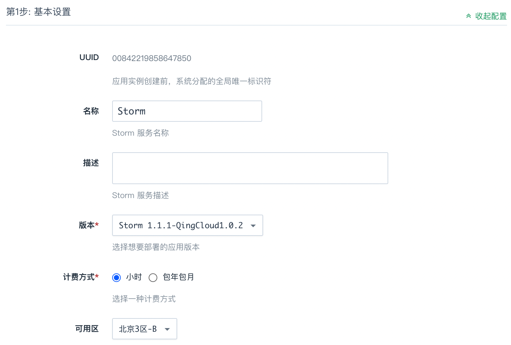

**第二步：配置主节点**

输入主节点的数量，并选择主节点配置、容量，以定义 master 集群的规模和性能。

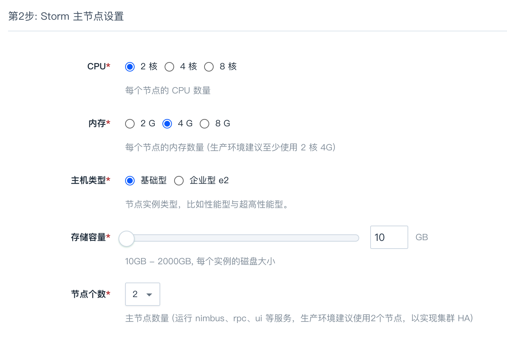

>注解
主节点上运行了 Nimbus、DRPC、UI 等服务，建议在生产环境中使用至少 2 个主节点，以实现主节点集群的 HA。主机配置１核2G 仅供测试使用，生产环境建议至少使用 2 核 4G。节点数量和主机配置，在创建之后可以在线伸缩。

**第三步：配置从节点**

输入从节点的数量，并选择从节点配置、容量，以定义 slave 集群的规模和性能。

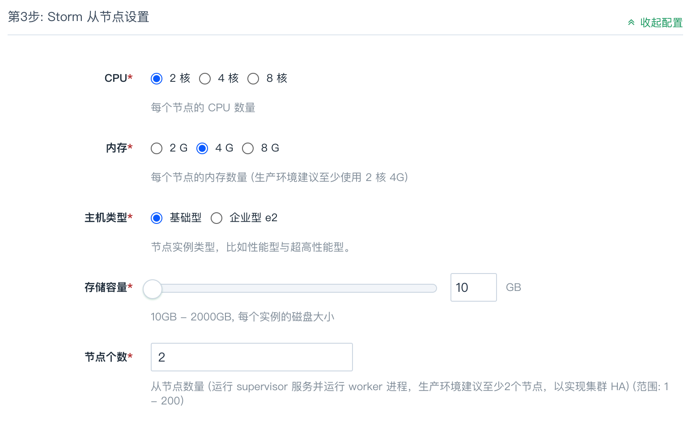

>注解
从节点上启用了 Supervisor 服务并运行 Worker 进程，请在生产环境使用至少 2 个从节点，以实现从节点集群的 HA。从节点作为工作节点，通常需要更高的配置。

**第四步：配置 RPC 节点**

输入 RPC 节点的数量，并选择 RPC 节点配置、容量，以定义 RPC 集群的规模和性能。

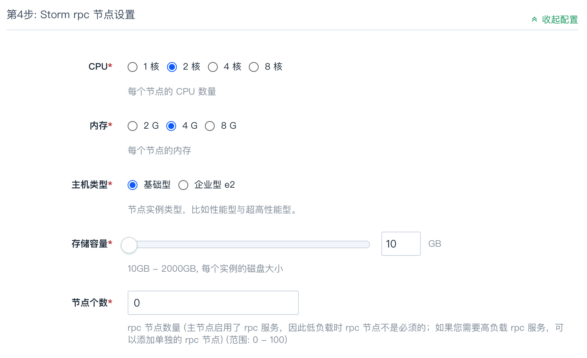

>注解
主节点已经启用了 DRPC 服务，因此低负载时 DRPC 节点不是必须的；如果您需要高负载 RPC 服务，可以添加额外的 RPC 节点。

**第五步：配置 Zookeeper 和网络**

选择 Storm 集群所依赖的 Zookeeper 服务，集群将创建于 ZooKeeper 所在的私有网络中，创建后可以切换到其他私有网络，但需要保证新的私有网络内仍能连接到 Zookeeper。您可以让 DHCP 服务自动分配 Storm 集群各节点的私有网络 IP，也可以手动指定。

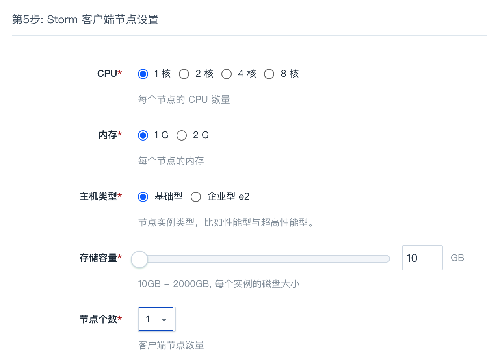

当 Storm 创建完成之后，您可以查看每个节点的运行状态。如图所示，当节点显示为“活跃”状态，表示该节点启动正常。当每个节点都启动正常后 Storm 集群显示为“活跃”状态，表示您已经可以正常使用 Storm 服务了。

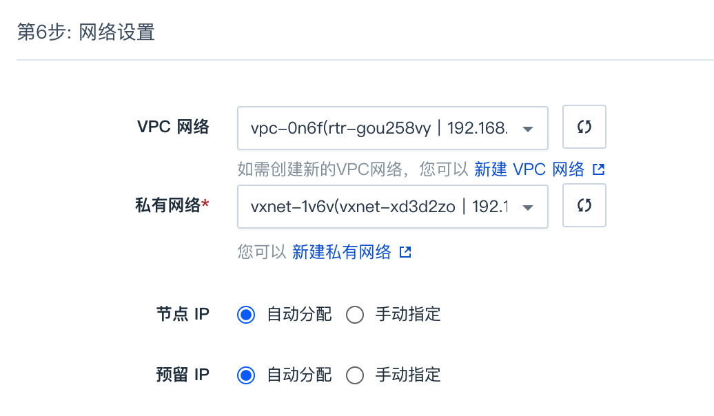

## 测试 Storm

Storm 创建完成之后可以测试其可用性。

**查看集群信息**

Storm 集群的主机名是按照节点类型定义的:

*   Storm 主节点: -master
*   Storm 从节点: -slave
*   Storm RPC 节点: -rpc

Storm 集群主节点上启动了 Storm UI 服务。Storm UI 服务是一个基于 Web 的监控服务，它不仅可以查看集群、配置、Topology 以及各组件（Spout 和 Bolt）等的信息，还可以暂停、激活、删除 Topology，更是 Topology 运行时的重要调优工具。

为了方便使用 Storm UI，请参考 [VPN 隧道指南](https://docs.qingcloud.com/product/network/vpn) 配置VPN，并修改本地 hosts 文件。

>注解
由于 Ubuntu 主机名对应 IP 127.0.0.1 存在 [已知问题](https://wiki.apache.org/hadoop/ConnectionRefused) 。所以先要在 /etc/hosts 文件里把 127.0.0.1 修改成主机的私网 IP (假设为 192.168.107.20)，同时还需要加上 Storm 主节点，从节点以及 RPC 节点的主机名与私网 IP 的信息，改完后的 /etc/hosts 类似于：

```
192.168.107.20    localhost
192.168.107.20    i-tp5n8o28
192.168.107.70    stmn-8ct52oqk-master
192.168.107.71    stmn-9ss52hui-master
192.168.107.80    stmn-2pfpy7bo-rpc
192.168.107.90    stmn-kflp37ij-slave
192.168.107.91    stmn-oc3uigmo-slave
192.168.107.92    stmn-e0woz5xh-slave
```

VPN 建立后，可通过访问主节点的 8080 端口（例如，[http://stmn-8ct52oqk-master:8080](http://stmn-8ct52oqk-master:8080)）来访问 Storm UI，如下图所示：


**创建 Storm 客户端节点**

为了提交 Storm Topology 做测试，需要创建 Storm 客户端节点。用户可以在青云上创建，也可以自己在本地搭建。在青云上创建 Storm 客户端节点, 首先打开映像市场，在工具分类中找到 Storm Client，然后点击使用，选择主机类型、CPU、内存，并将该主机加入 Storm 集群同一私有网络。如果在本地搭建，请安装 Storm 1.0.1、JRE、Python 等软件。

创建完客户端节点之后，需要修改 hosts 文件，请参考 [_查看集群信息_](#view-storm-cluster) 一节关于 hosts 文件的修改方法。

最后，在 ~/.storm 目录下创建 storm.yaml, 并指定 nimbus.seeds 和 drpc.servers，文件内容类似于：

```
nimbus.seeds: ["stmn-8ct52oqk-master", "stmn-9ss52hui-master"]
drpc.servers:
    - "stmn-8ct52oqk-master"
    - "stmn-9ss52hui-master"
    - "stmn-2pfpy7bo-rpc"
```

配置完毕，可进行后续测试。本指南中所有的测试都是基于 Storm 自带的示例 storm-starter 进行的。

**测试一：ExclamationTopology**

ExclamationTopology 是一个非常简单的 Storm Topology 示例，它的 Bolt 会在每个单词后追加 !!!。

首先，在客户端节点上执行如下 storm jar 命令以提交计算拓扑。

```
/opt/storm/bin/storm jar /opt/storm/examples/storm-starter/storm-starter-topologies-1.0.1.jar org.apache.storm.starter.ExclamationTopology ExclamationTopology
```

下图展示了 storm jar 命令的执行结果：

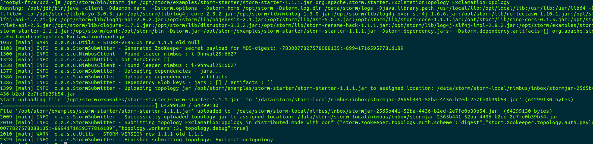

Topology 提交成功后，用户可以在 Storm UI 上看到 ExclamationTopology 的概要信息，例如状态、运行时间、worker 数量、任务总数等，具体如下图所示：


点击 ExclamationTopology 链接，可查看该 Topology 的各个组件：


点击 exclaim1 组件，可以查看运行该组件的 executors，如下图所示:

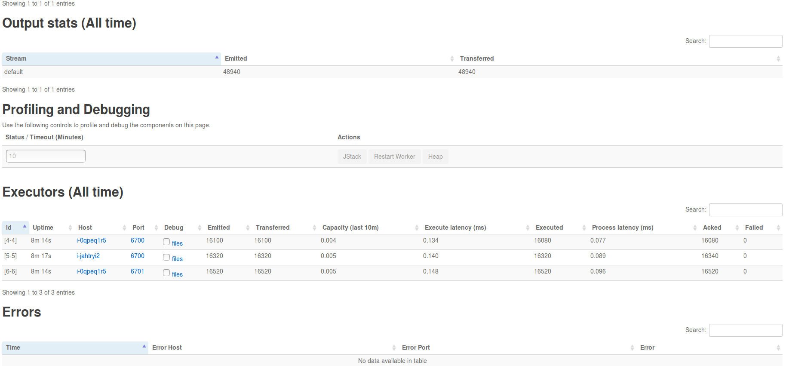

点击 executors 中的 Port 列中的端口号，可进一步查看相应的日志:


若需要删除 Topology，可以在 Storm UI 的 Topology actions 栏，点击 Kill 按钮，如下图所示：

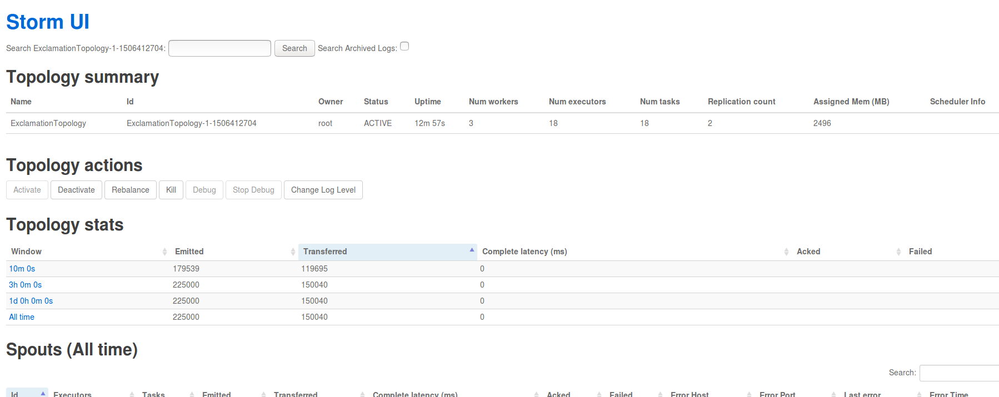

用户也可以通过执行如下 storm kill 命令来删除计算拓扑：

```
/opt/storm/bin/storm kill ExclamationTopology
```

执行结果如下图所示：


**测试二：ReachTopology**

ReachTopology 基于 Storm 可实时计算 Twitter 网站上任意 URL 的 Reach 值，并通过 Storm 分布式 RPC 对外提供服务。

首先，在客户端节点上执行如下 storm jar 命令以提交 ReachTopology。

```
/opt/storm/bin/storm jar /opt/storm/examples/storm-starter/storm-starter-topologies-1.0.1.jar org.apache.storm.starter.ReachTopology ReachTopology remote
```

通过 Storm UI 查看 ReachTopology ，结果如下：


Topology 成功提交运行后，接着创建用于发送 RPC 请求的客户端。为此，需创建一个基于 Maven 的 Java 工程，添加 storm-core 依赖包并创建 TestReachTopology 类，代码如下：

```
package test;

import org.apache.storm.utils.DRPCClient;
import org.apache.storm.utils.Utils;
import java.util.Map;

public class TestReachTopology {

    public static void main(String[] args) throws Exception {

        if (args.length

然后，将工程及其所有的依赖打成一个包（“uberjar” 或 “fat jar”）上传到 Storm 客户端节点，并在客户端节点上执行如下类似命令以完成 RPC 请求：
```
```
java -cp starter-client-1.0-SNAPSHOT-jar-with-dependencies.jar test.TestReachTopology stmn-2pfpy7bo-rpc
```

执行结果如下图所示:


**测试三：MultipleLoggerTopology**

MultipleLoggerTopology 使用了很多 Logger，并持续地打印各种级别的日志。执行如下命令，可提交该 Topology。

```
/opt/storm/bin/storm jar /opt/storm/examples/storm-starter/storm-starter-topologies-1.0.1.jar org.apache.storm.starter.MultipleLoggerTopology MultipleLoggerTopology
```

通过 Storm UI 可查看其日志，日志中包含了 INFO、WARN、ERROR 等级别的信息，如下图所示：


不仅如此，Storm UI 还提供了动态设置 Log 级别的功能。


按上图设置完毕后，再次查看日志时只能看到 ERROR 级别的信息。

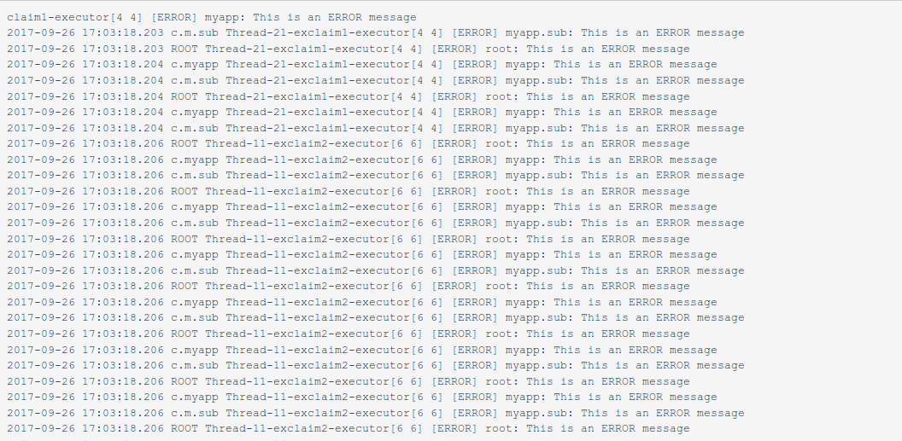

**测试四：TridentWordCount**

TridentWordCount 使用了 Storm Trident 接口，用于统计单词出现的次数。为了通过 Storm UI 查看 event，需要打开 event logging 功能。在配置组中的找到配置项 topology.eventlogger.executors，将其值设为 1，并应用到 Storm 集群即可开启 event logging 功能。接着执行如下命令以提交 TridentWordCount。

```
/opt/storm/bin/storm jar /opt/storm/examples/storm-starter/storm-starter-topologies-1.0.1.jar org.apache.storm.starter.trident.TridentWordCount TridentWordCount
```

在 Storm UI 的 Component actions 栏，点击 Debug 可开启组件的 event logging 功能。

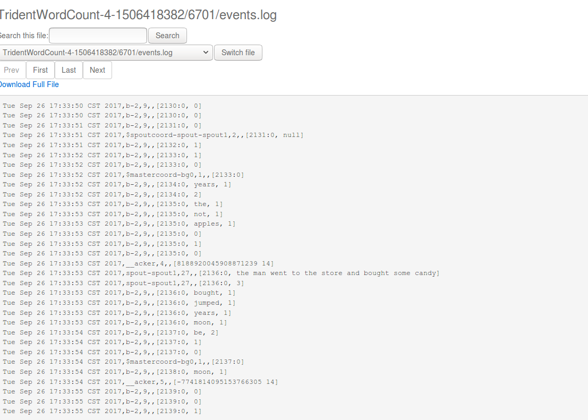

点击 event 链接，即可查看event.log，如下图所示：


用户可以参考 [_测试二：ReachTopology_](#storm-test-2) 来创建并执行 RPC 客户端。

**测试五：SlidingWindowTopology**

Storm 提供了流式窗口 API，支持 Sliding Window 和 Tumbling Window。SlidingWindowTopology 展示了这两种窗口 API 的基本使用方法。请执行如下命令以提交 SlidingWindowTopology。

```
/opt/storm/bin/storm jar /opt/storm/examples/storm-starter/storm-starter-topologies-1.0.1.jar org.apache.storm.starter.SlidingWindowTopology SlidingWindowTopology
```

通过 Storm UI 可以查看 tumblingavg 的输出，如下图所示：


**测试六：TridentKafkaWordCount**

TridentKafkaWordCount 包含 kafkaBolt 和 wordCounter 两个 Topology，并对外提供 RPC 服务。其中 kafkaBolt Topology 将产生的数据写入到 Kafka，而 wordCounter Topology 用于读取 Kafka 中的数据，并统计各个单词出现的次数。

首先，请参考 [消息队列指南](https://docs.qingcloud.com/product/big_data/queue) 创建 Kafka 集群。为方便描述，假设创建好的 Kafka 集群的 ZooKeeper 连接串为 192.168.100.30:2181/kafka/q-md3ejihc，Broker URL 为192.168.100.9:9092,192.168.100.10:9092。

其次，在 Kafka 客户端，执行如下命令以创建示例所需要的 test 主题。

```
kafka-topics.sh --create --zookeeper 192.168.100.30:2181/kafka/q-md3ejihc --replication-factor 1 --partition 1 --topic test
```

然后，将 TridentKafkaWordCount Topology 与上面创建的 Kafka 集群集成。为此，需要对 TridentKafkaWordCount Topology 做些配置和修改，具体如下：

1.  修改 storm-starter 工程的 pom.xml 文件，将 storm-kafka 和 kafka 包的 scope 设置为 compile，并修改 kafka 包的版本号。该版本号需与 Kafka 集群保持一致。因青云目前提供的 Kafka 版本号为 0.8.2.1，所以修改后的 pom.xml 文件中的 storm-kafka 和 kafka 配置如下：

```

  org.apache.storm
  storm-kafka
  ${project.version}

  org.apache.kafka
  kafka_2.10
  0.8.2.1

        org.apache.zookeeper
        zookeeper

        log4j
        log4j

        org.slf4j
        slf4j-log4j12

```

2.  修改 Topology 提交逻辑，允许远程部署，具体如下：

```
// submit the consumer topology.
StormSubmitter.submitTopologyWithProgressBar("wordCounter", wordCount.getConsumerConfig(), wordCount.buildConsumerTopology(null));

Config conf = new Config();
conf.setMaxSpoutPending(20);
// submit the producer topology.
StormSubmitter.submitTopologyWithProgressBar("kafkaBolt", conf, wordCount.buildProducerTopology(wordCount.getProducerConfig()));
```

3. 因 TransactionalTridentKafkaSpout 在 Storm 1.0.1 中有 Bug（具体请参考 [STORM-1728](https://issues.apache.org/jira/browse/STORM-1728) ），故在本示例中，我们将使用 OpaqueTridentKafkaSpout，请参考下文修改 createKafkaSpout 方法：

```
private OpaqueTridentKafkaSpout createKafkaSpout() {
    ZkHosts hosts = new ZkHosts(zkUrl);
    TridentKafkaConfig config = new TridentKafkaConfig(hosts, "test");
    config.scheme = new SchemeAsMultiScheme(new StringScheme());

    // Consume new data from the topic
    config.startOffsetTime = kafka.api.OffsetRequest.LatestTime();
    return new OpaqueTridentKafkaSpout(config);
}
```

按如上步骤修改完毕后，请将 storm-starter 打包并上传到客户端节点，并执行如下命令以提交 Topology。

```
/opt/storm/bin/storm jar /opt/storm/examples/storm-starter/storm-starter-topologies-1.0.1.jar org.apache.storm.starter.trident.TridentKafkaWordCount  192.168.100.30:2181/kafka/q-md3ejihc 192.168.100.9:9092,192.168.100.10:9092
```

通过 Storm UI 查看 kafkaBolt Topology，如下图所示：


通过 Storm UI 查看 wordCounter Topology，如下图所示：


参考 [_测试二：ReachTopology_](#storm-test-2) ，创建并执行 RPC 客户端，结果如下：


此外，也可参考`消息队列指南 ` 来查看 test 主题中的消息。

## 在线伸缩

**增加节点**

当您需要横向扩展集群规模时，您可以在 Storm 详细页点击“新增节点”按钮增加主节点、从节点或 RPC 节点，每个新增节点在私有网络中的 IP 可以手动指定或选择自动分配。

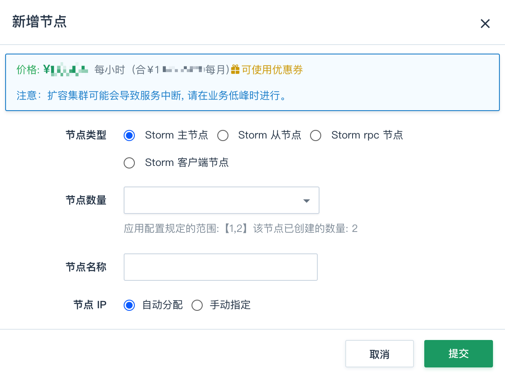

**删除节点**

当您不需要集群中的某些节点时，您可以在 Storm 详细页选中需要删除的节点，然后点“删除”按钮，以在线缩减集群规模。

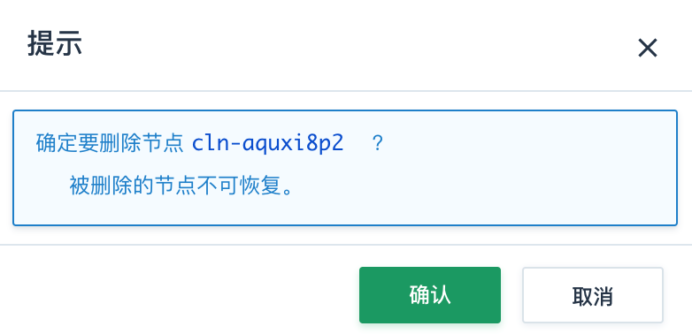

**纵向伸缩**

由于不同类节点压力并不同，所以青云 Storm 支持对 主节点、从节点 和 RPC 节点分别进行纵向伸缩。通常情况下主节点和 RPC 节点的压力都不会太大，运行 worker 进程的从节点的配置一般更高些。

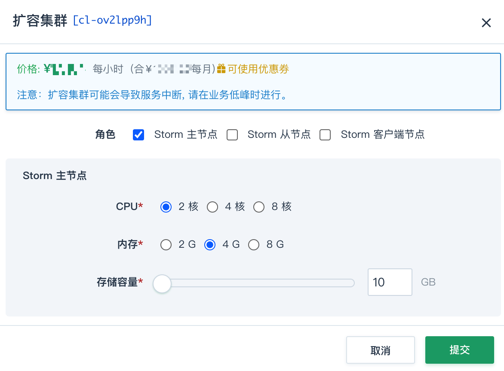

## 性能测试

参考 [yahoo/streaming-benchmarks](https://github.com/yahoo/streaming-benchmarks) ，我们对 Storm 集群做了延迟时间性能测试，以下是测试报告。

**测试条件**

北京3区-A，在一个 VPC 网络下创建 Storm 集群、Kafka 集群、Zookeeper 集群、Redis 以及若干主机，具体配置如下：

| 资源 | 版本 | 主机类型 | CPU | 内存 | 存储 | 备注 |
| --- | --- | --- | --- | --- | --- | --- |
| Storm | 1.0.1 | 超高性能型 | 8核 | 16G | 10G | 10个从节点 |
| Kafka | 0.8.2.1 | 超高性能型 | 8核 | 32G | 30G | 5个节点 |
| Zookeeper | 3.4.6 | 超高性能型 | 4核 | 8G |   | 为 Storm 和 Kafka 各创建一个集群 |
| Redis | 3.0.5 | 超高性能型 |   | 8G |   | 1个节点 |
| Instance |   | 性能型 | 4核 | 8G |   | 基于Ubuntu 14.04，运行 Load 脚本 |

**测试步骤**

首先，启动Storm 集群、Kafka 集群、Zookeeper 集群、Redis 以及 Load 主机，并在 Load 主机上安装 [Leiningen](http://leiningen.org/#install) ，并下载 [yahoo/streaming-benchmarks](https://github.com/yahoo/streaming-benchmarks) 中的仓库代码。

其次，在 Kafka 集群中创建 ad-events Topic（分区数为5），并参考 [yahoo/streaming-benchmarks](https://github.com/yahoo/streaming-benchmarks) 中的脚本初始化 Redis 中的数据。

>注解
每轮测试前都需要重新初始化数据。

由于 [yahoo/streaming-benchmarks](https://github.com/yahoo/streaming-benchmarks) 使用的 Storm 版本为 0.10.0/0.11.0，因此需要修改测试用的 storm.benchmark.AdvertisingTopology 类，具体改法如下：

*   将代码中的 backtype.storm　替换为 org.apache.storm
*   将代码中的 storm.kafka 替换为 org.apache.storm.kafka
*   在 localConf.yaml 中添加配置参数 zookeeper.brokerZkPath，并根据 Kafka 集群配置设置其值，例如: “/kafka/q-cvhyvab7/brokers”
*   按如下方式，修改代码中使用的 ZkHost：

```
String brokerZkPath = (String)commonConfig.get("zookeeper.brokerZkPath");
ZkHosts hosts = new ZkHosts(zkServerHosts, brokerZkPath);
```

修改完毕，重新编译打包，并部署到 Storm 集群中进行测试。

然后，通过在多个主机上同时执行如下类似命令以运行 Load 脚本，并持续运行半小时。

```
cd data
lein run -r -t 15000 --configPath ../conf/localConf.yaml
```

>注解
为产生每秒 450000 个 Tulples，需运行 30 个 Load 主机，每个主机每秒产生 15000 个 Tuples。

最后，运行如下类似命令生成测试结果（seen.txt 和 updated.txt）

```
cd data
lein run -g --configPath ../conf/localConf.yaml
```

**测试结果**


## 监控和告警

我们对 Storm 集群的每个节点提供了资源的监控和告警服务，包括 CPU 使用率、内存使用率、硬盘使用率等，以帮助用户更好的管理和维护 Storm 集群。 同时，Storm 主节点上运行的 Storm UI 服务提供了丰富的集群监控信息，默认端口为8080。 此外，青云提供的 Storm 集群还在各个节点上运行了 Logviewer 服务，该服务允许用户访问各个节点上的日志。拨入到 VPN 网络后，可以访问以下 URL 来浏览 Storm UI 及节点日志：

*   [http:/](http:/)/:8080
*   [http:/](http:/)/:8080/daemonlog?file=

例如：

*   [http://stmn-9ss52hui-master:8080](http://stmn-9ss52hui-master:8080)
*   [http://stmn-9ss52hui-master:8000/daemonlog?file=nimbus.log](http://stmn-9ss52hui-master:8000/daemonlog?file=nimbus.log)
*   [http://stmn-2pfpy7bo-rpc:8000/daemonlog?file=drpc.log](http://stmn-2pfpy7bo-rpc:8000/daemonlog?file=drpc.log)

## 配置

我们通过 Storm 配置组来管理 Storm 服务的配置。Storm 服务和 Storm 配置组是解耦的，您可以创建多个独立的配置组，并应用到不同的 Storm 服务。

> 注解
Storm 服务在运行过程中，也可以随时变更配置组。


**创建新的 Storm 配置组**

默认情况下，我们会为每个用户创建一个缺省配置组。用户也可以创建新的配置组，如图所示：


> 注解
缺省配置组不可以被删除。

**修改配置项**

点击该新建的 Storm 配置组，我们可以对每项配置项进行修改，如图所示：


修改完后，我们需要进行 “保存”，并点击 “应用” 让新的配置生效。

> 注解

当配置发生变化时，将会重启对应的 Storm 服务。


**常用配置项**

*   **storm.zookeeper.session.timeout**: Zookeeper客户端的 session 超时时间
*   **nimbus.childopts**: Storm Nimbus 服务的 JVM 参数
*   **supervisor.childopts**: Storm Supervisor 服务的 JVM 参数
*   **worker.childopts**: Storm Worker 进程的 JVM 参数
*   **drpc.childopts**: Storm DRPC 服务的 JVM 参数
*   **ui.childopts**: Storm UI 服务的 JVM 参数
*   **logviewer.childopts**: Storm Logviewer 服务的 JVM 参数
*   **pacemaker.childopts**: Storm Pacemaker 服务的 JVM 参数
*   **worker.heap.memory.mb**: Worker 进程默认堆内存大小
*   **nimbus.task.timeout.secs**: 若 Nimbus 在该时间内未收到 Task 的心跳消息，则会重新调度该 Task
*   **nimbus.supervisor.timeout.secs**: 若 Nimbus 在该时间内未收到 Supervisor 的心跳消息，则认为该节点失效
*   **nimbus.task.launch.secs**: Task 启动时的超时时间
*   **supervisor.worker.timeout.secs**: 若 Supervisor 在该时间内未收到 Worker 的心跳消息，则会重启该 Worker
*   **supervisor.slots.ports**: Worker 可用的端口列表
*   **supervisor.worker.start.timeout.secs**: Worker 启动时的超时时间
*   **topology.worker.max.heap.size.mb**: 应用于 Topology，限定 Worker 最大可用堆内存
*   **topology.max.spout.pending**: 指定一个 Spout Task 允许的未确认 Tuple 总数
*   **topology.eventlogger.executors**: Event Logger 的进程个数
*   **topology.acker.executors**: Acker 的进程个数
*   **storm.scheduler**: 全局的任务调度器
*   **storm.cluster.state.store**: 指定用于创建 ClusterState 的工厂

配置项的详细解释请参见 [Storm 官方文档](http://storm.apache.org/releases/1.0.1/Configuration.html)。
