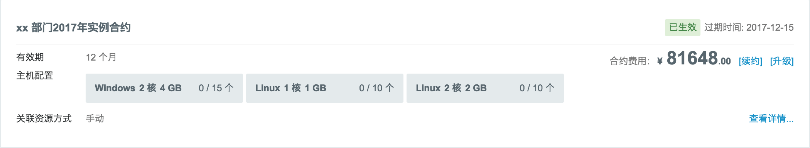
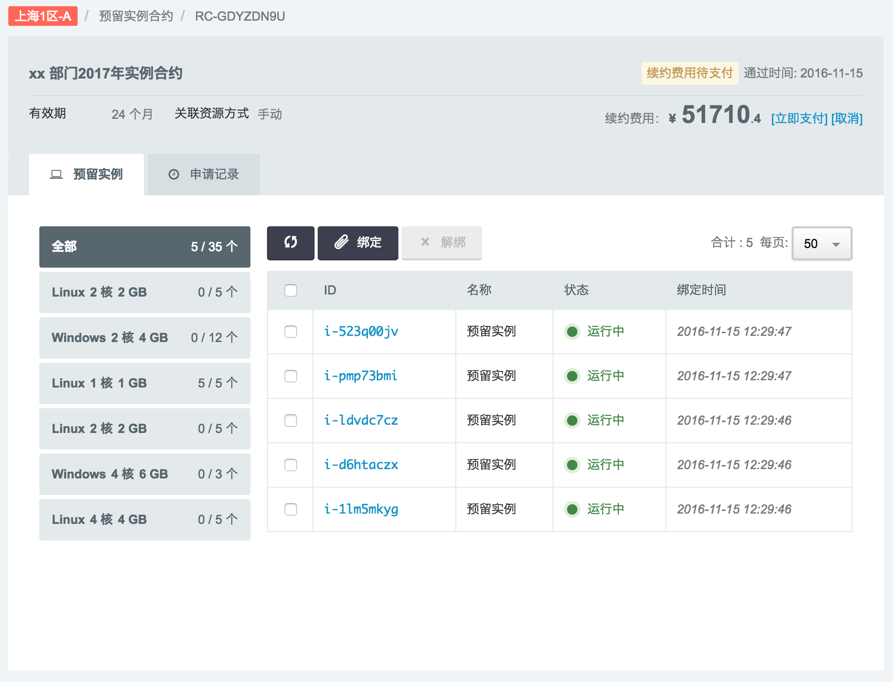
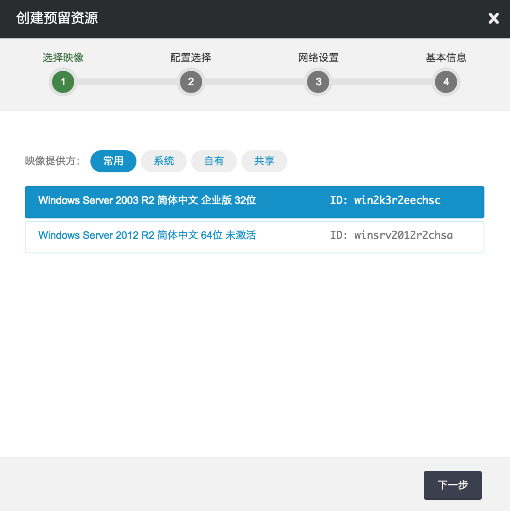

## 充值与计费

青云账号支持多种充值途径：支付宝、网上银行、微信支付、线下银行转账。 可在 [充值页面](https://console.qingcloud.com/account/wallet/recharge/)选择。微信支付目前只能在 Android 手机的青云 App 中操作。

如果需要发票，请到 [发票管理](https://www.qingcloud.com/account/invoices) 提出申请。

青云执行按用量收费原则，即，您只需要为您使用了的资源付费，并且计费是按秒进行的，并且不设最低消费指标。

您随时可以在 WEB 控制台中查询消费情况 [消费记录](https://console.qingcloud.com/consumptions/query/) 。

## 余额不足提醒

青云系统会定期检查用户余额和当时名下弹性计费资源的消费预估， 如果检查发现余额即将不足，会提前给用户发送通知。

通知策略是：分别在提前 15，7，3，2，1 天时发送提醒。 默认是发送给账号的注册手机号及通知邮箱，如果用户希望自定义接受者列表，可在 [账户信息](https://console.qingcloud.com/account/profile/notify_map/) 中修改“财务通知”对应的通知列表。

## 资源欠费

如果用户余额已不足，资源会被自动暂停，并保留5天时间。 在此期间内用户可随时充值来恢复资源。 如果欠费逾期仍未充值，则资源会被删除，删除的资源会在“回收站”保留2小时， 之后便会被彻底删除，无法再恢复。

所以请您留意系统通知，并及时予以充值，以免造成损失。感谢您的理解和配合。

## 预留资源计费模式

针对用户长期、稳定的 IT 需求，青云 QingCloud 全新推出『预留资源』计费模式， 目前此模式仅适用于主机、专属宿主机 (详情参看 [_专属宿主机_](dedicated_host.html#guide-dedicated-host) )，和关系型数据库，相对于按需付费可享有更优惠价格。

青云 QingCloud 支持『按需付费』与『预留资源』两种计费方式结合使用， 为用户提供更加全面和灵活的成本管理支持。我们建议企业用户对自身 IT 需求进行合理规划， 区分短期弹性需求和中长期稳定需求，精确配置相应投入，获得最优成本收益结构。

通过合理规划，灵活使用这两种计费模式可以大幅缩减 IT 支出。

*   短期弹性需求：按秒计费，灵活精准，避免浪费；
*   长期稳定需求：预留资源，价格更低，大幅降低 IT 成本。

本指南将详细介绍用户如何对名下主机资源启用『预留资源』计费模式。

### 预留合约

首先用户需要与青云QingCloud 签署一份“预留合约”，在申请合约时主要涉及以下几个概念：

**合约名称** 用户可以根据自己的规划来标注命名合约，比如：xx公司xx部门2017年第一季度预留资源合约。且可以随时对名称进行修改。

**适用区域** 每份合约只允许在一个区域使用，不可跨区使用。如果多个区域都有预留资源购买需求则每个区域需要各签署一份。

**有效期** 根据资源使用需求用户可以选择合约的有效期，目前支持的有效期有：1 个月、3 个月、6 个月、1 年、2 年、3 年、4 年、5 年，最高折扣率可达 70%。

**实例配置** 每份合约中可以指定1组或多组实例配置，配置中包括实例的平台、CPU 核数、内存大小、类型和数量。

**资源关联方式** 目前支持“手动关联”：用户在合约详情页面可以选择相应资源与合约进行关联，未来会考虑增加支持“自动关联”方式。

**费用** 根据用户选择的适用区域、有效期以及实例配置计算出合约费用。之后续约、升级甚至终止都会有相应费用。

合约生效之后用户便可以选择符合实例配置定义的资源与其进行绑定，绑定之后的实例（主机）其计算模式将从『按需付费』切换到『预留资源』。相反，解绑之后会再恢复到『按需付费』模式。

接下来将详细介绍合约从申请到过期的完整过程，以及各种申请的处理方式。

### 预留资源

与合约关联的实例被称为“预留资源”。合约生效期间用户可以手动将符合实例配置条件的资源进行绑定或解绑的操作。

绑定成功之后该实例将不再使用“按需计费”的模式，解绑成功之后则恢复“按需计费”。

另外，合约详情页面也支持直接创建相应配置的新实例（主机）并直接与合约绑定。

