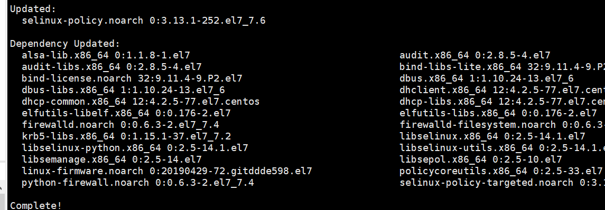
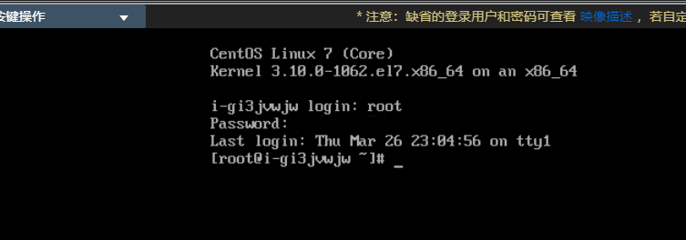
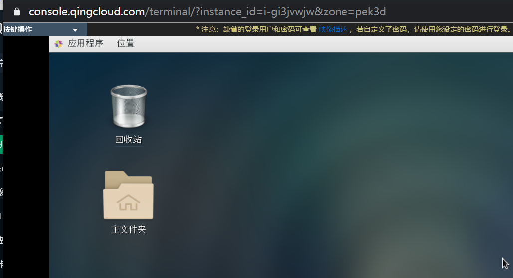
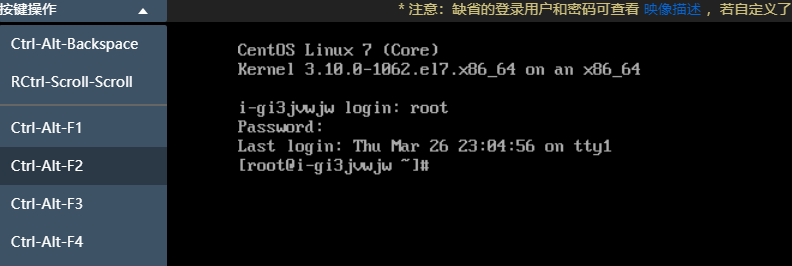

##  1、准备环境

  OS：CentOS 7.5 64 bit

  青云centos7镜像默认为最小化部署，需要自行安装图形化桌面

  本次示例为安装 GNOME 图形化

##  2、安装 xinit

 安装图形化界面前，需先安装X WINDOWS控制功能插件

```shell
 yum groupinstall "X Window System" 
```

##  3、安装GNOME登录器 

 登录管理器 gnome display manager,简称 gdm

```shell
yum groupinstall -y "GNOME Desktop"
```
 

##  4、启动图形化桌面

 从控制台vnc登入到云服务器内，命令输入inti 5 可进入图形化桌面

 

 

 vnc窗口按键操作中选择ctrl-alt-f2 可切换会命令行模式，选择ctrl-alt-f1 可再次切换回图形化桌面

 