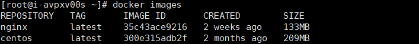

##  简介

本文介绍了如何在Linux云服务器实例中部署Docker，并提供了Docker常用操作命令及简单的镜像制作过程。
>本文档示例环境为CentOS7.9

## Docker相关术语
### Docker镜像
Docker 镜像是一个特殊的文件系统，除了提供容器运行时所需的程序、库、资源、配置等文件外，还包含了一些为运行时准备的一些配置参数（如匿名卷、环境变量、用户等）。镜像不包含任何动态数据，其内容在构建之后也不会被改变。
### Docker容器
镜像（Image）和容器（Container）的关系，就像是面向对象程序设计中的 类 和 实例 一样，镜像是静态的定义，容器是镜像运行时的实体。容器可以被创建、启动、停止、删除、暂停等。

容器的实质是进程，但与直接在宿主机执行的进程不同，容器进程运行于属于自己的独立的 命名空间。因此容器可以拥有自己的 root 文件系统、自己的网络配置、自己的进程空间，甚至自己的用户 ID 空间。容器内的进程是运行在一个隔离的环境里，使用起来，就好像是在一个独立于宿主的系统下操作一样。
### Docker仓库
镜像构建完成后，可以很容易的在当前宿主机上运行，但是，如果需要在其它服务器上使用这个镜像，我们就需要一个集中的存储、分发镜像的服务，Docker Registry 就是这样的服务。
一个 Docker Registry 中可以包含多个 仓库（Repository）；每个仓库可以包含多个 标签（Tag）；每个标签对应一个镜像。

注：更多关于镜像、容器、仓库的基础知识，请参见<a href="https://docs.docker.com/" target="_blank">Docker Documentation。</a>

## 部署Docker

Docker 支持 64 位版本 CentOS 7/8，并且要求内核版本不低于 3.10。 CentOS 7 满足最低内核的要求，但由于内核版本比较低，部分功能（如 `overlay2` 存储层驱动）无法使用，并且部分功能可能不太稳定。

### 1、添加yum源。

```shell
 yum install epel-release -y  #安装EPEL YUM源
```

### 2、安装yum-util。
```shell
yum install -y yum-utils device-mapper-persistent-data lvm2
```

### 3、设置docker yum源。
```
yum-config-manager --add-repo https://download.docker.com/linux/centos/docker-ce.repo
```

### 4、更新、安装并运行Docker。
```
1、yum makecache fast	#生成缓存
2、yum -y install docker-ce	#安装docker
3、systemctl enable docker	#设置开机自启
4、systemctl start docker	#启动docker服务
```
### 5、查看安装的docker版本

```
[root@i-avpxv00s ~]# docker --version
Docker version 20.10.5, build 55c4c88
```

## Docker基本用法

### 1、Docker进程管理

* 运行Docker
```
systemctl start docker
```
* 停止Docker
```
systemctl stop docker
```
* 重启Docker
```
systemctl restart docker
```
### 2、镜像管理

* 拉取镜像。此处以Nginx和CentOS官方镜像为例。
```
1、docker pull  nginx	#拉取nginx镜像
2、docker pull centos	#拉取centos镜像
```
* 查看已有镜像
```
docker images
```


* 强制删除镜像
```
docker rmi centos
```
### 3、Docker容器创建

* 创建一个容器并运行
```
docker run -it -d -p 80:80 --name nginx nginx	#使用镜像Nginx，以交互模式启动一个容器，将容器的80端口映射到云服务器的80端口，并返回容器ID。
```
启动参数说明如下：
-i：以交互模式运行容器，通常与-t同时使用。
-t：为容器重新分配一个伪输入终端，通常与-i同时使用。
-d：后台运行容器。
-p：端口映射，格式为“云服务器端口:容器端口”。
--name：为容器指定一个名称。
-v：把云服务器的一个目录挂载到容器里，格式为“云服务器目录:容器内挂载的路径”，必须为绝对路径。


* 查看容器启动情况
```
docker ps -a
```


* 测试容器服务是否正常运行


## Docker镜像制作

通过Dockerfile定制一个简单的Nginx镜像。

### 1、创建Dockerfile文件

```
1、mkdir test	#创建存放文件夹
2、cd test	#打开文件夹
3、touch Dockerfile	#创建Dockerfile空白文件
```

### 2、编辑Dockerfile
```
vim Dockerfile	#修改Dockerfile文件，添加以下内容

FROM nginx
RUN echo '<h1>QINGCLOUD</h1>' > /usr/share/nginx/html/index.html
```
>- FROM语句：表示使用nginx镜像作为基础镜像，一个Dockerfile中FROM是必备的指令，并且必须是第一条指令。
>- RUN语句：格式为RUN <命令>，表示执行echo命令，修改NGINX默认首页内容。

Dockerfile指令介绍如下。以下仅介绍简单指令，如需了解更多，请参见官方网站[https://hub.docker.com/](https://hub.docker.com/)

### 3、构建镜像
```
docker build -t nginx:v1 .	 #注意最后有一个点，代表当前目录
```

> -t nginx:v1：指定镜像的名称和版本。
.：指定上下文路径，镜像构建命令将该路径下所有的内容打包给Docker引擎帮助构建镜像。

### 4、查看部署的镜像
```
docker images
```


### 5、通过构建的镜像部署容器
```
docker run -it -d -p 80:80 --name nginx nginx:v1
```
* 在浏览器输入云服务器所绑定的弹性公网IP，访问测试容器运行情况。出现以下内容表示运行成功。
