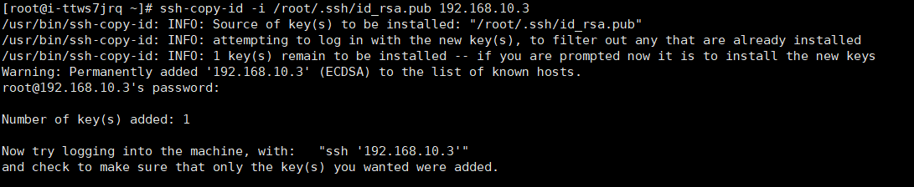

## 操作场景

通过配置Linux云服务器SSH互信可以实现云服务器间免密码登录

## 操作步骤

1、在客户端生成公钥、私钥对

> ssh-keygen -t rsa

一路默认回车，系统在/root/.ssh下生成id_rsa、id_rsa.pub

2、查看系统生成的公钥私钥对

> ls /root/.ssh

可以看到如下的文件

```
[root@i-ttws7jrq ~]# ls /root/.ssh
id_rsa  id_rsa.pub
```

3、将生成的公钥对id_rsa.pub发送到其它要连接的服务器上

> ssh-copy-id   -i   /root/.ssh/id_rsa.pub  192.168.10.3
>
>  注：命令可简单记忆为 ssh-copy-id  -i   公钥对文件   服务器ip地址




<p></p>

可以看到成功将公钥对发送到了其它服务器，更多服务器一样操作即可

4、现在可以测试连接其它服务器是否不需要密码登录

>登录其它服务器命令：ssh 192.168.10.3


<p></p>

显示连接成功