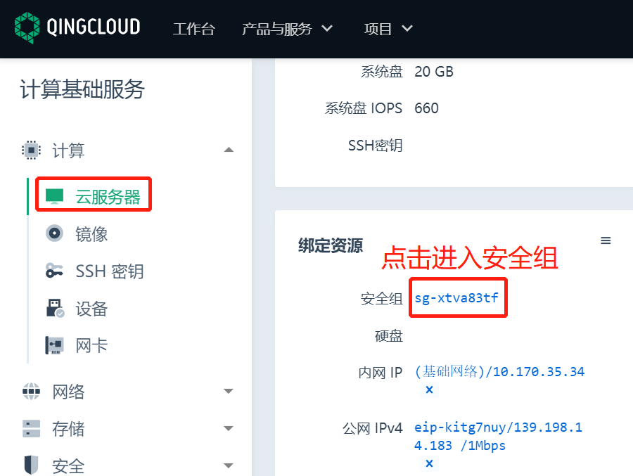
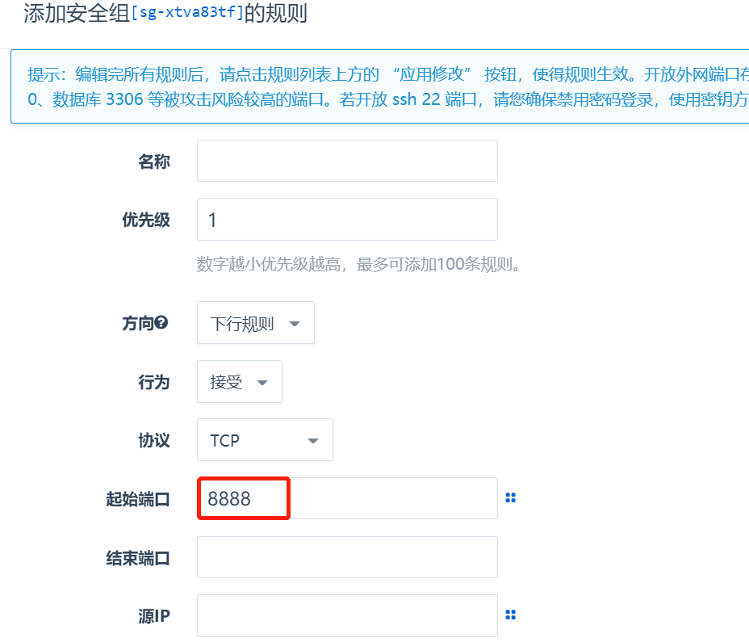
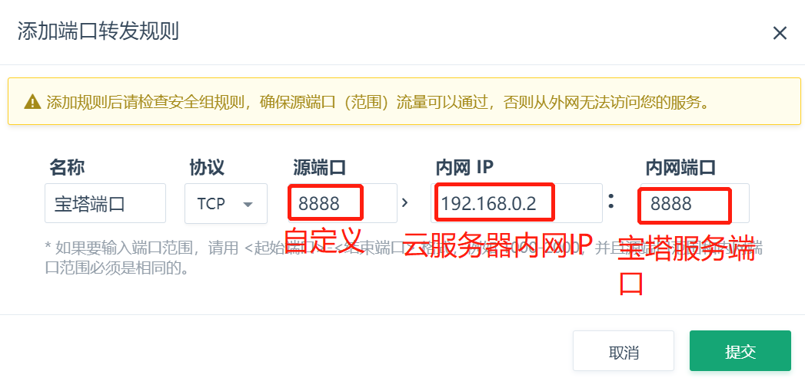
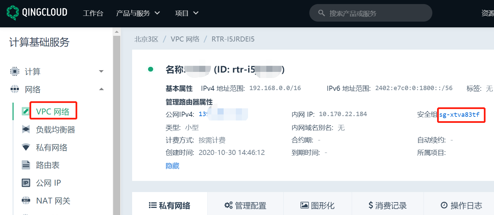
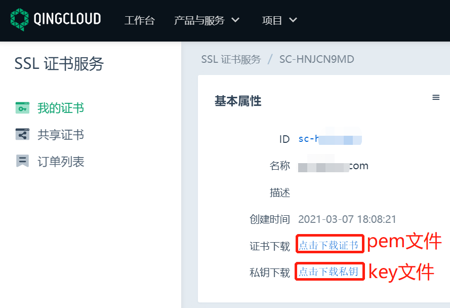
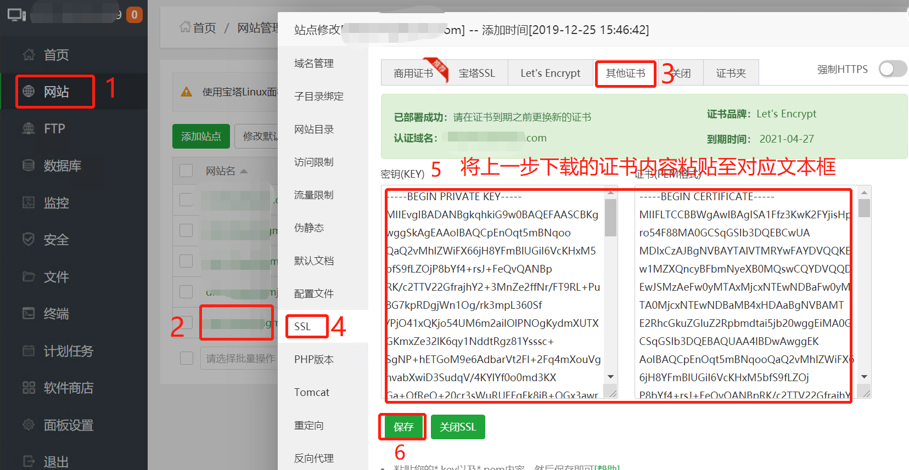
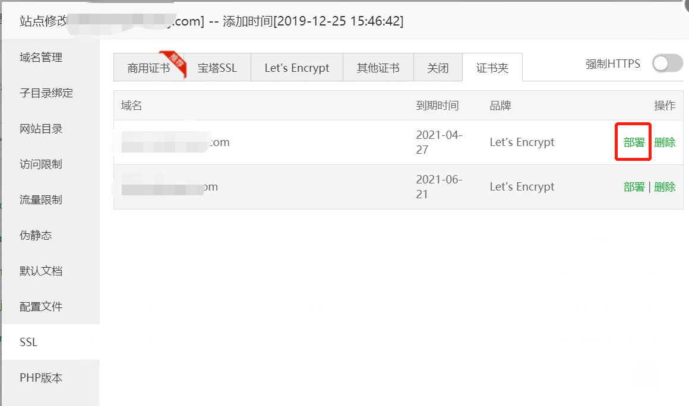
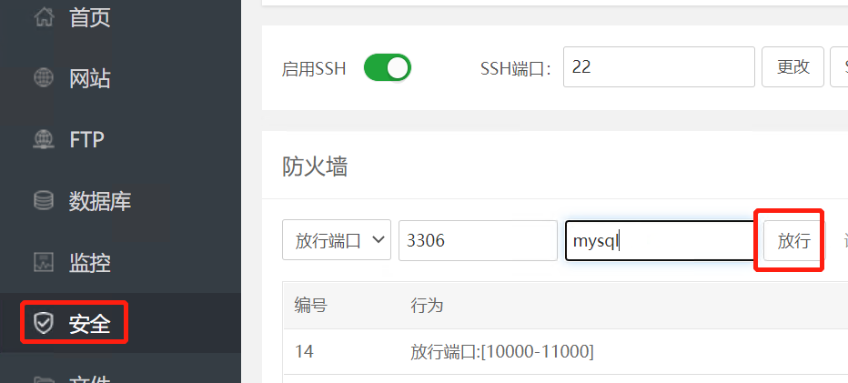

## 文档背景

此文档介绍用户如何在云服务器安装及使用宝塔面板

## 安装宝塔
### 前提条件  

1.  云服务器可以正常访问外网  
2. 云服务器操作系统及版本支持安装宝塔面板  
3. 云服务器8888端口未被占用

### 安装步骤
1、打开[宝塔官网](https://www.bt.cn/)  
2、找到云服务器对应系统的宝塔面板安装方式，根据官方提供的命令及方式安装。

## 使用宝塔

### 放行8888端口
宝塔面板安装完成后，默认使用8888端口，用户访问前，需要先放行该端口。以下为两种网络环境中放行端口规则介绍：

**1、云服务器使用基础网络，单独绑定了公网 IP**  
在**产品与服务** > **计算** > **云服务器**，点击云服务器id，进入后查看绑定资源中的安全组

点击安全组id进入后，添加8888端口的下行规则

**2、云服务器使用私有网络，通过VPC上绑定的公网IP进行访问**  
在**产品与服务** > **网络服务** > **VPC网络**，点击VPC名称进入VPC，在**管理配置** > **端口转发** > **添加规则**，添加宝塔端口的转发规则

修改VPC绑定的安全组，添加转发规则中的自定义端口的下行规则

### 宝塔面板使用青云平台证书
用户在青云平台申请了SSL证书（[申请SSL证书步骤](https://docsv3.qingcloud.com/security/ssl/manual/user_guide/)），需要在宝塔中部署的网站中使用

**1、下载已经签发的证书**  
下载下来后会有一个.pem和.key文件

**2、上传到宝塔面板**  
复制上一步下载的证书文件内容，粘贴到上传证书对应文本框。

**3、部署证书**  
点击部署，即会自动部署网站证书

### 宝塔面板端口放行
用户通过宝塔面板部署了应用程序，部署后已按照放行8888端口的方式在青云平台放行了服务端口，却仍然无法正常访问服务，此时需要检查宝塔面板上的防火墙是否放行该服务端口。  
