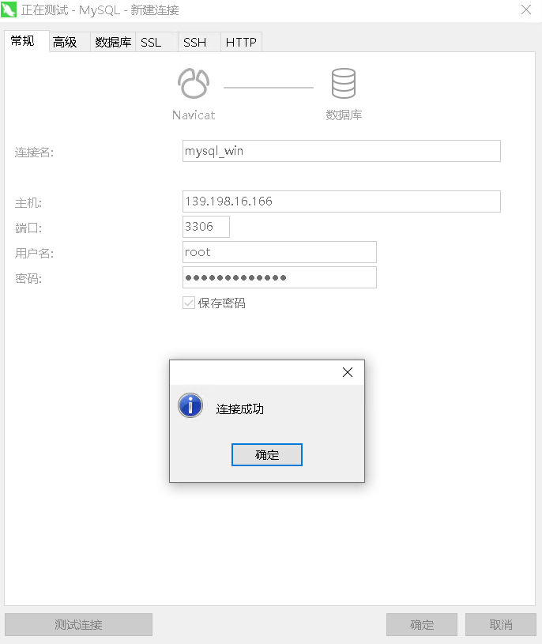

## 背景介绍

MySQL 是最流行的关系型数据库管理系统，在 WEB 应用方面 MySQL 是最好的 RDBMS(Relational Database Management System：关系数据库管理系统)应用软件之一。本文介绍了在不同系统的云服务器中安装配置MySQL。

## CentOS

### 1. 安装MySQL

使用yum安装。

```shell
yum -y install mysql-server
rpm -qa | grep mysql   #检查mysql是否安装成功
systemctl start mysqld.service  #查看mysql服务状态
```

### 2. 启动MySQL服务 

```shell
systemctl start mysqld.service #启动 mysql
systemctl restart mysqld.service #重启 mysql
systemctl stop mysqld.service #停止 mysql
systemctl enable mysqld.service #设置 mysql 开机启动
```

**MySQL常用文件路径：**

　　/etc/my.cnf 　　这是mysql的主配置文件

　　/var/lib/mysql 　　mysql数据库的数据库文件存放位置

　　/var/logs/mysql/mysqld.log　　数据库的日志输出存放位置

### 3. 本地登录MySQL

MySQL启动后，有默认密码，可以通过下述命令来获取默认密码。

```shell
grep "password" /var/log/mysql/mysqld.log
```

若无密码，直接执行命令后回车即可登录。

```shell
mysql -u root -p
```

### 4. 修改密码并开启远程访问

登录MySQL后，需要重置root用户密码，否则无法继续操作。

```mysql
mysql> ALTER USER 'root'@'localhost' IDENTIFIED BY 'QingCloud1234';
```

开启root用户远程访问。

```mysql
mysql> USE mysql;
mysql> UPDATE user SET host = '%' WHERE user = 'root' ;
mysql> FLUSH PRIVILEGES;
mysql> SELECT host,user FROM user;
```

### 5. 关闭主机内部防火墙

关闭主机防火墙，Active为dead即为关闭状态。

```shell
systemctl status firewalld.service   #查看防火墙状态
systemctl stop firewalld.service     #关闭防护墙
systemctl start firewalld.service    #打开防火墙
systemctl enable firewalld.service   #开启防火墙
systemctl disable firewalld.service  #禁用防火墙
```

### 6. 远程客户端连接测试

远程客户端连接，需要在主机绑定的安全组处添加相应的规则，添加之后点击上方的应用修改。点击主机id进入主机详情页，点击绑定资源的安全组，即可跳转至安全组。


点击添加规则，添加端口并提交后，点击应用修改。


通过云服务器绑定的公网ipv4进行连接，已正常连接。


## Ubuntu

### 1. 安装MySQL

使用apt-get命令安装，可以切换到root用户进行操作。在安装MySQL时，会弹出密码输入界面，输入两次密码即可。

```shell
apt-get update
apt-get install mysql-server
systemctl status mysql.service #查看mysql服务状态
```

### 2. 启动 MySQL 服务 

```shell
systemctl start mysql.service #启动 mysql
systemctl restart mysql.service #重启 mysql
systemctl stop mysql.service #停止 mysql
systemctl enable mysql.service #设置 mysql 开机启动
```

### 3. 设置服务监听地址

修改服务监听地址为0.0.0.0，后重启MySQL服务。

```shell
vi /etc/mysql/mysql.conf.d/mysqld.cnf
bind-address            = 0.0.0.0  #设置监听地址为0.0.0.0
systemctl restart mysql.service #重启 mysql
netstat -lntp | grep mysql  #查看监听地址为0.0.0.0
```


此时可以看到已经监听 0.0.0.0地址。


### 4. 本地登录MySQL

直接执行命令后回车即可登录。

```shell
mysql -u root -p
```

### 5. 开启远程访问

登录后开启远程访问。

```mysql
mysql> USE mysql;
mysql> UPDATE user SET host = '%' WHERE user = 'root' ;
mysql> FLUSH PRIVILEGES;
mysql> SELECT host,user FROM user;
```

### 6. 关闭主机内部防火墙ufw

关闭主机防火墙，Active为dead即为关闭状态

```shell
ufw status   #查看防火墙状态
ufw enable   #开启防火墙
ufw disable  #禁用防火墙
```

```shell
systemctl status iptables   #查看iptables状态
systemctl stop iptables     #关闭iptables
systemctl start iptables    #打开iptables
systemctl enable iptables   #开启iptables
systemctl disable iptables  #禁用iptables
```

### 7. 远程客户端连接测试

远程客户端连接，需要在主机绑定的安全组处添加相应的规则，添加之后点击上方的应用修改。点击主机id进入主机详情页，点击绑定资源的安全组，即可跳转至安全组。


点击添加规则，添加端口并提交后，点击应用修改。本地客户端连接，需要在主机绑定的安全组处添加相应的规则，添加之后点击上方的应用修改。


通过主机绑定的公网ipv4进行连接，已正常连接。


## Windows

### 1. 下载安装MySQL

进入官网找到所需的安装包：https://dev.mysql.com/  ，路径：MySQL Downloads --- MySQL Community Server--- Microsoft Windows，或者直接点击链接：https://dev.mysql.com/downloads/mysql/ 。


下载完成后，将zip包解压到相应目录，本文解压至 C:\mysql 下。


然后在C:\mysql\mysql-8.0.23-winx64目录下添加配置文件my.ini，输入以下信息，C:\mysql\data 需要提前创建。也可以自行添加所需的参数。

```ini
[mysqld]
basedir = C:\mysql\mysql-8.0.23-winx64  #mysql的安装目录
datadir = C:\mysql\data  #设置数据存放目录，也可以不设置
bind-address = 0.0.0.0  #设置监听地址为0.0.0.0
port = 3306  #设置端口为3306
```

执行win+R，打开运行，使用管理员权限打开cmd。


切换至bin目录下。

```shell
cd C:\mysql\mysql-8.0.23-winx64\bin
```
初始化数据库

```shell
mysqld --initialize --console
```

由于部分镜像未安装vc++运行库，导致无法初始化，可以通过这个链接([vc_redist.x64.exe](https://aka.ms/vs/16/release/vc_redist.x64.exe))下载x64的运行包，也可以在这个链接处自行下载 [最新支持的 Visual C++ 下载](https://support.microsoft.com/zh-cn/topic/%E6%9C%80%E6%96%B0%E6%94%AF%E6%8C%81%E7%9A%84-visual-c-%E4%B8%8B%E8%BD%BD-2647da03-1eea-4433-9aff-95f26a218cc0)。


此时已初始化成功，红框处为root用户的默认密码。

然后执行安装命令并启动。

```shell
mysqld --install
net start mysql
```

执行 netstat 命令可以看是否正常监听 0.0.0.0，下图为监听状态。

```shell
netstat -ano | findstr 3306
```


### 2. 本地登录MySQL

使用默认密码登陆MySQL。

```shell
mysql -u root -p
```


登录后需要重置密码，参考命令。

```mysql
mysql> ALTER USER 'root'@'localhost' IDENTIFIED BY 'QingCloud1234';
```

### 3. 开启远程访问

登录后开启远程访问。

```mysql
mysql> USE mysql;
mysql> UPDATE user SET host = '%' WHERE user = 'root' ;
mysql> FLUSH PRIVILEGES;
mysql> SELECT host,user FROM user;
```

### 4. 关闭主机内部防火墙

关闭防火墙，点击开始---服务器管理器---本地服务器---Windows Defender 防火墙，将防火墙关闭。


### 5. 远程客户端连接测试

远程客户端连接，需要在主机绑定的安全组处添加相应的规则，添加之后点击上方的应用修改。点击主机id进入主机详情页，点击绑定资源的安全组，即可跳转至安全组。


点击添加规则，添加端口并提交后，点击应用修改。


通过云服务器绑定的公网IPv4进行连接，已正常连接。

