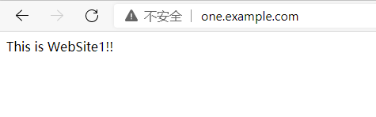

## 背景

用户在同一台云服务器上部署了多个站点，需要使用不同域名的80端口来访问不同的网站

## 准备事项

* 云服务器已安装好nginx服务
* 站点文件已上传到云服务器目录
* 不同域名已解析到云服务器IP

## 部署步骤
**1、检查/etc/nginx/nginx.conf <span style="color:red">（nginx默认配置文件路径，如果使用其他方式部署，对应部署的其他路径）</span>配置文件，确保文件中包含 include /etc/nginx/conf.d/*.conf;**

```nginx
user nginx;
worker_processes auto;
error_log /var/log/nginx/error.log;
pid /run/nginx.pid;

# Load dynamic modules. See /usr/share/doc/nginx/README.dynamic.
include /usr/share/nginx/modules/*.conf;

events {
    worker_connections 1024;
}

http {
    log_format  main  '$remote_addr - $remote_user [$time_local] "$request" '
                      '$status $body_bytes_sent "$http_referer" '
                      '"$http_user_agent" "$http_x_forwarded_for"';

    access_log  /var/log/nginx/access.log  main;

    sendfile            on;
    tcp_nopush          on;
    tcp_nodelay         on;
    keepalive_timeout   65;
    types_hash_max_size 2048;

    include             /etc/nginx/mime.types;
    default_type        application/octet-stream;

    # Load modular configuration files from the /etc/nginx/conf.d directory.
    # See http://nginx.org/en/docs/ngx_core_module.html#include
    # for more information.
    include /etc/nginx/conf.d/*.conf;  #nginx站点配置文件路径

    server {
        listen       80 default_server; #默认监听端口
        listen       [::]:80 default_server;
        server_name  _;
        root         /usr/share/nginx/html; #默认站点路径

        # Load configuration files for the default server block.
        include /etc/nginx/default.d/*.conf;

        location / {
        }

        error_page 404 /404.html;
        location = /404.html {
        }

        error_page 500 502 503 504 /50x.html;
        location = /50x.html {
        }
    }
}
```
**2、在目录/etc/nginx/conf.d下面新建website1.conf，website2.conf，文件名可自定义。监听端口都改为80端口并绑定不同的域名，root路径分别配置为不同的站点路径。
website1.conf文件内容：**

```nginx
server {
    listen       80;	#website1监听端口
    server_name  one.example.com;	#website1绑定域名
    root         /var/www/html/web1/;	#website1站点路径
    # Load configuration files for the default server block.

    location / {
        index index.php index.html index.htm;	#站点默认页面
        }
    error_page 404 /404.html;
        location = /40x.html {
    }
    error_page 500 502 503 504 /50x.html;
        location = /50x.html {
    }
}
```

**website2.conf文件内容：**
```nginx
server {
    listen       80;	#website2监听端口
    server_name  two.example.com;	#website2绑定域名
    root         /var/www/html/web2/;	#website2站点路径
    # Load configuration files for the default server block.

    location / {
        index index.php index.html index.htm;	#站点默认页面
        }
    error_page 404 /404.html;
        location = /40x.html {
    }
    error_page 500 502 503 504 /50x.html;
        location = /50x.html {
    }
}
```
**3、重启nginx服务，验证不同域名访问效果**


