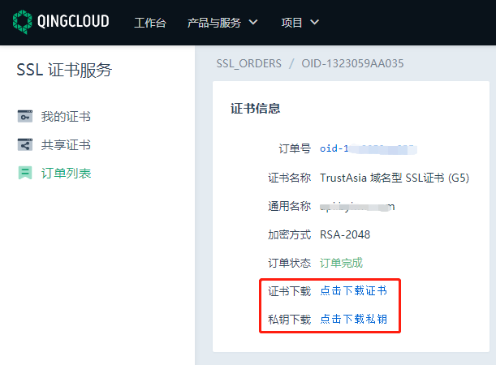
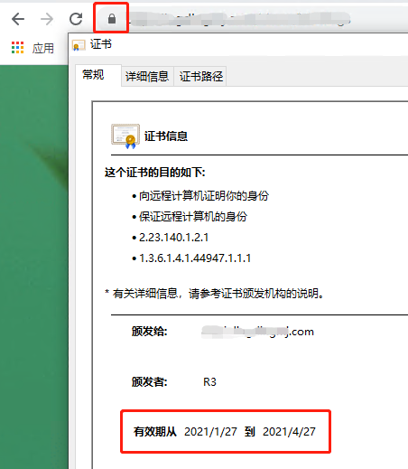

## 背景

由于http协议以明文方式发送请求，不提供任何方式的数据加密，因此不适合传输一些敏感信息，而https使用SSL/TLS来加密数据包，能很好的保护数据的隐私性和完整性，因此目前对网站安全性有要求的都会采用https协议来进行加密传输。

## 准备事项

* 云服务器已安装nginx
* 已经申请并签发了SSL证书，如没有证书，请[购买SSL证书](https://console.qingcloud.com/ssl_certificates)
* 申请SSL证书时绑定的域名已解析到服务器IP
* 站点文件已上传至云服务器目录

## 部署步骤

**1、查看nginx 是否安装了http_ssl_module 模块，执行/usr/sbin/nginx -V后返回的configure arguments包含--with-http_ssl_module则表示已经安装**

```shell
[root@i-3lioycgh ~]# /usr/sbin/nginx -V
nginx version: nginx/1.16.1
built by gcc 4.8.5 20150623 (Red Hat 4.8.5-44) (GCC) 
built with OpenSSL 1.1.1c FIPS  28 May 2019 (running with OpenSSL 1.1.1g FIPS  21 Apr 2020)
TLS SNI support enabled
configure arguments: --prefix=/usr/share/nginx --sbin-path=/usr/sbin/nginx --modules-path=/usr/lib64/nginx/modules --conf-path=/etc/nginx/nginx.conf --error-log-path=/var/log/nginx/error.log --http-log-path=/var/log/nginx/access.log --http-client-body-temp-path=/var/lib/nginx/tmp/client_body --http-proxy-temp-path=/var/lib/nginx/tmp/proxy --http-fastcgi-temp-path=/var/lib/nginx/tmp/fastcgi --http-uwsgi-temp-path=/var/lib/nginx/tmp/uwsgi --http-scgi-temp-path=/var/lib/nginx/tmp/scgi --pid-path=/run/nginx.pid --lock-path=/run/lock/subsys/nginx --user=nginx --group=nginx --with-file-aio --with-ipv6 --with-http_ssl_module --with-http_v2_module --with-http_realip_module --with-stream_ssl_preread_module --with-http_addition_module --with-http_xslt_module=dynamic --with-http_image_filter_module=dynamic --with-http_sub_module --with-http_dav_module --with-http_flv_module --with-http_mp4_module --with-http_gunzip_module --with-http_gzip_static_module --with-http_random_index_module --with-http_secure_link_module --with-http_degradation_module --with-http_slice_module --with-http_stub_status_module --with-http_perl_module=dynamic --with-http_auth_request_module --with-mail=dynamic --with-mail_ssl_module --with-pcre --with-pcre-jit --with-stream=dynamic --with-stream_ssl_module --with-google_perftools_module --with-debug --with-cc-opt='-O2 -g -pipe -Wall -Wp,-D_FORTIFY_SOURCE=2 -fexceptions -fstack-protector-strong --param=ssp-buffer-size=4 -grecord-gcc-switches -specs=/usr/lib/rpm/redhat/redhat-hardened-cc1 -m64 -mtune=generic' --with-ld-opt='-Wl,-z,relro -specs=/usr/lib/rpm/redhat/redhat-hardened-ld -Wl,-E'
```
**2、下载证书，并上传到云服务器上面（例目录/etc/nginx/cert）**


```
[root@i-3lioycgh cert]# pwd
/etc/nginx/cert
[root@i-3lioycgh cert]# ll
total 8
-rw-r--r-- 1 root root 1675 Mar  7 18:14 api.xxxxxx.com.key
-rw-r--r-- 1 root root 3729 Mar  7 18:14 api.xxxxxx.com.pem
```
**3、修改站点的conf配置文件，添加SSL相关配置**
```
server
{
    listen 80;
	listen 443 ssl http2;	#SSL监听端口
    server_name api.xxxxxx.com;	#绑定证书对应域名
    index index.php index.html index.htm default.php default.htm default.html;
    root /var/www/html/web;	#站点路径
    
    #SSL-START SSL相关配置
    #error_page 404/404.html;
    ssl_certificate    /etc/nginx/cert/api.xxxxxx.com.pem;	#pem证书路径
    ssl_certificate_key   /etc/nginx/cert/api.xxxxxx.com.key;	#key证书路径
    ssl_protocols TLSv1.1 TLSv1.2 TLSv1.3;	#SSL协议
    ssl_ciphers ECDHE-RSA-AES128-GCM-SHA256:HIGH:!aNULL:!MD5:!RC4:!DHE;
    ssl_prefer_server_ciphers on;
    ssl_session_cache shared:SSL:10m;
    ssl_session_timeout 10m;
    error_page 497  https://$host$request_uri;

    #SSL-END
    
    #ERROR-PAGE-START  错误页配置，可以注释、删除或修改
    #error_page 404 /404.html;
    #error_page 502 /502.html;
    #ERROR-PAGE-END
    
    #禁止访问的文件或目录
    location ~ ^/(\.user.ini|\.htaccess|\.git|\.svn|\.project|LICENSE|README.md)
    {
        return 404;
    }
    location /client-log-file {
             autoindex on;
    }
    
    location ~ .*\.(gif|jpg|jpeg|png|bmp|swf)$
    {
        expires      30d;
        error_log off;
        access_log /dev/null;
    }
    
    location ~ .*\.(js|css)?$
    {
        expires      12h;
        error_log off;
        access_log /dev/null; 
    }
    access_log  /www/wwwlogs/api.xxxxxx.com.log;
    error_log  /www/wwwlogs/api.xxxxxx.com.error.log;
}
```
**4、使用https访问域名进行验证，点击地址旁边的锁图标，可以查看当前页面使用的证书信息**

