SFTP工具可以用来打开一次安全互动的 FTP 会话。它与 FTP 相似，只不过，它使用安全、加密的连接。它的一般语法是：sftp username@hostname.com。一旦通过验证，你可以使用一组和使用 FTP 相似的命令。

### Ubuntu云服务器开启SFTP

#### 1.确认是否已经安装openssh-server

```
dpkg --get-selections |grep ssh
```

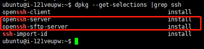

如果没有安装，请手动执行下面的指令进行安装

```
sudo apt-get install openssh-server
```

#### 2.新建用户组 sftp-users，并新建用户sftp

```
sudo addgroup sftp-users
sudo adduser sftp
```

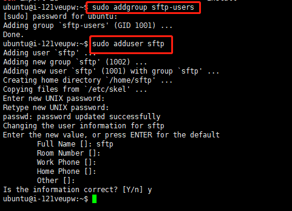

#### 3.给sftp赋权并新建用户组ssh-users

3.1将sftp从所有其他用户组中移除并加入到sftp-users组，并且关闭其Shell访问：

```
sudo usermod -G sftp-users -s /bin/false sftp
```

3.2创建SSH用户组，并把管理员加入到该组（注意usermod中的-a参数的意思是不从其他用户组用移除）。

```
sudo addgroup ssh-users
sudo usermod -a -G ssh-users root
```

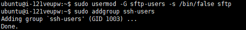

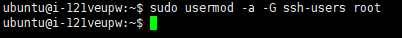

#### 4.创建并设置sftp用户目录

```
sudo mkdir /home/sftp_root
sudo mkdir /home/sftp_root/shared
sudo chown root:sftp-users /home/sftp_root/shared
sudo chmod 770 /home/sftp_root/shared
```

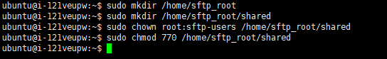

#### 5.修改SSH配置文件

```
sudo vi  /etc/ssh/sshd_config

在sshd_config文件的最后，添加以下内容：
AllowGroups ssh-users sftp-users
Match Group sftp-users
ChrootDirectory /home/sftp_root
AllowTcpForwarding no
X11Forwarding no
ForceCommand internal-sftp
```

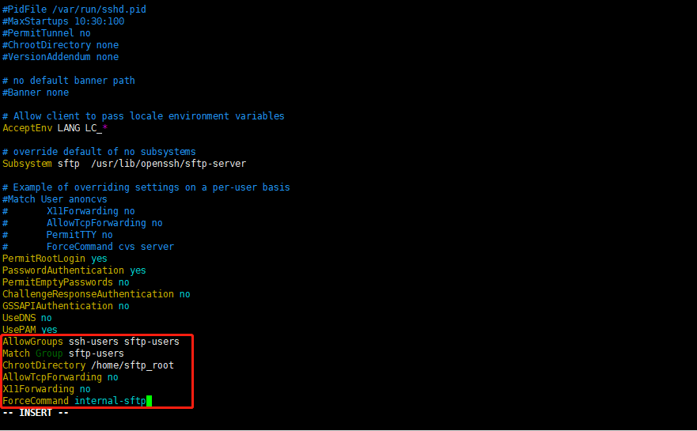

#### 6.重启系统使配置生效

```
sudo reboot now
```

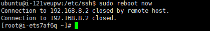

#### 7.验证

```
sftp sftp@192.168.8.2
```

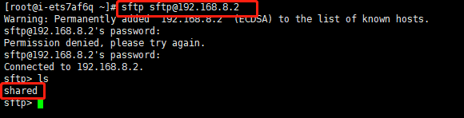

### CentOS云服务器开启SFTP

#### 1.创建用户组 sftp

```
groupadd sftp
```

#### 2.创建用户ftp文件目录

```
mkdir /home/sftp
```

#### 3.创建用户sftpuser

```
useradd -g sftp -s /sbin/nologin -d /home/sftp/sftpuser sftpuser
```

注解：-g 加入到sftp组；-s 禁止登录；-d 指定用户的登入目录

#### 4.设置密码

```
passwd sftpuser
```

#### 5.修改文件夹 属组

```
chown -R sftpuser:sftp /home/sftp/sftpuser
```

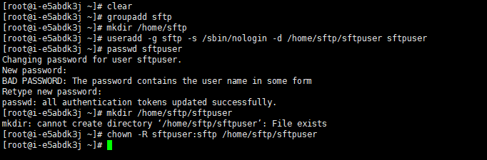

#### 6.修改SSH的配置文件

```
vi /etc/ssh/sshd_config

注释Subsystem原配置
#Subsystem sftp /usr/libexec/openssh/sftp-server

添加下面几列：
启用internal-sftp
限制用户SFTP访问的根目录
限制ftpuser1用户的根目录
Subsystem sftp internal-sftp
Match User ftpuser
ChrootDirectory /home/sftp
ForceCommand    internal-sftp
```

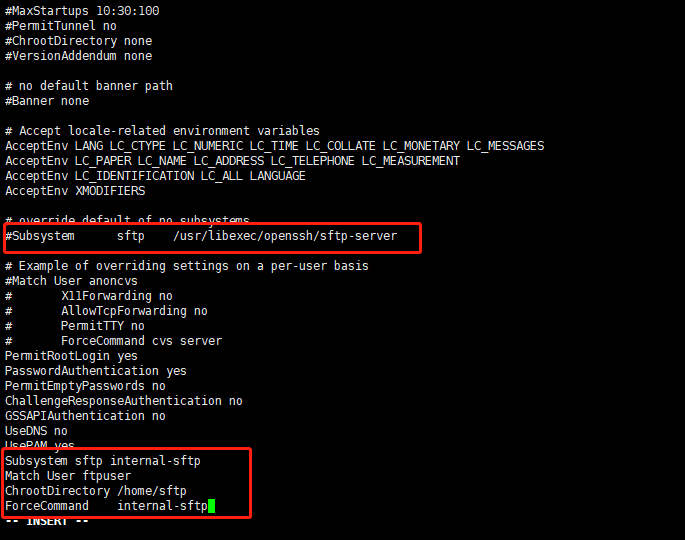

#### 7.重启sshd服务

```
systemctl restart sshd
```

#### 8.验证

```
sftp sftpuser@192.168.8.2
没有重启sshd时去连接sftpuser，会提示Received message too long 1416128883
```

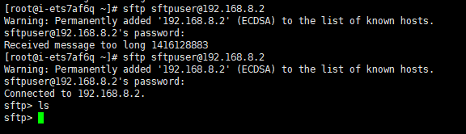