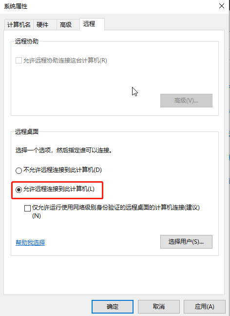
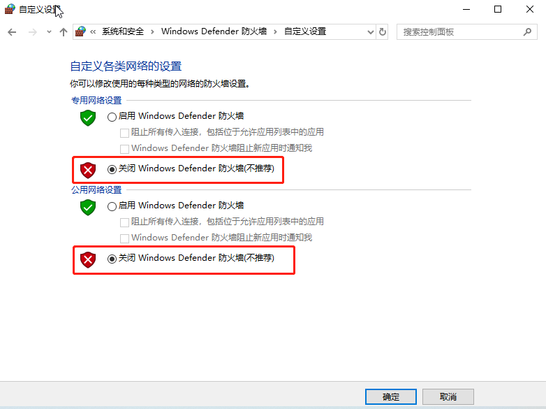
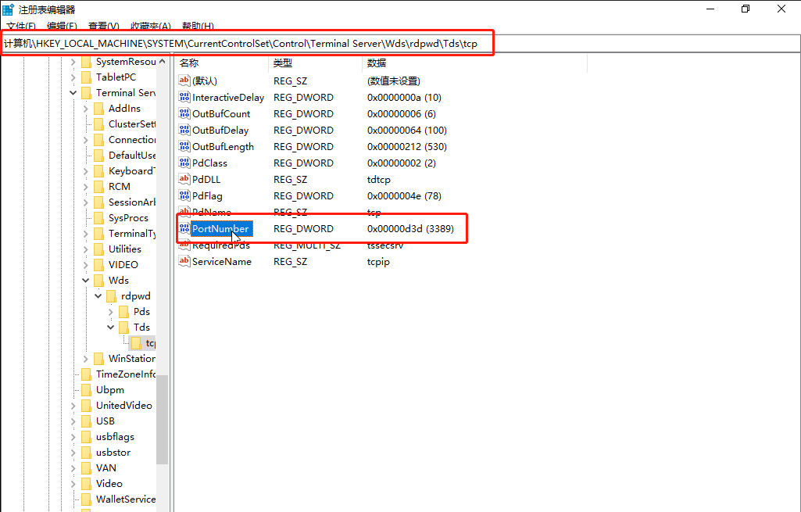

## 1.打开windows云服务器远程桌面，关闭系统自带防火墙

### 1.1打开windows云服务器远程桌面

开始-控制面板-系统和安全-系统-允许远程访问-勾选"允许远程连接到此计算机(L)"

### 1.2关闭系统自带防火墙

开始-控制面板-系统和安全-"Windows Defender 防火墙"-"启用或关闭Windows Defender 防火墙"-勾选"关闭关闭Windows Defender 防火墙(不推荐)"

## 2.修改注册表

2.1.开始-运行-regedit，打开注册表，进入以下注册表项“HKEY_LOCAL_MACHINE/SYSTEM/CurrentControlSet/Control/Terminal Server/Wds/rdpwd/Tds/tcp”，在右侧找到PortNamber，可以看见其默认值是3389，修改成所希望的端口(2000-65535间选择)即可。

2.2修改注册表项HKEY_LOCAL_MACHINE/SYSTEM/CurrentControlSet/Control/Terminal Server/WinStations/RDP-Tcp]，将PortNumber的值修改成其他端口，注意使用十进制。

## 3.重启云服务器

右键云服务器-重启

## 4.放行青云安全组的对应端口，并点击应用修改

安全-安全组-找到云服务器对应的安全组sg-xxxxxx，放行修改后的端口，并应用修改安全组

## 5.测试新端口的远程桌面ip:port