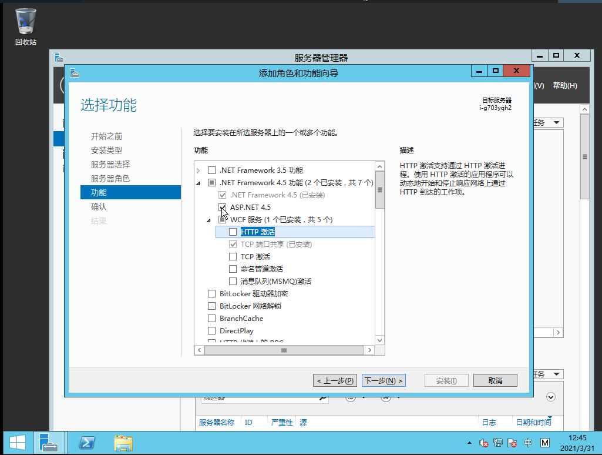
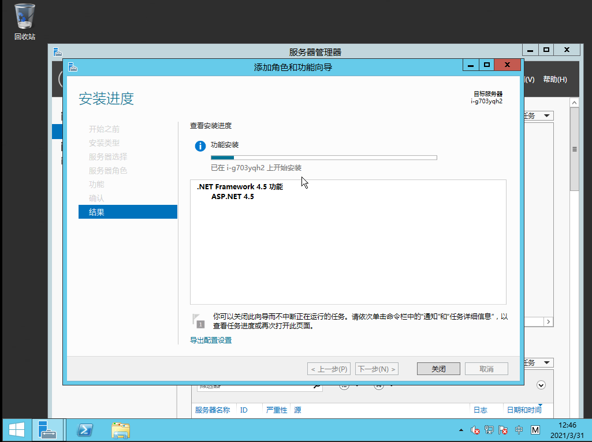
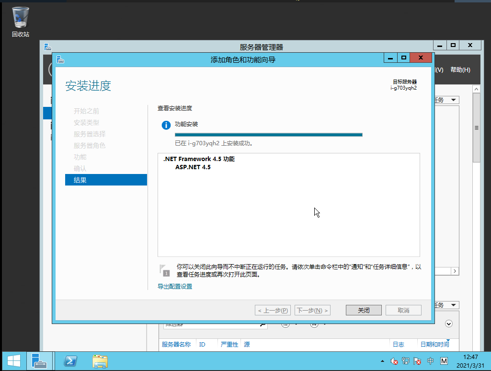

.NET Framework 4.5为轻松便捷的构架和运行应用程序提供了全面而一致的编程模型，这些应用程序可针对包括台式PC、服务器、智能手机以及公共云和专有云在内的各种不同平台而构造。

## 1 Windows  Server 2012安装.NET Framework 4.5

Windows Server 2012云服务器中，.NET Framework 4.5功能默认已经安装了2个功能，如下图

如果有需求安装ASP.NET 4.5，可以勾选ASP.NET 4.5复选框

选择下一步，再点击安装

安装成功，点击关闭

至此完成了.NET Framework 4.5-ASP.NET 4.5的安装。