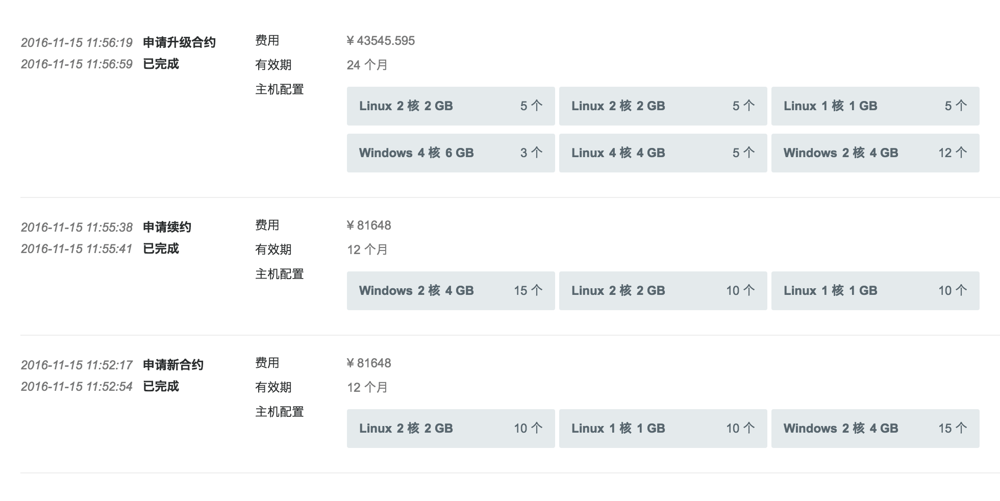
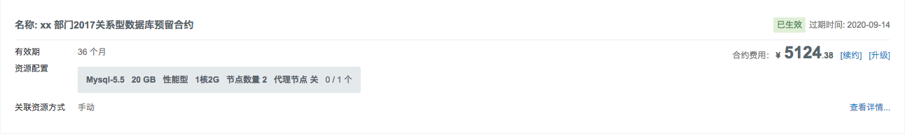
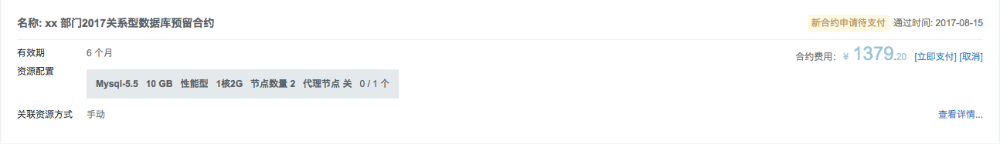
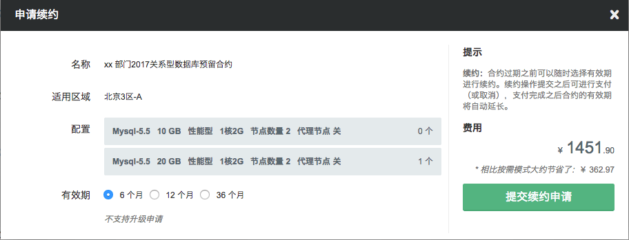
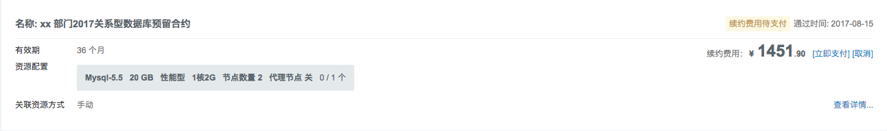
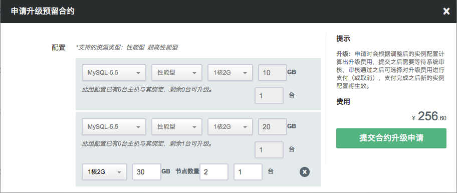
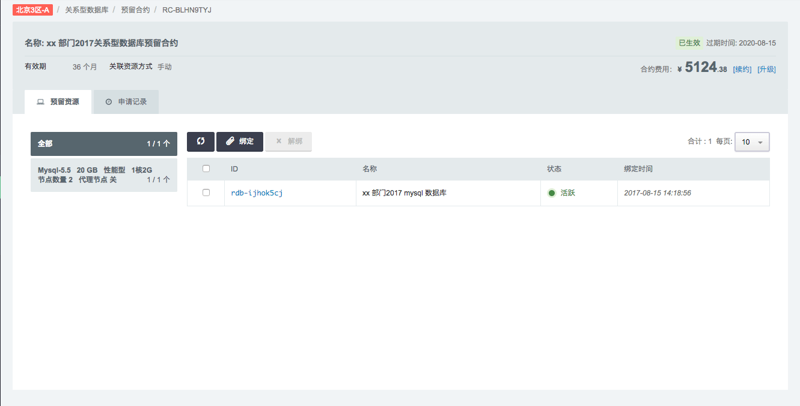
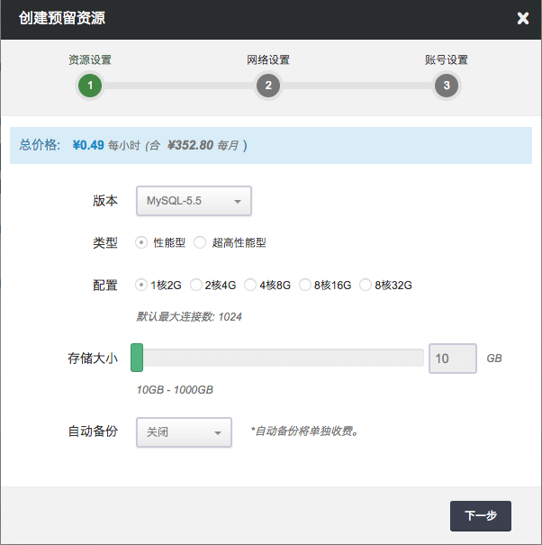
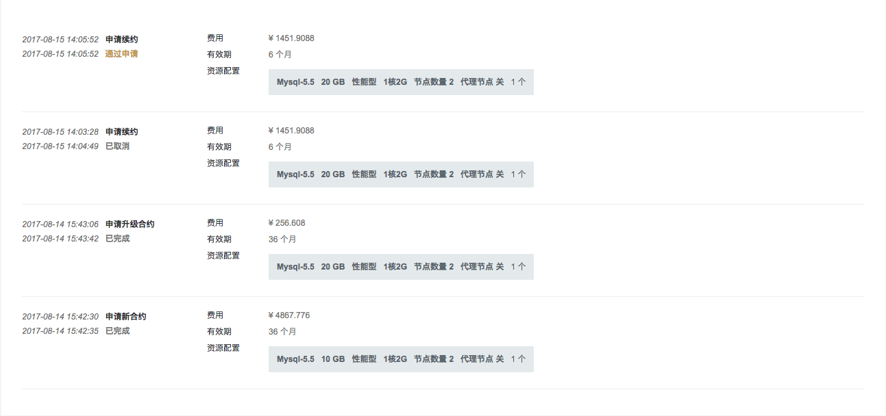

## 预留合约

与合约关联的实例被称为“预留合约”。合约生效期间用户可以手动将符合实例配置条件的资源进行绑定或解绑的操作。

绑定成功之后该实例将不再使用“弹性计费”的模式，解绑成功之后则恢复“弹性计费”。

另外，合约详情页面也支持直接创建相应配置的新实例（云服务器）并直接与合约绑定。

## 合约申请记录

每次合约的申请、支付、续约、取消、升级等操作都会有详细记录，此记录在合约详情页面可查。

## 关系型数据库

首先进入青云控制台，选择“北京3区”，点击“数据库与缓存”-“关系型数据库”-“预留合约”-“申请新合约”。

凡是通过了个人或企业认证的用户均可申请预留合约，申请时需要指定合约名称、有效期、关系型数据库配置等。

**生效合约**

**支付合约**

**续费合约** 合约到期之前用户可以随时对合约进行续费操作，每次续费时都可以选择不同有效期。

同样，续约操作提交之后用户可进行支付（或取消），支付完成之后合约的有效期将自动延长。

**升级合约**

>注解
目前只允许在关系型数据库总数量不变的情况下提高关系型数据库配置的升级申请。

**RDB 预留合约** 与合约关联的关系型数据库被称为“预留合约”。合约生效期间用户可以手动将符合关系型数据库配置条件的资源进行绑定或解绑的操作。

绑定成功之后该关系型数据库将不再使用“弹性计费”的模式，解绑成功之后则恢复“弹性计费”。

另外，合约详情页面也支持直接创建相应配置的新关系型数据库并直接与合约绑定。

**RDB 合约申请记录**

