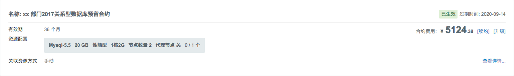
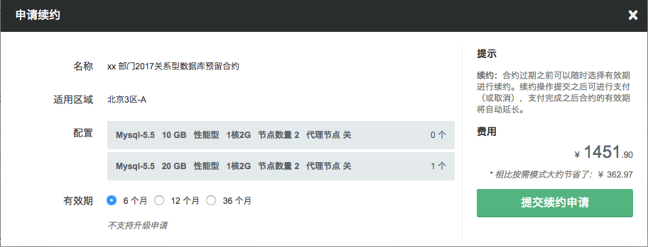
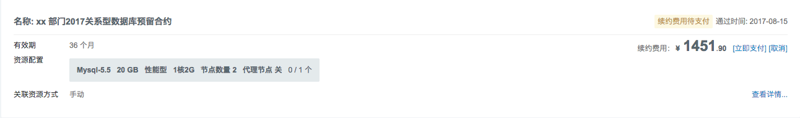

## 取消合约

当合约处于“待支付”或“已拒绝”的状态时用户都可以随时提交“取消”操作以放弃最新的一次申请。

## 终止合约

### 退订类型

（1）Open期合约30天无理由全额退订退款

（2）已生效合约非全额退订退款

（3）未生效续约期订单全额退订退款

### 退款限制

1、退订次数限制

（1）个人用户每年享有退订次数配额 2 次，企业用户每年享有退订次数配额 6 次，退订合约（包含退订续约期订单）次数超出配额上限，则不再支持合约退订。

> 说明：因用户自身原因，如误操作、合约规划失误等原因退订，默认消耗上述配额。

因产品功能等问题需要终止并退订合约，可提工单说明并申请附加配额，不会消耗账户内的默认配额数量。若为恶意退订等情况，青云有权驳回退订需求。

2、退订形式限制

以优惠券等形式购买的合约金额不予退回，未消耗的本金部分会以余额形式退还至用户账号内。

在平台活动期购买的合约，以活动合约退订规则为主。

3、退订账户限制

合约可退订配额为主账户/子账户共享配额，请谨慎、合理使用。

4、支持退订资源

云服务器预留合约、硬盘预留合约、专属宿云服务器组预留合约、包月包年制APP集群。

### 退订资金流向说明

以余额形式退还至用户账户内。

### 退订规则详述

#### Open 期合约退订规则说明

Open期（30天）内合约支持全额退款，并以余额形式退还至用户账号内。

#### 已生效合约退订规则说明

已生效合约，将按照以下计算公式算出退订合约费用，并退还至您的账户内。购买时若使用了优惠券，优惠券不予退还，会在退订费用计算公式中扣除。

##### 退订费用计算公式如下：

  `退订费用 = 原配置合约价格（含折扣） -优惠券抵扣 - 已使用的合约价格 `

- 若退订费用> 0，退还费用
- 若退订费用 <= 0，不予退还

##### 场景举例：

假定某配置的虚拟云服务器定价信息如下：

      弹性价格为：0.3 /小时               
      月单价为：100元             
      1个月折扣率95%  ，1年的折扣率为  80% ，2年的折扣率为  70%  ，3年的折扣率为  60%         

 场景1：用户A购买了一个36个月的预留合约，购买时未使用优惠券，使用1年7个月10天之后，退订。 

*原配置合约价格（含折扣）*= 36&times; 100&times; 60%=`2160`；                     

*已使用合约价格*  = 100 &times; （月价-不含折扣）&times; 19（月份数）&times; 80% （已使用月份数向下折扣系数）+ 24 &times; 10（不足一个月的按需的小时数）&times; 0.3 （按需每小时的单价）= `1592`

*退订费用* =  `2160 `**（原配置合约价格：含折扣）**-  `1592 `**（已使用的合约价格）**= `568`  >0

那么我们场景1下退费为`568`

 场景2：用户B购买了1个月的预留合约，购买时使用了 `2 `元优惠券，使用20天之后，退订。

*原配置价格（含折扣）*=100&times; 95%= `95 `

*已使用合约价格* = 24&times; 20（不足一个月的按需的小时数）&times; 0.3（按需每小时的单价）= `144 `

*退订费用*   =    `95 `**（原配置价格：含折扣）**- `2 `**（优惠券金额）**-  `144 `**（已使用的合约价格）**  < 0 

那么我们场景2的下退费为 `0 `

##### 公式说明：

     `已使用的合约价格 `=原配置对应的优惠月价格 &times; 已使用月份 &times;  已使用月份数向下折扣系数 + 已使用且不满一个月的弹性价格

（已使用的合约价格部分，已满整月的，按已使用整月的部分按上述方式计算；不满整月的，按已使用时长的按量计费价格进行扣除。）

若在合约配置A在使用期间因二次操作，如迁移、变更配置 等，导致合约变为配置B，则「已使用合约价格」部分的计算方式为：

     `已使用的合约价格 ` = 配置 A月单价  &times; 使用时间  +  配置 B月单价  &times;  使用时间 (不享受折扣)  + 已使用且不满一个月的弹性价格

### 用户退订流程

1、用户可先在云平台总览页面查看 【合约退订配额】次数是否充足

2、若配额充足，可自行在需要退订的合约详情页面内，点击【退订合约】按钮进行退订，并确认可退还金额数。确认无误后，系统将自动返还退订金额

## 预留合约

与合约关联的实例被称为“预留合约”。合约生效期间用户可以手动将符合实例配置条件的资源进行绑定或解绑的操作。

绑定成功之后该实例将不再使用“弹性计费”的模式，解绑成功之后则恢复“弹性计费”。

另外，合约详情页面也支持直接创建相应配置的新实例（云服务器）并直接与合约绑定。

## 合约申请记录

每次合约的申请、支付、续约、取消、升级等操作都会有详细记录，此记录在合约详情页面可查。

## 关系型数据库

首先进入青云控制台，选择“北京3区”，点击“数据库与缓存”-“关系型数据库”-“预留合约”-“申请新合约”。

凡是通过了个人或企业认证的用户均可申请预留合约，申请时需要指定合约名称、有效期、关系型数据库配置等。

**生效合约**

**支付合约**

**续费合约** 合约到期之前用户可以随时对合约进行续费操作，每次续费时都可以选择不同有效期。

同样，续约操作提交之后用户可进行支付（或取消），支付完成之后合约的有效期将自动延长。

**升级合约**

>注解
目前只允许在关系型数据库总数量不变的情况下提高关系型数据库配置的升级申请。

**RDB 预留合约** 与合约关联的关系型数据库被称为“预留合约”。合约生效期间用户可以手动将符合关系型数据库配置条件的资源进行绑定或解绑的操作。

绑定成功之后该关系型数据库将不再使用“弹性计费”的模式，解绑成功之后则恢复“弹性计费”。

另外，合约详情页面也支持直接创建相应配置的新关系型数据库并直接与合约绑定。

**RDB 合约申请记录**

