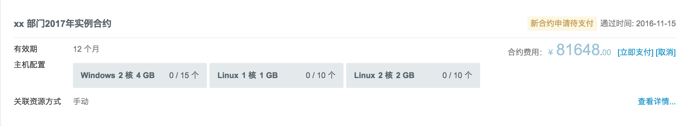
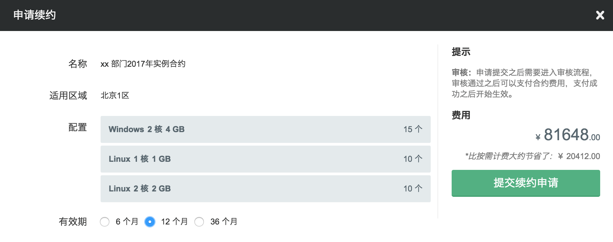
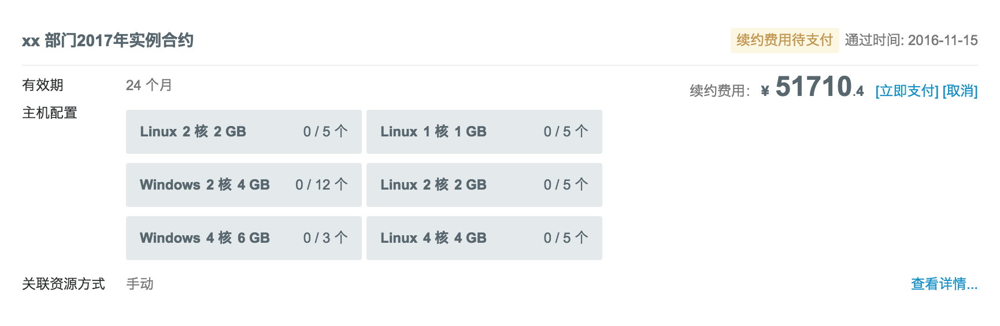
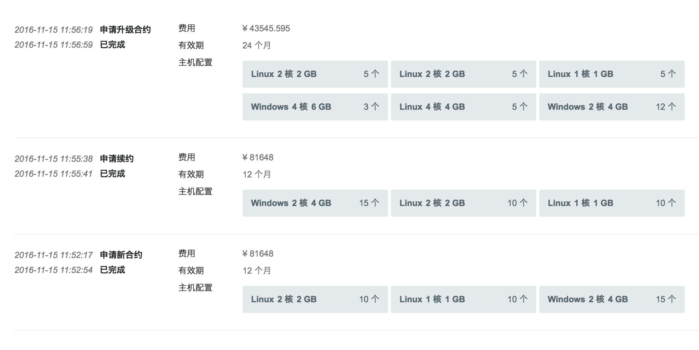
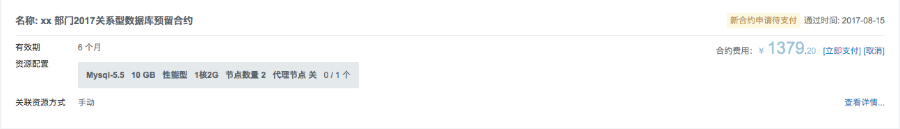
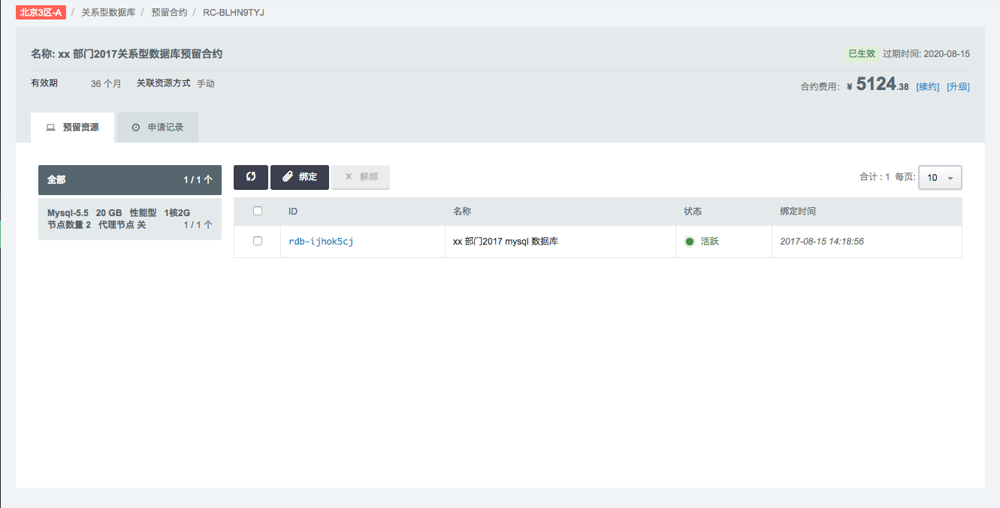
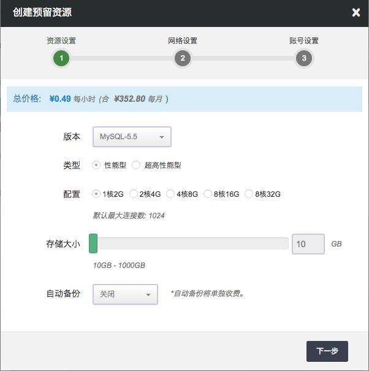

## 总览

针对用户长期、稳定的 IT 需求，青云 QingCloud 全新推出『预留合约』计费模式， 目前此模式仅适用于云服务器、专属宿云服务器，和关系型数据库，相对于弹性付费可享有更优惠价格。

青云 QingCloud 支持『弹性付费』与『预留合约』两种计费方式结合使用， 为用户提供更加全面和灵活的成本管理支持。我们建议企业用户对自身 IT 需求进行合理规划， 区分短期弹性需求和中长期稳定需求，精确配置相应投入，获得最优成本收益结构。

通过合理规划，灵活使用这两种计费模式可以大幅缩减 IT 支出。

*   短期弹性需求：按秒计费，灵活精准，避免浪费；
*   长期稳定需求：预留资源，价格更低，大幅降低 IT 成本。

### 合约功能特性介绍

*  **预留合约灵活绑定**

预留合约创建成功后，可为其绑定配置一致的实例，绑定实例后合约即进入计费期。在合约计费期内，也可以随时解绑资源实例并绑定其他匹配的实例，从而可实现同一合约可灵活绑定不同实例的业务需求。

* **多种有效期和折扣优惠**

合约享有大幅的优惠折扣，有效期越长，可享有的折扣力度就越大。

* **合约生命周期可视化**

在每个合约的详情页内，可以看到该合约的生命周期时间轴。用户可在时间轴上清晰地了解到合约当前所处的具体位置，以及后续剩余的合约时长，保证用户对合约的全局感知。

* **合约跨区迁移**

同一个合约在解绑资源后，可支持迁移至其他区继续使用。不仅从资源绑定层面实现随时变更，也从合约使用区域层面上支持灵活迁移。

* **续约形式多样**

目前合约续约支持手动续约和自动续约两种方式。开启自动续约功能，平台可在合约到期前自动为其进行续约操作；进行手动续约操作并完成支付后，在合约到期前也会同步续约合约期限。

* **升级合约配置**

在合约配置不满足业务需求的情况下，合约可支持升级配置、新增合约数量的操作。

本指南将详细介绍用户如何对名下云服务器资源启用『预留合约』计费模式。

## 预留合约

首先用户需要与青云QingCloud 签署一份“预留合约”，在申请合约时主要涉及以下几个概念：

**合约名称** 用户可以根据自己的规划来标注命名合约，比如：xx公司xx部门2019年第一季度预留合约。且可以随时对名称进行修改。

**适用区域** 合约可支持在指定的区域内灵活跨区使用。

**Open期** 合约支付完成之后的一个月为合约 Open 期。在 Open 期内，当发生资源与合约的绑定，则合约立即开始计时生效；如果 Open 期内没有发生资源绑定，则在 Open 期满时，合约自动开始计时生效。

**有效期** 根据资源使用需求用户可以选择合约的有效期，目前支持的有效期有：1 个月、3 个月、6 个月、1 年、2 年、3 年、4 年、5 年，最高折扣率可达 48 %。

**实例配置** 每份合约中可以指定1组或多组实例配置，配置中包括实例的平台、CPU 核数、内存大小、类型和数量。

**资源关联方式** 目前支持“手动关联”：用户在合约详情页面可以选择相应资源与合约进行关联，未来会增加支持“自动关联”方式。

**费用** 根据用户选择的适用区域、有效期以及实例配置计算出合约费用。之后续约、升级、迁移等都会有相应费用。

合约生效之后用户便可以选择符合实例配置定义的资源与其进行绑定，绑定之后的实例（云服务器）其计算模式将从『弹性付费』切换到『预留合约』。相反，解绑之后会再恢复到『弹性付费』模式。

接下来将详细介绍合约从申请到过期的完整过程，以及各种申请的处理方式。

### 合约类型介绍

在云平台【预留合约】管理页面内，将预留合约分为待支付、未生效、已生效、已失效四种类型。云平台会根据合约当前所处的类型自动为其划分类别，方便用户更加直观地管理账户内的各类合约，如下图：

下面对这几种类型进行介绍：

1、待支付：新合约在创建完成后，或对已有合约进行升级、迁移等操作后，会产生一笔合约订单需要用户支付，支付成功后合约才会正式生效。在未支付前，合约会统一集中在【待支付】Tab页面里。建议用户尽快完成此页面内的合约支付。

2、未生效：对于新创建的空合约，在完成支付后合约会进入 Open期，在这期间合约不进入计费周期，页面会显示计费倒计时的时间。只要绑定了资源实例合约会自动开始计费，即开始消耗创建合约支付的合约金。

3、已生效：完成支付并完成资源实例绑定后，合约正式进入计费状态，即进入【已生效】合约页面内。用户可根据实际业务需求创建多种模式的合约，若存在合约内配置实例数量未绑定完全的情况，会在合约数量上标红提示，请尽快对这类合约进行资源实例的绑定。

4、已失效：到期且未及时续约的合约会成为失效合约，统一显示在【已失效】合约页面内，这部分合约支持合约的重启使用，即点击「重启合约」即可创建出配置规格、合约时长与原合约一致的新合约。

接下来将详细介绍合约从申请到过期的完整过程，以及各种申请的处理方式。

## 申请合约

>注解
以云服务器为例，专属宿主云服务器和关系型数据库在申请，支付，续费，升级，取消，终止，绑定资源上类似。

首先进入[QingCloud 管理控制台](https://console.qingcloud.com/login)，选择**北京 3 区**，选择**计算** > **云服务器** > **预留合约** > **申请新合约**。

凡是通过了个人或企业认证的用户均可申请预留合约，申请时需要指定合约名称、有效期、实例配置等。

若资源需求量不大则直接进入“新合约待支付”状态。若需求量比较大则需要等待管理员进行审核。 审核通过后可继续支付，审核不通过则需要用户重新提交合约申请。

## 支付合约

新合约申请提交之后需要用户对合约费用进行支付（或取消），支付完成之后合约将正式生效。支付需在审核通过之后的一个月之内完成，逾期合约则自动作废。

>注解
确认支付后将一次性从用户账户上扣除预留合约费用，所以请保证剩余金额不会影响其他资源的使用。 预留合约只能使用账号余额，不支持优惠券购买。

## 续费合约

合约到期之前用户可以随时对合约进行续费操作，每次续费时都可以选择不同有效期。

同样，续约操作提交之后用户可进行支付（或取消），支付完成之后合约的有效期将自动延长。

>注解
若没有及时续约，合约过期之后与其关联的实例将自动恢复为“弹性计费”的模式。 预留合约仅可整单续约，无法单独对合约内某个/某几个实例提出续约申请。 如有此类需求，建议在合约期满时，重新申请新合约。

## 调整配置

当合约中的实例配置需要升级或降配时用户可以提交调整配置申请。

> 注：调整配置前请按照页面提示解绑资源实例。

以下分别从调整配置次数、调整配置费用、策略适用范围等方面进行介绍。

### (1) 调整配置次数

不限制用户的合约调整配置次数。

### (2) 调整配置费用

#### 升级

对于单月级别以上的预留合约：

> 升级费用 = （新配置月价格-旧配置月价格）&times; 升配后剩余时间 &times;  所剩余时间最靠近（向下靠近）的预留折扣率。

例：若云服务器合约时长：6 个月，1 年，2 年；分别对应折扣：90 折， 80 折， 60 折。

用户购买 A 配置云服务器 2 年，使用完 8 个月后，想升级到 B 配置。

这时产生的调整配置费用为：（ B 配置月价格 — A 配置月价格 ）&times; (24 — 8) &times;  80%；

对于一个月的预留合约：

> 升级费用 = ( 新配置月价格 — 旧配置月价格 ）&times; 剩余天数 / 全部天数

例：用户购买 A 配置云服务器 1 个月（31 天），使用完 10 天后，需要升级到 B 配置。

这时产生的调整配置费用为：

>（B 配置月价格 — A 配置月价格 ）&times;  (31 — 10) / 31；

#### 降配

- 降配价格规则

与现有升级方式区别，但前一步需要根据变更配置的单价差 判断是否是降配操作：

1、先计算可退款金额，再进行降配后价格的扣除；

2、降配费用  > 0， 退还费用 ; 降配费用  < 0， 不退还，不补价

- 说明

> - 降配退款金额 = 原配置退订费用 — 新配置新购费用
> - 原配置退订费用 = 原配置合约价格（含折扣） — 优惠券抵扣 —  已使用的合约价格
> - 已使用的合约价格 = 原配置对应的优惠月价格 &times; 已使用月份 &times; 已使用月份数向下折扣系数

（已使用的合约价格部分，已满整月的，按已使用整月的部分按上述方式计算；不满整月的，按已使用时长的按   量计费价格进行扣除。）

> - 新配置新购费用 = 新配置对应的优惠月价格  &times; 剩余月份数 &times; 剩余月份数向下折扣系数

  若购买时使用优惠券，优惠券不予退还。

###  (3) 策略适用范围

- 硬盘类型合约

允许新类型硬盘 (基础型， 企业型) 间互相转换，

老类型 (性能型， 超高性能型) 间互转，

允许硬盘大小降低 (硬盘步长大小必须在允许的范围内)

NeonSAN 容量盘保持原有规则，不允许修改硬盘类型

允许老类型 (性能型， 超高性能型) 转成 新类型 (基础型， 企业型)

- 云服务器类型合约

允许基础型， 企业型， GPU 云服务器等新类型互相转换，

允许老类型 (性能型， 超高性能型) 间互转，

允许系统盘大小降低 (必须大于系统允许的最小大小)

允许老类型 (性能型，超高性能型) 转成新类型 (基础型， 企业型， 专业增强型，GPU 云服务器等)

> 注： 目前允许在实例总数量不变或者减少的情况下调整配置的申请。如果需要增加或者减少数量，可以通过调整数量来实现。

## 取消合约

当合约处于“待支付”或“已拒绝”的状态时用户都可以随时提交“取消”操作以放弃最新的一次申请。

## 终止合约

### 一、退订类型

（1）Open期合约30天无理由全额退订退款

（2）已生效合约非全额退订退款

（3）未生效续约期订单全额退订退款

### 二、退款限制

1、退订次数限制

（1）个人用户每年享有退订次数配额 2 次，企业用户每年享有退订次数配额 6 次，退订合约（包含退订续约期订单）次数超出配额上限，则不再支持合约退订。

> 注：因用户自身原因，如误操作、合约规划失误等原因退订，默认消耗上述配额。

因产品功能等问题需要终止并退订合约，可提工单说明并申请附加配额，不会消耗账户内的默认配额数量。若为恶意退订等情况，青云有权驳回退订需求。

2、退订形式限制

以优惠券等形式购买的合约金额不予退回，未消耗的本金部分会以余额形式退还至用户账号内。

在平台活动期购买的合约，以活动合约退订规则为主。

3、退订账户限制

合约可退订配额为主账户/子账户共享配额，请谨慎、合理使用。

4、支持退订资源

云服务器预留合约、硬盘预留合约、专属宿云服务器组预留合约、包月包年制APP集群。

### 三、退订资金流向说明

以余额形式退还至用户账户内。

### 四、退订规则详述

#### 1、Open 期合约退订规则说明

Open期（30天）内合约支持全额退款，并以余额形式退还至用户账号内。

#### 2、已生效合约退订规则说明

已生效合约，将按照以下计算公式算出退订合约费用，并退还至您的账户内。购买时若使用了优惠券，优惠券不予退还，会在退订费用计算公式中扣除。

##### 退订费用计算公式如下：

  `退订费用 = 原配置合约价格（含折扣） -优惠券抵扣 - 已使用的合约价格 `

- 若退订费用> 0，退还费用
- 若退订费用 <= 0，不予退还

##### 场景举例：

假定某配置的虚拟云服务器定价信息如下：

      弹性价格为：0.3 /小时               
      月单价为：100元             
      1个月折扣率95%  ，1年的折扣率为  80% ，2年的折扣率为  70%  ，3年的折扣率为  60%         

 场景1：用户A购买了一个36个月的预留合约，购买时未使用优惠券，使用1年7个月10天之后，退订。 

*原配置合约价格（含折扣）*= 36&times; 100&times; 60%=`2160`；                     

*已使用合约价格*  = 100 &times; （月价-不含折扣）&times; 19（月份数）&times; 80% （已使用月份数向下折扣系数）+ 24 &times; 10（不足一个月的按需的小时数）&times; 0.3 （按需每小时的单价）= `1592`

*退订费用* =  `2160 `**（原配置合约价格：含折扣）**-  `1592 `**（已使用的合约价格）**= `568`  >0

那么我们场景1下退费为`568`

 场景2：用户B购买了1个月的预留合约，购买时使用了 `2 `元优惠券，使用20天之后，退订。

*原配置价格（含折扣）*=100&times; 95%= `95 `

*已使用合约价格* = 24&times; 20（不足一个月的按需的小时数）&times; 0.3（按需每小时的单价）= `144 `

*退订费用*   =    `95 `**（原配置价格：含折扣）**- `2 `**（优惠券金额）**-  `144 `**（已使用的合约价格）**  < 0 

那么我们场景2的下退费为 `0 `

##### 公式说明：

     `已使用的合约价格 `=原配置对应的优惠月价格 &times; 已使用月份 &times;  已使用月份数向下折扣系数 + 已使用且不满一个月的弹性价格

（已使用的合约价格部分，已满整月的，按已使用整月的部分按上述方式计算；不满整月的，按已使用时长的按量计费价格进行扣除。）

若在合约配置A在使用期间因二次操作，如迁移、变更配置 等，导致合约变为配置B，则「已使用合约价格」部分的计算方式为：

     `已使用的合约价格 ` = 配置 A月单价  &times; 使用时间  +  配置 B月单价  &times;  使用时间 (不享受折扣)  + 已使用且不满一个月的弹性价格

### 五、用户退订流程

1、用户可先在云平台总览页面查看 【合约退订配额】次数是否充足

2、若配额充足，可自行在需要退订的合约详情页面内，点击【退订合约】按钮进行退订，并确认可退还金额数。确认无误后，系统将自动返还退订金额

## 预留合约

与合约关联的实例被称为“预留合约”。合约生效期间用户可以手动将符合实例配置条件的资源进行绑定或解绑的操作。

绑定成功之后该实例将不再使用“弹性计费”的模式，解绑成功之后则恢复“弹性计费”。

另外，合约详情页面也支持直接创建相应配置的新实例（云服务器）并直接与合约绑定。

## 合约申请记录

每次合约的申请、支付、续约、取消、升级等操作都会有详细记录，此记录在合约详情页面可查。

## 关系型数据库

首先进入青云控制台，选择“北京3区”，点击“数据库与缓存”-“关系型数据库”-“预留合约”-“申请新合约”。

凡是通过了个人或企业认证的用户均可申请预留合约，申请时需要指定合约名称、有效期、关系型数据库配置等。

**生效合约**

**支付合约**

**续费合约** 合约到期之前用户可以随时对合约进行续费操作，每次续费时都可以选择不同有效期。

同样，续约操作提交之后用户可进行支付（或取消），支付完成之后合约的有效期将自动延长。

**升级合约**

>注解
目前只允许在关系型数据库总数量不变的情况下提高关系型数据库配置的升级申请。

**RDB 预留合约** 与合约关联的关系型数据库被称为“预留合约”。合约生效期间用户可以手动将符合关系型数据库配置条件的资源进行绑定或解绑的操作。

绑定成功之后该关系型数据库将不再使用“弹性计费”的模式，解绑成功之后则恢复“弹性计费”。

另外，合约详情页面也支持直接创建相应配置的新关系型数据库并直接与合约绑定。

**RDB 合约申请记录**

