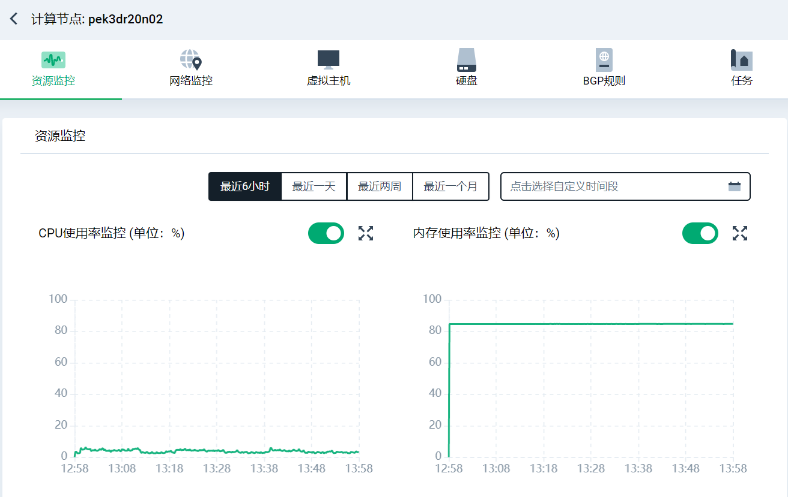
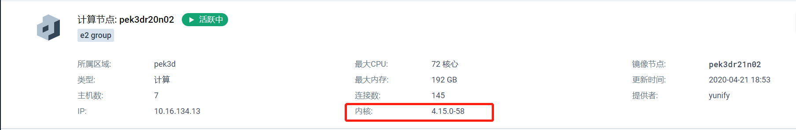

**1、需要注意目标hyper的负载情况，比如cpu/内存/磁盘的占用率，不要迁移到负载高的主机，如截图**

**2、需要注意目标hyper已分配资源情况，迁移之前需要计算一下资源是否充足，如截图**

**3、需要确保目标hyper的kernel版本要比当前hyper的内核版本一样或者更高**

**关于内核版本tips**
linux内核版本的分类

Linux内核版本有两种：稳定版和开发版 ，Linux内核版本号由3组数字组成：第一个组数字.第二组数字.第三组数字

第一个组数字：目前发布的内核主版本。

第二个组数字：偶数表示稳定版本；奇数表示开发中版本。

第三个组数字：错误修补的次数。

例1： 2.6.18-128.ELsmp ,

 第一个组数字: 2 , 主版本号

 第二个组数字: 6 , 次版本号，表示稳定版本(因为有偶数)

 第三个组数字 18 , 修订版本号 ， 表示修改的次数，头两个数字合在一齐可以描述内核系列。如稳定版的2.6.0，它是2.6版内核系列。128: 表示这个当前版本的第5次微调patch ， 而ELsmp指出了当前内核是为ELsmp特别调校的 EL : Enterprise Linux ； smp : 表示支持多处理器 ， 表示该内核版本支持多处理器
 
**4、sds1.0的机器支持迁移到sds2.0**
**5、e2 group和e2 large memory group**
e2 就是给 e2 主机用的, 如果e2 主机是 内存:cpu 很大的那种主机的话, memory:cpu>14 的这种就会place 到后面这个plg 里, 另外后者通常和环境large memory group 的hyper是相同的, 是平台预留的 hyper, 当所有的节点都不满足的安置的话, 就会尝试去在(e2) large memory group 里再尝试安置一次

**6、迁移的时候尽量确保存储模式保持一致，比如sds存储模式不支持迁移到sanc;repl不支持迁移pair**
**7、主机如果绑定了安置策略组（比如集中/离散的安置策略），需要联系客户解除**