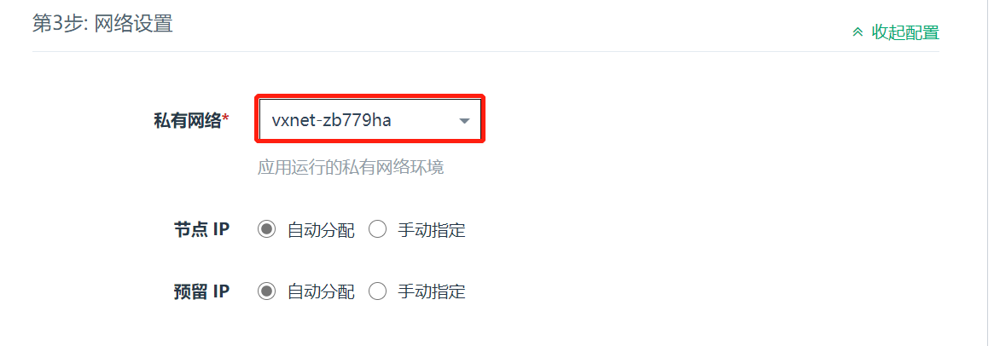
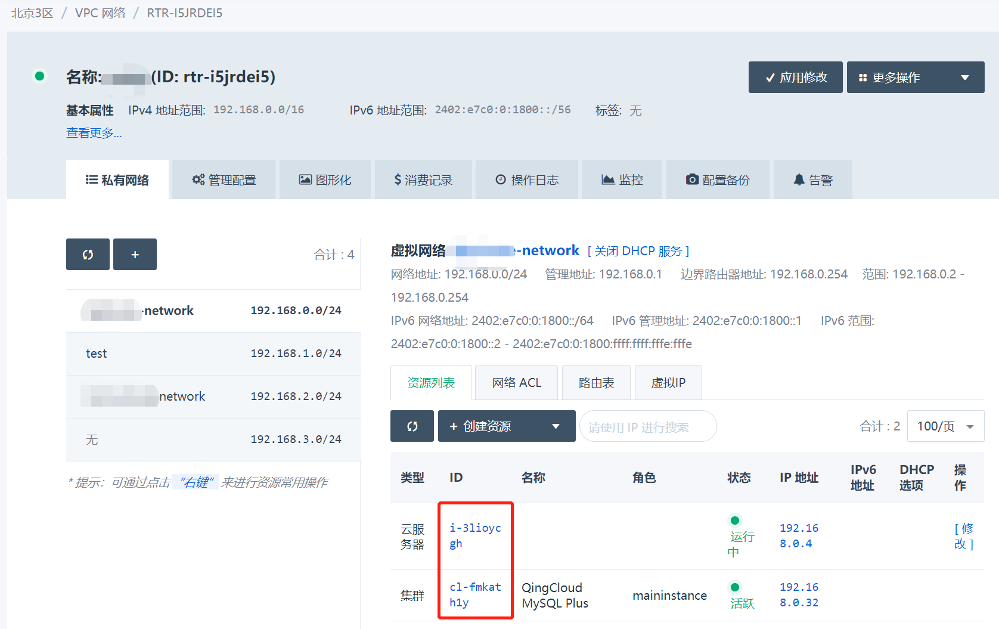
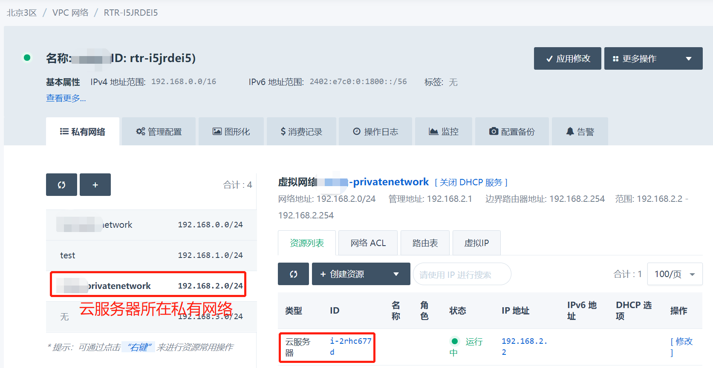
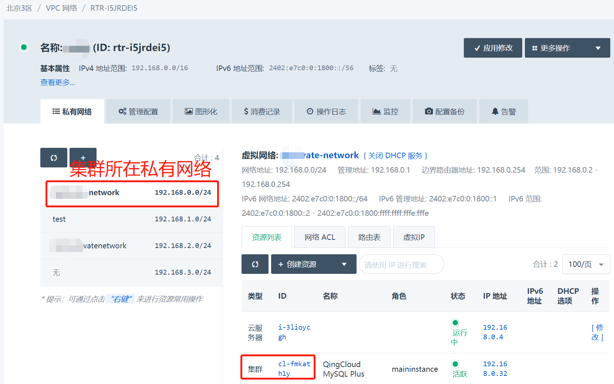
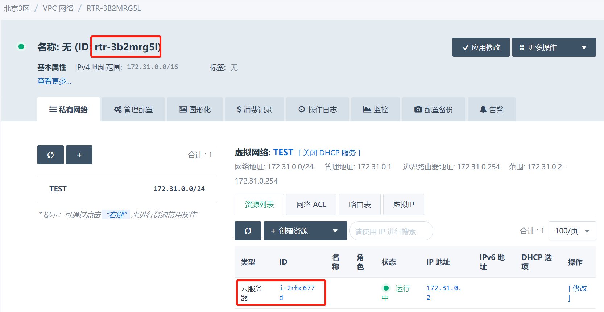
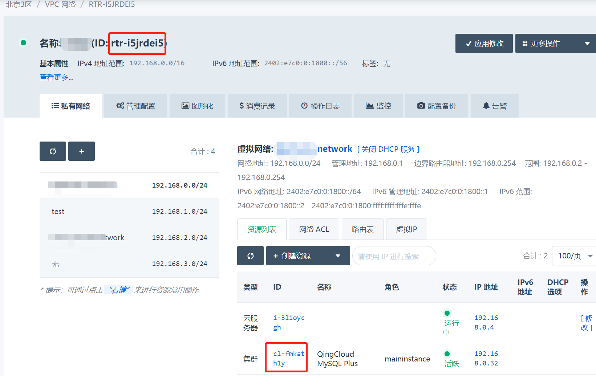
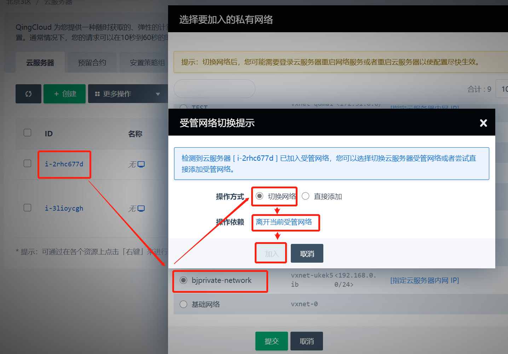
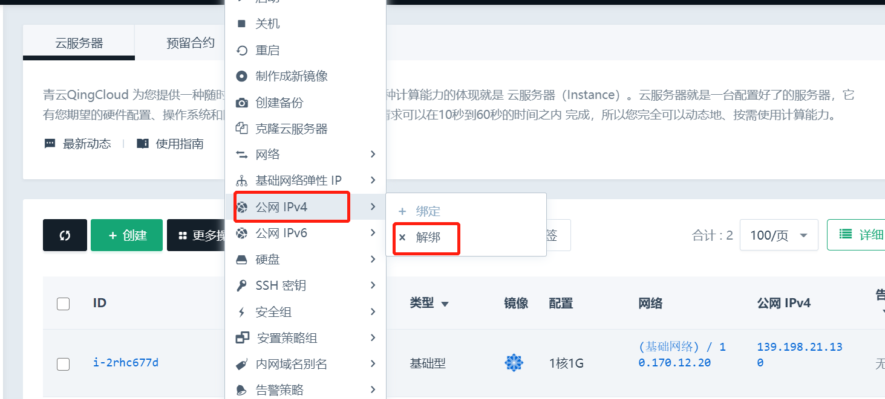
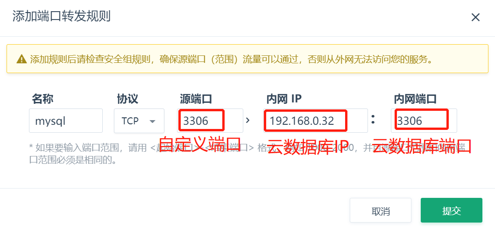
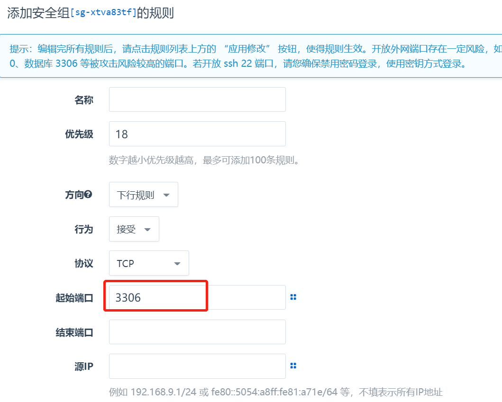

用户在青云平台购买数据库产品，购买后想要通过公网或内网去连接数据库，本文主要介绍使用青云平台数据库集群如何进行连接。

## 配置连接云数据库
云数据库在购买时，会要求加入到私有网络环境中，因此，同VPC下的云服务器和云数据库都是可以通过内网地址进行连接。

### 私有网络云服务器连接
**情形一：云服务器和云数据库在同一私有网络，不需要修改配置即可通过内网地址连接。**

**情形二：云服务器和云数据库在不同私有网络，但是在同一个VPC下面，不需要修改配置即可通过内网地址进行连接。**

**情形三：云服务器和云数据库在不同私有网络，且不在同一个VPC下面。需要修改云服务器或云数据库添加到同VPC网络下。**  

右键云服务器—网络—加入—选择私有网络—提交—切换网络—离开当前受管网络—加入

### 基础网络云服务器连接
云服务器在基础网络，且绑定公网IP，云数据库在VPC下面。需要修改云服务器添加到云数据库所在VPC网络下。  
右键云服务器—公网IPv4—解绑，右键云服务器—网络—加入—选择私有网络—提交—切换网络—离开当前受管网络—加入

### 非青云云服务器连接
非青云云服务器。需要连接青云云数据库。需要在VPC中配置云数据库端口的端口转发规则，并在VPC绑定的安全组中放行端口。

