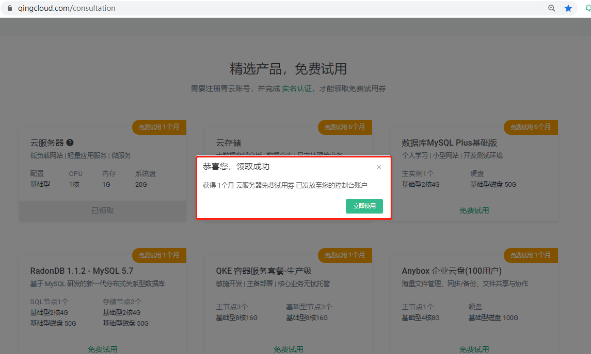
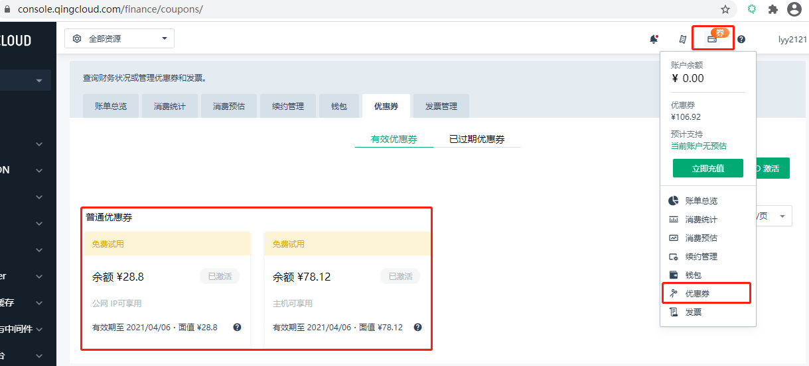
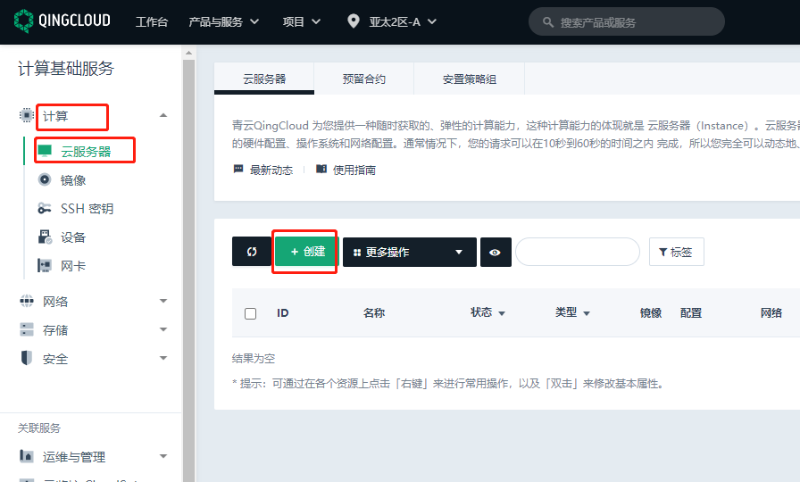
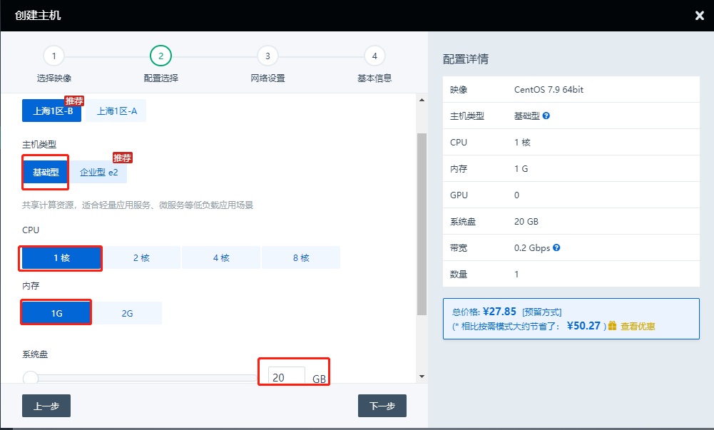
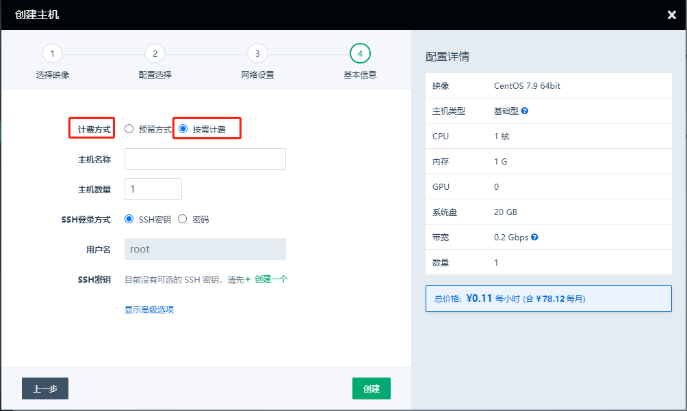
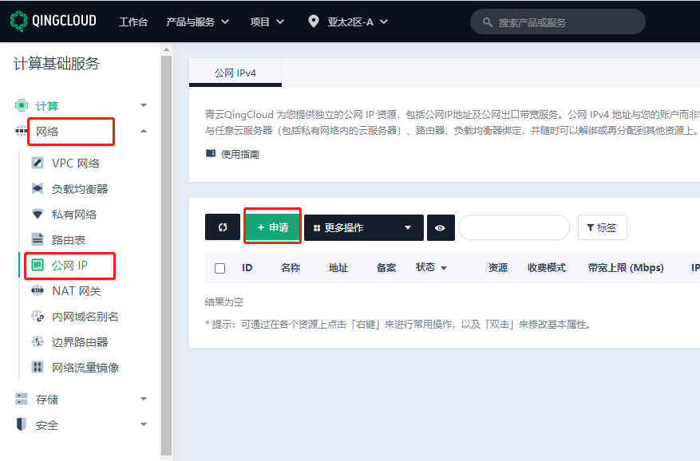
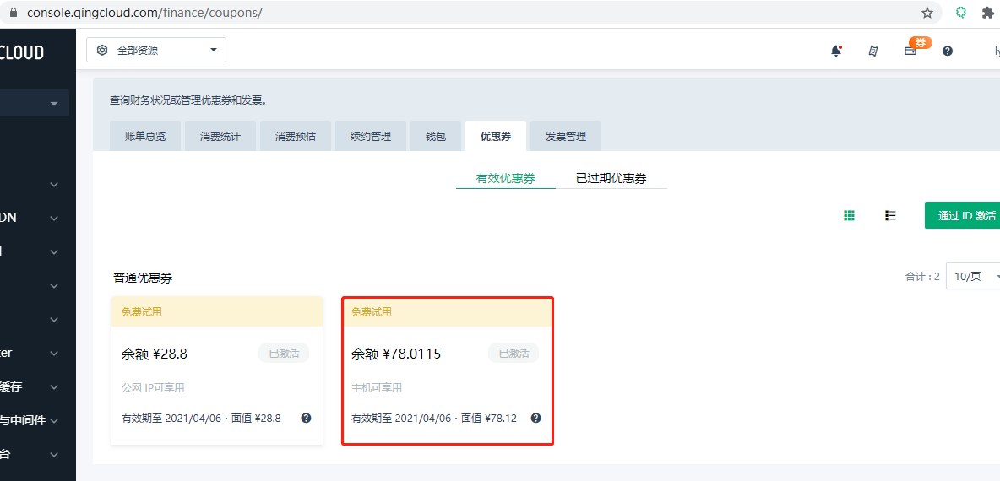

## 前提条件

### 申请免费试用云服务器

https://www.qingcloud.com/consultation

申请条件：1.注册青云账户；2.完成实名认证

## 操作步骤

您可以根据以下步骤免费试用 1个月云服务器。

### 查看优惠券

1. 登录 [QingCloud 管理控制台](https://console.qingcloud.com/login)，选择**产品与服务** > **计算** > **云服务器**，进入域名列表页，点击云服务器**免费试用**。

   

   

2. 进入账户优惠券界面，查看已发放的优惠券。

   

### 使用优惠券

#### 创建云服务器

- 免费试用78.12元优惠券可用于创建**上海1区**或**广东2区**的**基础型1核1g 20g**的云服务器。
- 如果创建Linux云服务器，正好支撑1个月。不支持创建 Windows 云服务器。
- 创建路径：**QingCloud 控制台** > **计算** > **云服务器**
- 云服务器配置选择**基础型1核1g 20g系统盘**的云服务器；计费方式选择**按需计费**。
- 云服务器创建详情请参考：[云服务器快速创建流程](/compute/vm/quickstart/create_vm/)
- 创建云服务器时，可以异步选择并绑定 IP，无需单独创建。

1. 点击**创建**，创建云服务器。

   

2. 选择计费方式为**按需计费**，选择区域为**上海1区**或**广东2区**。

   

3. 选择云服务器配置为**基础型1核1g 20g系统盘**的云服务器。

   

4. 选择并绑定 IP。

   

5. 点击**立即购买**，创建成功。

   

#### 创建公网 IP

- 单独创建 IP时，需要分配到云服务器。
- 免费试用28.8元优惠券,可用于创建**上海1区**或**广东2区**的公网IP，带宽必须是1Mbps。
- 创建路径：**控制台** > **网络** > **公网IP**

1. 点击**申请**，创建公网 IP。

   

2. 将创建好的公网 IP 分配到云服务器。

   

3. 选择需要绑定的云服务器。

   

4. 分配完成。

   
