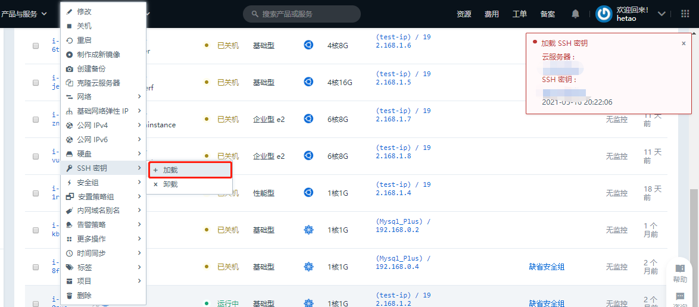
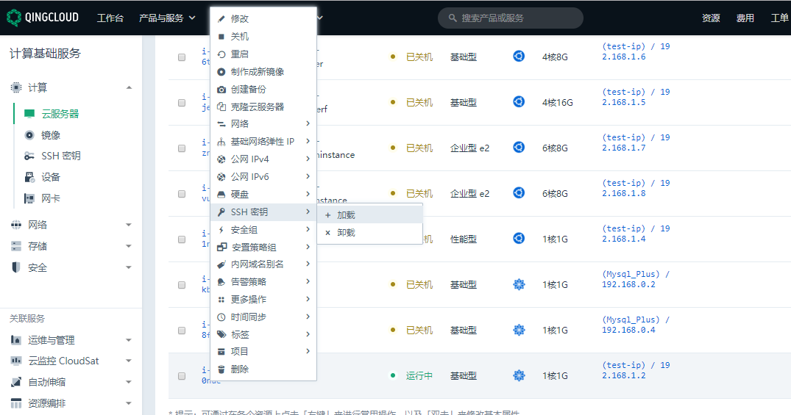

## 问题介绍

使用[QingCloud 管理控制台](https://console.qingcloud.com/login)云服务器加载 SSH 秘钥失败



## 解决办法

1. 进入主机重启一下 gapd 服务

```
systemctl restart gapd  #Centos
service gapd restart    #Ubuntu
```

2. 在控制台重新加载 SSH 秘钥



