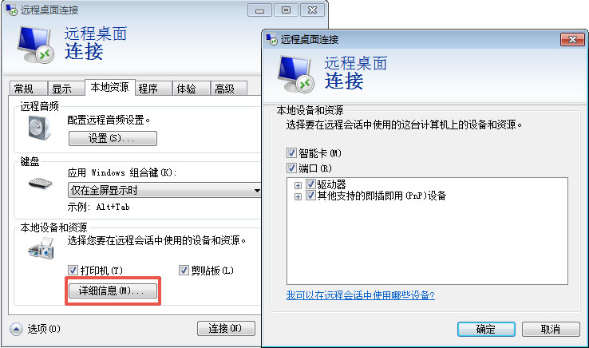

## 打开RDP服务

首先， 在 Windows 主机里打开RDP服务：

1. 使用“虚拟终端”登录 Windows 主机，“虚拟终端”就是主机 ID 旁边的 显示器形状的小图标，点击即可以弹出 Windows 桌面;

2. 右键点击“我的电脑” -> “属性” -> “远程” -> 选择”启用这台机器上的远程桌面”。

3. 然后您需要在青云控制台的 “安全” -> “防火墙” 中手动为主机的防火墙添加一条 接受 tcp 3389 端口 的下行规则， 点击 更新规则 使其应用到主机。

## 确认设置

如果希望在 Windows 本地电脑与远程服务器之间复制粘贴，你需要确认如下设置：

1. 打开本机的远程桌面连接时，按照下图所示勾选要远程使用的资源。

2. 在服务器上打开任务管理器，查看进程，看是否有 rdpclip.exe 进程。 通常，只要存在该进程，就可以在本机和远程服务器之间粘贴文本了。 如果没有此进程则需要手动启动，开始->运行->rdpclip.exe

> **注意**
>
> 请确认关闭了主机内部防火墙或者主机内部防火墙放行了相应的端口。
