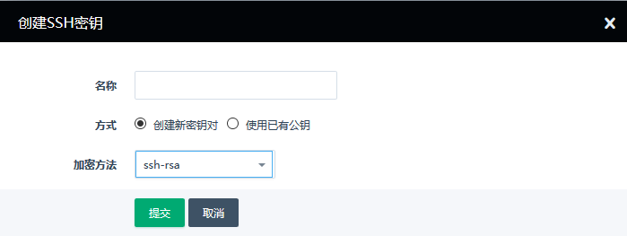

在连接实例前，请确保您的云服务器已经绑定了弹性公网 IP 或者采用NAT转发了相应的端口，并且您的`防火墙`放行了相应端口。
## 浏览器web连接
### 登录 QingCloud 管理控制台

登录 [QingCloud 管理控制台](https://console.qingcloud.com/login)，选择**产品与服务** > **计算** > **云服务器**，进入域名列表页。

### 点击图标，打开VNC

每个实例 ID （名称）右侧有个显示屏的图标，点击图标将打开一个远程连接 ( VNC ) 的会话

### 输入用户信息

依次输入用户名和密码即可

如果云服务器不接受您的密码，您可以先关闭云服务器，然后[修改云服务器密码](https://docs.qingcloud.com/product/faq/#id7)。

## Linux云服务器
如果您使用的是 Windows 操作系统，除了通过 QingCloud 控制台以外，您也可以通过软件连接至 Linux 云服务器，常见的软件有[PuTTY](https://www.putty.org/) ， [Xshell](https://www.netsarang.com/zh/xshell/)。

请注意，青云并不知道您的软件来源和用途，也不对其产生的任何的问题和纠纷负责。

### 通过用户名密码连接
>注解
相较于密钥，通过用户名和密码连接更加的简单易用

#### 1. 配置好弹性 IP 和防火墙

首先在连接云服务器之前，请确保您的云服务器已经绑定了弹性公网 IP，[防火墙放行](https://docsv3.qingcloud.com/security/security_group/manual/sg_setting/) TCP 22 端口。

登录 [QingCloud 管理控制台](https://console.qingcloud.com/login)，选择**产品与服务** > **计算** > **云服务器**，进入域名列表页。

点击云服务器的 ID进入配置界面，在左侧选择**绑定资源** > **安全组** 查看防火墙设置。

添加安全组规则，并放行TCP 22 端口。

#### 2. 打开软件，输入 IP 地址

如果您用的是 Putty ，在 `Session` 页面输入 IP 地址，点击 Open

#### 3. 输入用户信息

然后按照提示输入用户名和密码

### 通过 SSH 密钥连接
>注解
相对于用户名密码方式，密钥方式拥有更强的安全性，也可以很大程度阻止暴力破解的发生。目前常用的密钥都是非对称性的加密方式，云服务器内置公钥，而用户则拥有私钥。由于采用非对称加密，入侵者试图通过公钥去破解私钥难度会远远超出密码的破解。

#### 1. 准备密钥

登录 [QingCloud 管理控制台](https://console.qingcloud.com/login)，选择**产品与服务** > **计算** > **云服务器**，进入域名列表页。

在左侧的**计算基础服务**导航栏，选择 **计算** > **SSH 密钥** 页面, 点击**创建**，创建SSH 密钥，您也可以使用自己原有的密钥。

#### 2. 云服务器加载上密钥

您可以在创建云服务器时选择密钥。

也可以给现有云服务器加载密钥,右键点击云服务器 ID，选择**SSH 密钥** > **加载**。

#### 3. 配置好弹性 IP 和防火墙

在连接云服务器之前，请确保您的云服务器已经绑定了弹性公网 IP，[防火墙放行](https://docsv3.qingcloud.com/security/security_group/manual/sg_setting/) TCP 22 端口。

#### 4. 将密钥转换为正确的格式

如果您用的是 PuTTY ，您需要用 PuTTYgen 将私钥转换为 PuTTY 支持的格式 ( .ppk ) ，点击 Load 加载您的私钥

#### 5. 打开软件，选择密钥

然后在 PuTTY 的配置页面 `Connection` 的 `Auth` 选择您的私钥

#### 6. 输入 IP 地址

最后，在 `Session` 页面输入 IP 地址，点击 Open

## Windows云服务器
从安全考虑， QingCloud 上的 Windows 云服务器默认关闭了远程登录， 您首先需要通过浏览器 Web 方式登录到云服务器，并开启远程登录功能

### 第一部分  Windows Server  开启远程登录

#### 1. 浏览器打开VNC，连接 Windows Server

在 Web 登录页面，点击左上角 `Ctrl-Alt-Del` ，然后输入密码

#### 2. 同意内部网络共享

登录后会弹出网络共享的界面，点击`是`，允许VPC内部的网络

#### 3. 打开系统属性

在云服务器中，点击下方文件管理器，依次点击 `此电脑` - `计算机` - `系统属性`

#### 4. 允许远程桌面连接

然后，点击 `远程设置` ，在远程桌面处选择`允许远程桌面连接`

### 第二部分  Windows 远程桌面连接

#### 1. 配置好弹性 IP 和防火墙

在启动远程桌面连接之前，请给您的云服务器绑定弹性 IP ，防火墙开启上下行的 `TCP` `3389` 端口，并`应用修改`

#### 2. 本地电脑启动远程桌面，输入用户信息

您需要通过 Windows 系统自带的`远程桌面连接`连接 Windows Server ，然后输入用户名密码即可

>注解
如果您已经尝试采用上述的步骤，仍然无法连接至您的云服务器。建议您提交工单，我们的工程师会尽快帮您解决问题。
