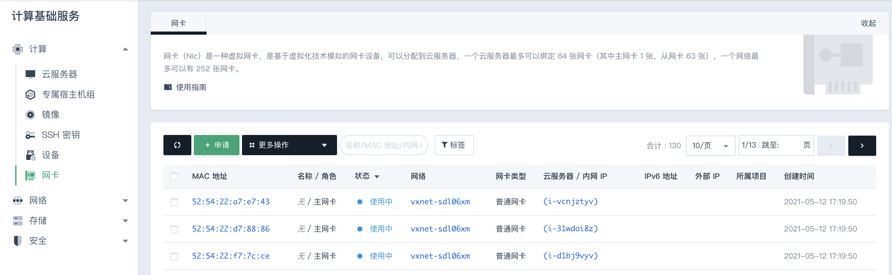
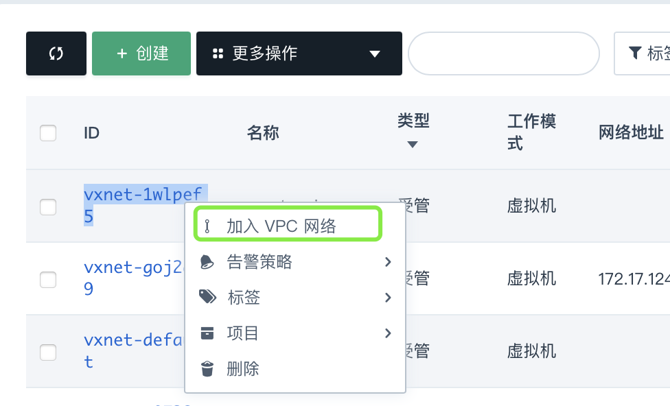
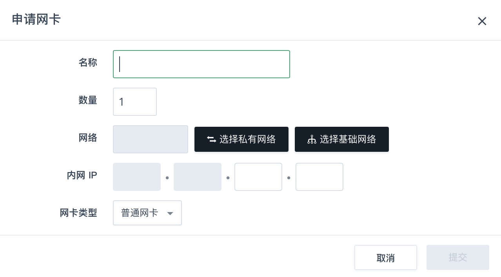
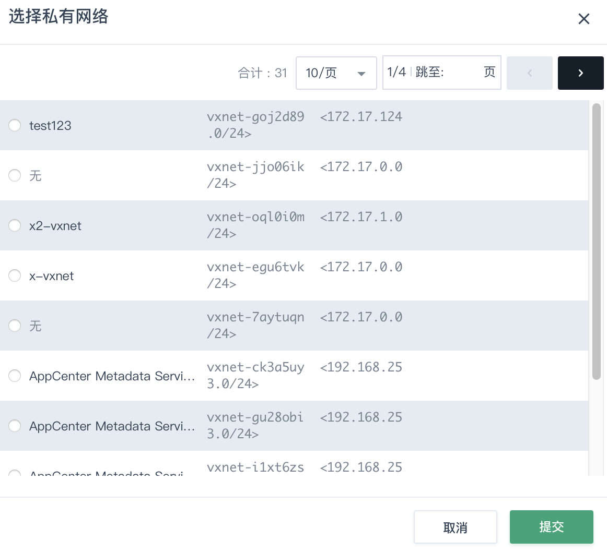
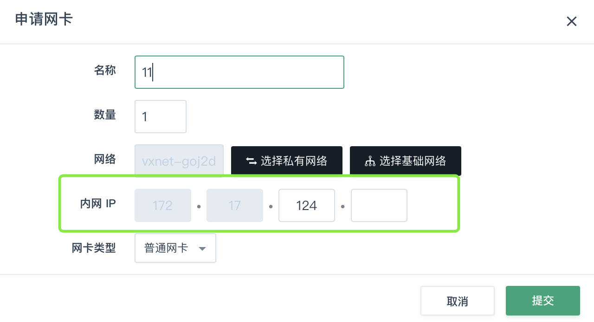
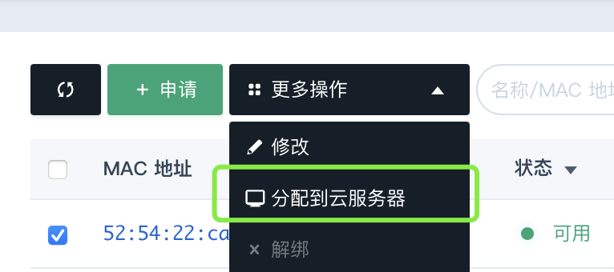

# QingCloud 主机网卡

## 介绍

对于物理主机来说，网卡就是服务器的网络设备，用于接入以太网络，和其它计算机进行通信。QingCloud 网卡是基于虚拟化技术模拟的网卡设备，此设备是基于虚拟机所在的物理设备。QingCloud 云平台可以将集群内的虚拟网络统一起来，进行再分配。用户毋需关心具体的网卡在什么位置，有需要申请、挂接即可。


> 限制说明
>
> 每个 QingCloud 主机最多可以绑定 64 张网卡（其中主网卡 1 张，从网卡 63 张），而每个中网络最多可以有 252 张网卡。

## 使用操作

登录[QingCloud 云平台控制台](https://console.qingcloud.com/sh1a/nics/)，选择区域Region，在 **计算** --> **网卡** 页面中，会看到如下的操作界面：



### 前提

在进行申请网卡操作之前，需要先建立一个私有网络：

在控制台上选择 **网络**，选中 **私有网络**，然后点击 **创建** 按钮：


这里我们创建一个名称为```create-nic```的私有网络，可以加入到某个具体的VPC网络。



### 创建

在 **计算** --> **网卡** 页面中，然后点击 **申请**：



此时，需要将新申请的网卡加入到刚刚建立的私有网络 ```create-nic``` 中，如下图所示：



点击提交，然后返回到网卡申请对话框，此时需要为其分配一个IP地址：



点击提交。

### 挂载

建立网卡是为了有效的使用它，那么接下来就将刚才建立的网卡（从）分配到具体的主机中。现在假设有一台QingCloud主机（操作系统为Ubunt 16.04），其只有一张网卡：

```
root@hosta:~# ifconfig
eth0      Link encap:Ethernet  HWaddr 52:54:9b:19:cf:38
          inet addr:10.120.7.40  Bcast:10.120.7.255  Mask:255.255.255.0
          inet6 addr: fe80::5054:9bff:fe19:cf38/64 Scope:Link
          UP BROADCAST RUNNING MULTICAST  MTU:1500  Metric:1
          RX packets:3819 errors:0 dropped:0 overruns:0 frame:0
          TX packets:3290 errors:0 dropped:0 overruns:0 carrier:0
          collisions:0 txqueuelen:1000
          RX bytes:6290512 (6.2 MB)  TX bytes:271951 (271.9 KB)

lo        Link encap:Local Loopback
          inet addr:127.0.0.1  Mask:255.0.0.0
          inet6 addr: ::1/128 Scope:Host
          UP LOOPBACK RUNNING  MTU:65536  Metric:1
          RX packets:36221 errors:0 dropped:0 overruns:0 frame:0
          TX packets:36221 errors:0 dropped:0 overruns:0 carrier:0
          collisions:0 txqueuelen:1
          RX bytes:31870809 (31.8 MB)  TX bytes:31870809 (31.8 MB)
```

此时，回到网卡的界面，选中刚刚创建的网卡 ```Nic```，然后，选择操作 **分配到主机**：



稍等几秒，绑定成功之后，我们回到主机操作界面，再执行 ```ifconfig``` 的时候，输出内容如下：

```
root@hosta:~# ifconfig
docker0   Link encap:Ethernet  HWaddr 02:42:1e:fb:a1:40
          inet addr:172.17.0.1  Bcast:172.17.255.255  Mask:255.255.0.0
          UP BROADCAST MULTICAST  MTU:1500  Metric:1
          RX packets:0 errors:0 dropped:0 overruns:0 frame:0
          TX packets:0 errors:0 dropped:0 overruns:0 carrier:0
          collisions:0 txqueuelen:0
          RX bytes:0 (0.0 B)  TX bytes:0 (0.0 B)

eth0      Link encap:Ethernet  HWaddr 52:54:9b:19:cf:38
          inet addr:10.120.7.40  Bcast:10.120.7.255  Mask:255.255.255.0
          inet6 addr: fe80::5054:9bff:fe19:cf38/64 Scope:Link
          UP BROADCAST RUNNING MULTICAST  MTU:1500  Metric:1
          RX packets:3855 errors:0 dropped:0 overruns:0 frame:0
          TX packets:3317 errors:0 dropped:0 overruns:0 carrier:0
          collisions:0 txqueuelen:1000
          RX bytes:6294355 (6.2 MB)  TX bytes:277838 (277.8 KB)

eth1      Link encap:Ethernet  HWaddr 52:54:12:ec:11:d1
          inet addr:172.16.1.100  Bcast:172.16.1.255  Mask:255.255.255.0
          inet6 addr: fe80::5054:12ff:feec:11d1/64 Scope:Link
          UP BROADCAST RUNNING MULTICAST  MTU:1500  Metric:1
          RX packets:25 errors:0 dropped:0 overruns:0 frame:0
          TX packets:10 errors:0 dropped:0 overruns:0 carrier:0
          collisions:0 txqueuelen:1000
          RX bytes:2514 (2.5 KB)  TX bytes:1604 (1.6 KB)

```

测试网络可用性，以及网关输出：

```
root@hosta:~# route -n
Kernel IP routing table
Destination     Gateway         Genmask         Flags Metric Ref    Use Iface
0.0.0.0         10.120.7.1      0.0.0.0         UG    0      0        0 eth0
10.120.7.0      0.0.0.0         255.255.255.0   U     0      0        0 eth0
172.16.1.0      0.0.0.0         255.255.255.0   U     0      0        0 eth1
172.17.0.0      0.0.0.0         255.255.0.0     U     0      0        0 docker0
root@hosta:~# ping 172.16.1.1
PING 172.16.1.1 (172.16.1.1) 56(84) bytes of data.
64 bytes from 172.16.1.1: icmp_seq=1 ttl=64 time=0.169 ms
64 bytes from 172.16.1.1: icmp_seq=2 ttl=64 time=0.132 ms

```

恭喜你，添加网卡成功，如果有更多添加网卡的需求，请按照上面步骤配置即可，或者参考[QingCloud API文档网卡部分](https://docsv3.qingcloud.com/development_docs/api/command_list/nic/attach_nics/)。

## 应用场景

在现代的Web架构中，应用程序之间往往是分层的，如数据库层和应用层的分离，而往往架构是不将它们放在同一个网段内的，所以，创建多块虚拟网卡，然后利用NAT、多路由等技术实现配置它们互联互通。

有更多特殊需求，请联系QingCloud技术咨询团队。
