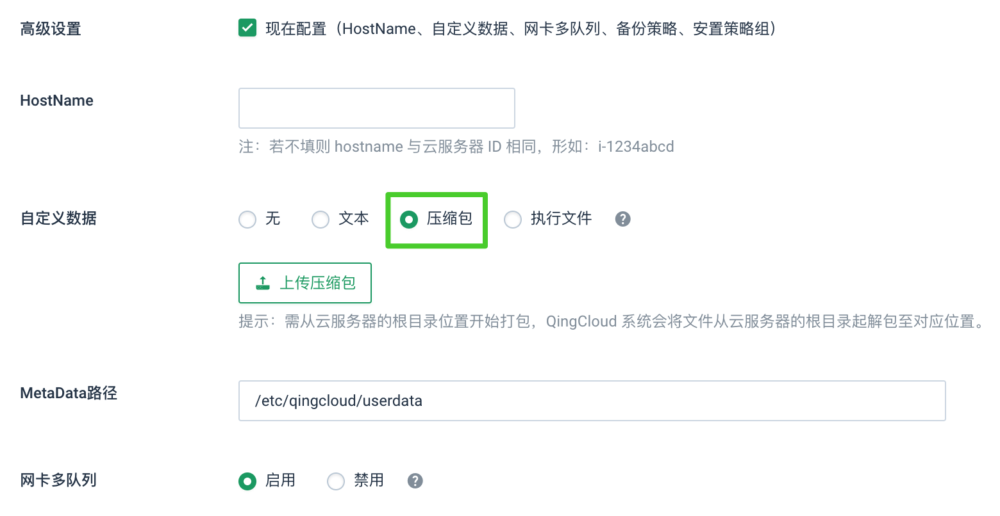

# User Data 指南

User Data，即用户自定义数据，可让用户在创建云服务器时通过上传一些自定义的参数或脚本，来对云服务器做一些定制化配置或完成特定任务。

与此同时，用户可能也需要获得一些云服务器的运行参数，作为定制行为的判断依据之一，这些系统参数被称为 MetaData，也会随 User Data 功能一起提供给用户。

## MetaData

MetaData 是青云定义的一组关于云服务器运行参数的字段，主要包括云服务器 ID，云服务器 CPU 和内存配置，操作系统，挂载的硬盘，所在的子网等。

### 1. 通过文件写入

青云可以通过将 MetaData 写入云服务器内文件的方式提供给用户，用户对文件做一定处理后即可获得 MetaData 值。

为方便用户编程时对参数值的调取，对 MetaData 文件的参数格式做了特殊规定，目前支持两种：

1.  JSON 格式：参数与参数值写成 JSON 格式，与目前青云 API 的提供方式类似。
2.  ENV 格式：参数与参数值写成类似于系统环境变量的形式，方便 bash 等的读取。

这两个文件，分别命名为 metadata.json 和 metadata.env，默认会放在云服务器 /etc/qingcloud/userdata 目录下（可通过自定义路径更改），用户可自行选择使用其中一种。

目前 MetaData 提供的字段如下：

| Name | Type | Description |
| --- | --- | --- |
| instance_id | String | 云服务器 ID |
| instance_name | String | 云服务器名称 |
| instance_type | String | 云服务器类型，为青云预定义的一些配置类型，可参考 [_Instance Types_](/development_docs/api/common/instance_type) |
| vcpus_current | Integer | CPU 核数，有效值为 1, 2, 4 等 |
| memory_current | Integer | 内存大小，单位 MB，有效值为 1024, 2048, 4096 等 |
| image_id | String | 镜像 ID |
| platform | String | OS 平台，windows 或 linux |
| os_family | String | OS 发行版，有效值为 centos，ubuntu 等 |
| volume_ids | String | 云服务器挂载的数据盘 ID，可能会有多个，每个 ID 间以逗号相连；若创建时不挂载则为空 |
| vxnets_count | Integer | 子网个数 |
| vxnets | List | 子网列表，可以为基础网络，也可以为私有网络，可能会有多个；若创建时不选择子网则为空。每个子网为一个 Dict，包含的 key 有 vxnet_id 和 nic_id，分别对应子网 ID 和网卡 MAC 地址 |

ENV 格式的 MetaData，大部分与 JSON 格式的定义相同。唯有 vxnets 因为是 List 和 Dict 的复合结构，为方便使用，在 ENV 中将其元素全部分解，作为独立的字段。以有两个子网的云服务器为例，对应的 ENV 字段分别为：

| Name | Type | Value | Description |
| --- | --- | --- | --- |
| vxnets_0_nic_id | String | ‘52:54:39:ea:a5:a2’ | 第一个子网的网卡 MAC 地址 |
| vxnets_0_vxnet_id | String | ‘vxnet-0’ | 第一个子网的子网 ID |
| vxnets_1_nic_id | String | ‘52:54:22:49:f7:46’ | 第二个子网的网卡 MAC 地址 |
| vxnets_1_vxnet_id | String | ‘vxnet-hunqvu1’ | 第二个子网的子网 ID |

### 2. 通过 Metadata Server 获取

用户可以在任何时间通过内网的 Metadata Server 获取本机的信息，方式如下:

```
curl http://metadata.ks.qingcloud.com/i-xxxxxxxx/
```

其中 ```i-xxxxxxxx``` 是本机的 ID ，可以从 ```hostname``` 得到。数据返回 JSON 格式，信息与前面描述相同。

需要注意的是，Metadata Server 有访问限制：

*   只能获取自己名下的云服务器信息。
*   对同一目标云服务器 ID ，一分钟内可重复请求 5 次。
*   对同一来源的请求（根据内网 IP 判断） ，一分钟内可接收 100 次。 如果是私有网络内的云服务器，Metadata Server 接收到的来源 IP 是路由器内网 IP 。

## User Data

User Data 为用户自定义的任何格式、任何内容的配置文本或脚本。

这里允许三种方式实现用户自定义：

1） 提供单一字符串。字串长度的最大限制为 4K。 此情况适用于用户的执行逻辑已固定在镜像中，需上传的灵活配置文件较小较简单时。

对于字符串类的 User Data，该字符串默认会被写入云服务器 ```/etc/qingcloud/userdata``` 目录下（可通过自定义路径更改）的 userdata.string 文件供访问。

2） 提供文件打包，添加或覆盖云服务器文件系统内的若干个文件。 压缩包数量限定为一个。压缩包的最大限制为 2M。压缩包格式限定为 zip、tar、tgz 或 tbz。 此情况适用于较大复杂度的 User Data 使用时；或有若干个与 User Data 相关的脚本需共同使用时。

用户打包时需从云服务器的根目录位置开始打包，如此才可包含全路径。青云系统会将文件从云服务器的根目录起解包至对应位置。

对于包内的内容， 若云服务器为 Linux 则不做限定。 Windows 云服务器必须包含一特别命名的 vbs 脚本，作为执行 User Data 相关任务的入口，此文件为 /etc/qingcloud/userdata 目录下的 userdata.vbs

3） 提供可执行脚本代码。内容长度的最大限制为 4K。 此情况适用于开机时自动执行脚本完成软件部署和配置。

对于可执行脚本代码的 User Data，代码默认会被写入云服务器 /etc/rc.local 文件中（可通过自定义路径更改），实现开机自动执行。 Windows 云服务器仅支持vbs脚本。

## 操作

1.  操作步骤

想要创建有 User Data 功能的云服务器，首先和创建普通云服务器一样点击“新建”按钮，并选择镜像和云服务器配置。若第二步“选择类型”中选择了挂载硬盘，则硬盘 ID 会反映在 MetaData 的字段中。


若想使用 User Data 功能，需在新建云服务器的第四步“基本设置”中选择“显示高级选项”。


在随后显示的 User Data 设置中，若选择“无”，则不使用 User Data 功能。若选择“文本”，则可以手动输入文本或从一个文本文件中读取。



默认的，metadata 和 userdata.string 文件都会放在 /etc/qingcloud/userdata 目录下。用户可以通过输入自定义路径更改其位置。只需在输入文本或上传压缩包时同时指定路径即可。 若路径不合法，则依然使用默认路径。

若选择“执行文件”，则需填入脚本代码。


若选择“压缩包”，则需上传一个压缩包。


最后点击“创建”，就可以创建带有 MetaData 和 User Data 的云服务器。

2.  使用实例

下面是一个使用压缩包类型的例子：

在本地任意位置创建一个 etc 目录，并在该目录下创建 rc.local 文件，其中的内容为:

```
#!/bin/sh

hostname myname
```

这个脚本可以修改云服务器名称为 myname

将 etc 目录和 rc.local 一起打包，在 userdata 中选择上传压缩包，路径仍然使用默认路径（注意：自定义路径不适用于压缩包）。云服务器启动后就可以执行上述逻辑。
