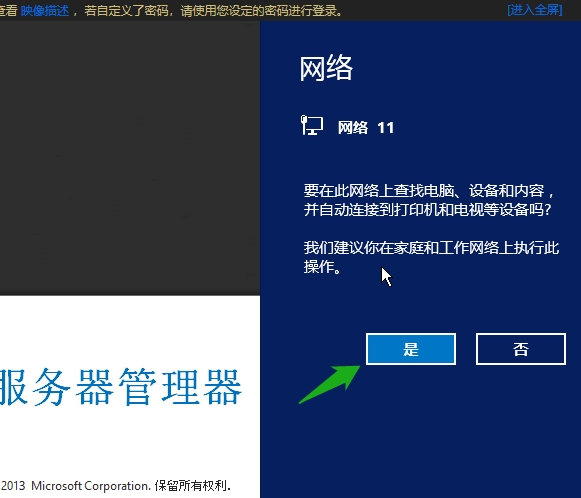
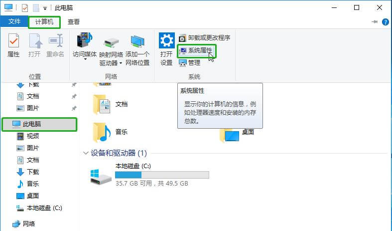
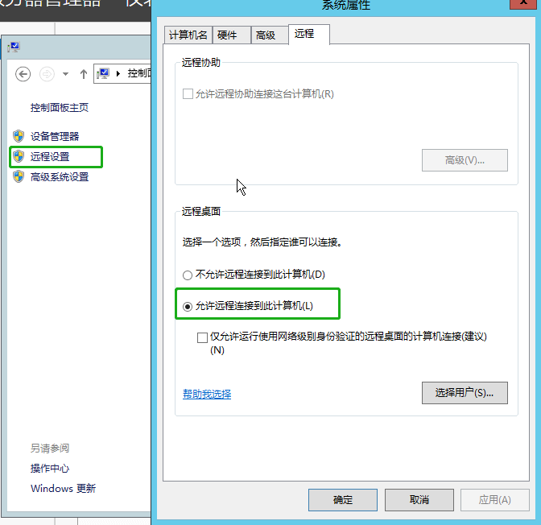

## 通过 Web 终端连接

1. 登录管理控制台。

2. 选择**产品与服务** > **计算** > **云服务器**，进入域名列表页。

3. 每个实例 ID （名称）右侧有个显示屏的图标，点击图标将打开一个远程连接会话。

   

4. 在 Web 登录页面，点击左上角 `Ctrl-Alt-Del` ，然后输入密码，按 Enter 登录到云服务器。

   若云服务器不接受您的密码，您可以将云服务器关机后[重置云服务器的登录密码](/compute/vm/manual/vm/mgmt_vm/20_reset_pw/) 。

   

## 通过远程桌面连接

从安全考虑， 青云QingCloud 上的 Windows 云服务器默认关闭了远程登录， 您首先需要通过浏览器 Web 方式登录到云服务器，并开启远程登录功能。

### 步骤一：允许远程桌面连接

1. 在云服务器列表页面，点击 Windows 云服务器的 Web 终端，连接 Windows Server。

2. 在 Web 登录页面，点击左上角 `Ctrl-Alt-Del` ，然后输入密码，按 Enter 登录到云服务器。

   

3. 同意内部网络共享。

   登录后会弹出网络共享的界面，点击`是`，允许 VPC 内部的网络。

   

4. 打开系统属性。

5. 在云服务器中，点击下方**文件管理器**，依次点击 `此电脑` > `计算机` > `系统属性`。

   

6. 允许远程桌面连接。

   点击 `远程设置` ，在远程桌面处选择`允许远程桌面连接`。

   

### 步骤二：远程连接桌面

1. 配置公网 IP 和防火墙。

   在启动远程桌面连接之前，请给您的云服务器绑定公网 IP ，防火墙开启上下行的 `TCP` `3389` 端口，并`应用修改`。

   

2. 本地电脑启动远程桌面，输入用户信息。

   您需要通过 Windows 系统自带的`远程桌面连接`连接 Windows Server ，然后输入用户名密码即可。

   > 注意
   >
   > 如果您已经尝试采用上述的步骤，仍然无法连接至您的云服务器。建议您提交工单，青云QingCloud 技术支持工程师会尽快帮您解决问题。

   
