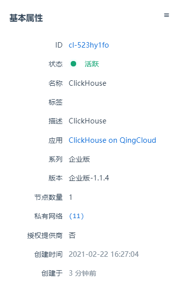
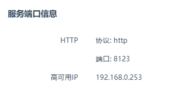
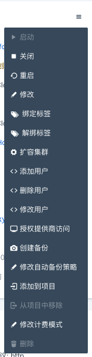

本小节主要介绍如何管理已集群信息、查看集群节点，以及备份集群等信息。

## 基本属性

1. 登录 QingCloud 管理控制台。
2. 选择**产品与服务** > **数据仓库与 BI** > **ClickHouse**，进入 ClickHouse 集群列表页。
3. 点击集群 ID，进入集群详情页面。
4. 在**基本属性**模块，可查看集群的基本信息。

   

## 服务端口信息

在**服务端口信息**模块，可查看集群端口信息。集群提供了高可用 IP，使用高可用 IP 对直接管理集群。

**注解**: 由于集群采用无主构架，建议直接使用节点 IP 管理集群的，以便可以更加灵活的控制集群的负载。

## 服务功能

点击**基本属性**区域的下拉按钮，可以管理集群基本属性。

包括启停集群、修改集群安全组、增删用户等。

## 节点列表

在集群**节点**页签，可查看节点及其 IP，以及每个每个节点的服务状态。通过节点任意 IP，可对集群进行管理操作。

## 配置参数

点击集群**配置参数**页签，可查看和管理集群的所有配置参数。

## 监控告警

点击集群**告警**页签，可对集群节点配置告警策略，及时掌握集群的资源和服务状况。

## 备份恢复

点击集群**备份**页签，可创建集群备份，包括手动备份和自动备份。

在集群列表页面右键选择备份时间，可自动备份。

如果需要从备份创建出一个独立于原有数据库服务的新数据库服务， 可在**备份**标签下右键相应的备份点，选择**从备份创建集群**。

**注解**：使用Page cache与最终一致模型，通常情况下不推荐使用备份功能。

## 用户列表

点击集群**用户列表**页签，可查看已有用户账号信息。

