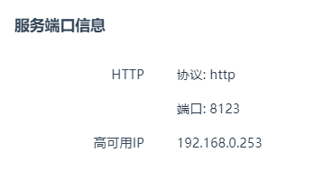

### 基本属性

这里显示了集群的基本信息。

### 服务端口信息

集群提供了高可用IP，您可以直接使用高可用IP对集群进行操作。

**注解**: 由于集群采用无主构架，我们更加建议您直接使用节点IP进行对集群的操作，以便可以更加灵活的控制集群的负载。

### 服务功能

点开基本属性旁边的下拉按钮，可以看到提供的服务功能。

### 节点列表

这里列出节点及其IP，可以使用这里列出的任意IP来对集群进行操作。同时显示了每个节点的服务状态。

### 配置参数

这里列出了集群的所有配置参数。仅供展示，我们不推荐您对它们进行修改。

### 监控告警

可以对集群节点配置告警策略，及时掌握集群的资源和服务状况。

### 备份恢复

可以对集群进行手动备份，也可以在集群列表页面右键选择备份时间进行自动备份。

如果需要从备份创建出一个独立于原有数据库服务的新数据库服务， 可以在详情页的『备份』标签下右键相应的备份点，再选择『从备份创建集群』即可。

**注解**：需要注意的是「ClickHouse on QingCloud」使用Page cache与最终一致模型，通常情况下我们不推荐您使用备份功能。

### 用户列表

展示已有用户账号信息。

