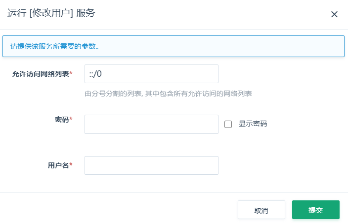

本小节主要介绍如何添加、修改、删除集群用户。

## 添加用户

1. 登录 QingCloud 管理控制台。
2. 选择**产品与服务** > **数据仓库与 BI** > **ClickHouse**，进入 ClickHouse 集群列表页。
3. 点击集群 ID，进入集群详情页面。
4. 在**基本属性**区域下拉窗口，点击**添加用户**。
5. 配置用户信息和网络。
   创建新账号时，需要指定账号密码和授权访问的网络。
6. 点击**提交**，即可添加用户。

   

## 修改用户

1. 在**基本属性**区域下拉窗口，点击**修改用户**。
2. 配置用户信息和网络。
3. 点击**提交**，即可修改用户信息。
   修改已有用户时，需要指定账号密码和授权访问的网络。

   

## 删除用户

1. 在**基本属性**区域下拉窗口，点击**删除用户**。
2. 在删除确认窗口，输入需要删除的用户名。
3. 点击**提交**，即可删除用户。

   
