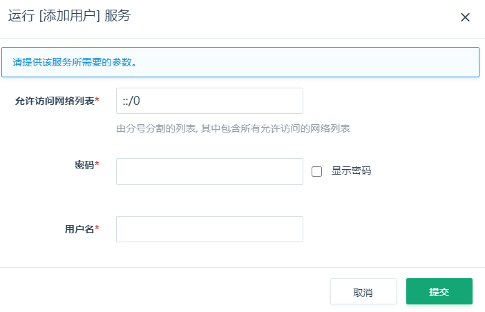
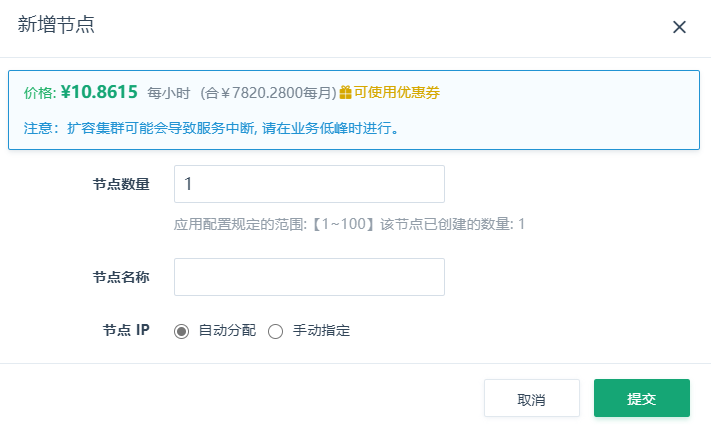
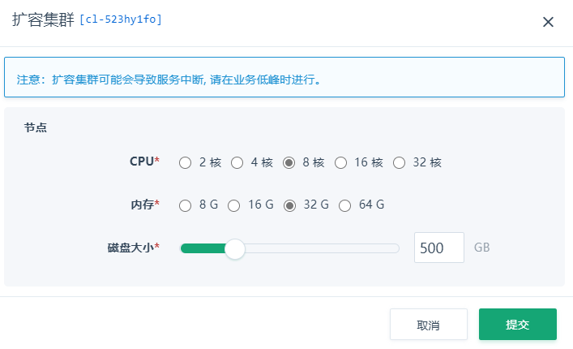

### 添加用户

要创建新账号时，需要指定账号密码和授权访问的网络。



### 修改用户

要修改已有用户时，需要指定账号密码和授权访问的网络。


### 删除用户

这里填写要删除的用户名。


### 增删节点

可以根据需要增加集群节点，需要注意的是增加节点的过程不会对原有数据迁移，这是为了尽快的完成增加节点操作，让计算资源更快的被集群应用。如果您需要对已有数据进行重新迁移，可以进入数据库执行 `SYSTEM RESHARDING` 操作即可对集群的所有节点进行数据重分布。对节点进行删除则自动进行集群的重分布。无需执行 `SYSTEM RESHARDING`



**注解**：暂不支持对集群进行删除节点操作

**注解**：由于 `SYSTEM RESHARDING` 的执行会造成大量的数据迁移工作，可能会对您的集群造成影响，默认情况下我们为其增加了 40MB/S 的迁移上限，但这并不代表不会对您的集群产生影响，如果需要进行该操作请选择在业务低峰时进行。


### 扩容集群

可以对一个运行中的数据库服务进行在线扩容，调整CPU/内存/磁盘空间大小。



**注解**：扩容需要在开机状态下进行，扩容时链接会有短暂中断，请在业务低峰时进行。

### 监控

这里提供了每台云服务器的资源监控和服务监控。服务监控统计了一些用于性能分析的常用的 Metrics 信息，可用于定位分析数据库的性能。资源监控统计了云服务器的资源信息，如: CPU使用率、硬盘IOPS情况等，可用于查看系统性能是否到达瓶颈。


### 性能测试

「ClickHouse on QingCloud」 与原生 ClickHouse 近乎一致的性能，更多性能相关测试信息可以参考：[ClickHouse Benchmark](https://clickhouse.yandex/benchmark.html)

### 集群的使用

「ClickHouse on QingCloud」 与原生 ClickHouse 高度兼容，你可以直接使用 ClickHouse 的任何连接方式连接 「ClickHouse on QingCloud」 。例如：

``` shell
# 使用Docker交互式的方式连接「ClickHouse on QingCloud」
docker run -it --rm yandex/clickhouse-client -h 高可用IP --port TCP服务端口 --user 用户名 --password 密码

# 使用Docker非交互式的方式向「ClickHouse on QingCloud」导入数据
cat visits_v1.tsv | docker run -i --rm yandex/clickhouse-client -h 高可用IP --port TCP服务端口 --user 用户名 --password 密码 --query "INSERT INTO datasets.visits_v1 FORMAT TSV"

# 使用clickhouse-client交互式的方式连接「ClickHouse on QingCloud」
sudo apt-get install clickhouse-client  #如已安装请忽略
clickhouse-client -h 高可用IP --port tcp服务端口 --user 用户名  --password 密码

# 使用clickhouse-client非交互式的方式向「ClickHouse on QingCloud」导入数据
sudo apt-get install clickhouse-client  #如已安装请忽略
cat visits_v1.tsv | clickhouse-client -h 高可用IP --port TCP服务端口 --user 用户名 --password 密码 --query "INSERT INTO datasets.visits_v1 FORMAT TSV"

# 使用curl访问「ClickHouse on QingCloud」
echo 'SELECT 1' | curl 'http://用户名:密码@高可用IP:端口' -d @-

# 使用curl向「ClickHouse on QingCloud」导入数据
cat visits_v1.tsv | curl 'http://用户名:密码@高可用IP:端口/?query=INSERT+INTO+datasets.visits_v1+FORMAT+FORMAT+TSV' --data-binary @-

```

**注解**：更多使用信息可以参考： [ClickHouse](https://clickhouse.yandex/docs/en/)

