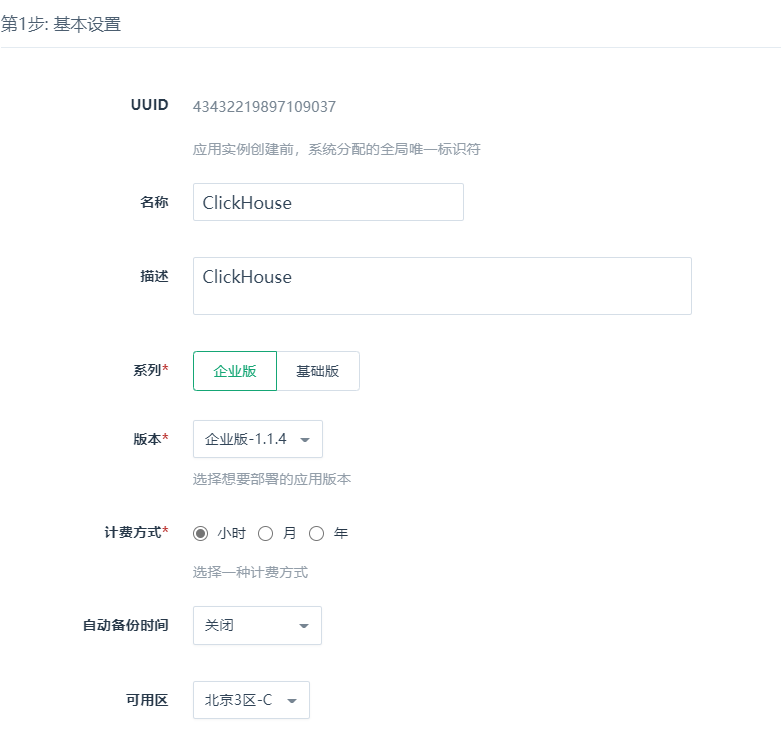
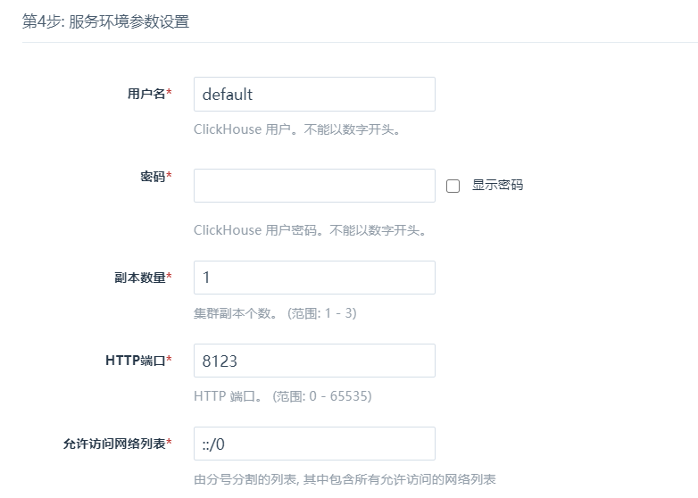

本小节主要介绍如何在 QingCloud 创建 ClickHouse 集群。 

## 基本设置

设置集群的基本参数信息。

计费方式可选小时、月、年。若开启自动备份，则在每天指定时间段都会创建一次备份。

**注解**：使用 Page cache 与最终一致模型，通常情况下不推荐开启自动备份功能。

## 节点设置

选择性能型或者超高性能型数据库实例，以及数据库的配置、磁盘大小。磁盘大小决定了数据库最大容量，您的数据和日志会共享这块磁盘。

## 网络设置

数据库集群服务只能加入已连接路由器的私有网络，并确保该私有网络的 DHCP 处于**打开**状态。

使用一个数据库独享的私有网络的，可方便做**过滤控制**管理，且不影响其他私有网络的设置。

## 服务环境参数设置

创建初始的数据库账号，并设置数据库服务的配置参数。

## 用户协议确认

阅读并同意青云 AppCenter 用户协议，点击**提交**即可开始部署应用。

