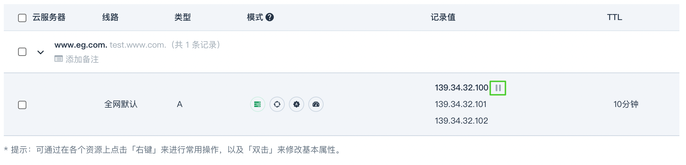
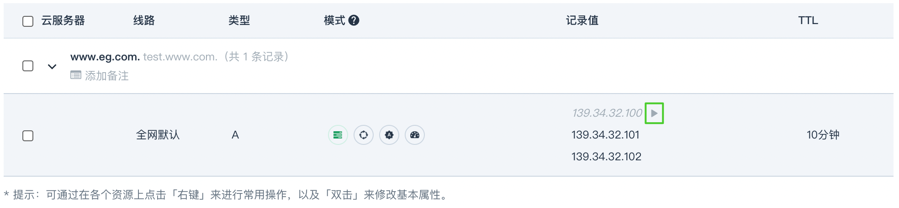
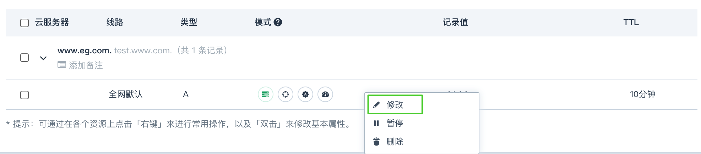
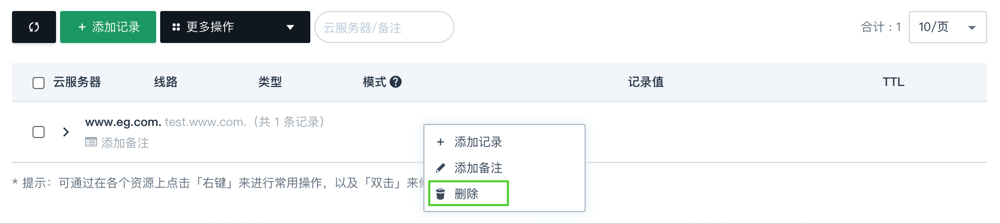
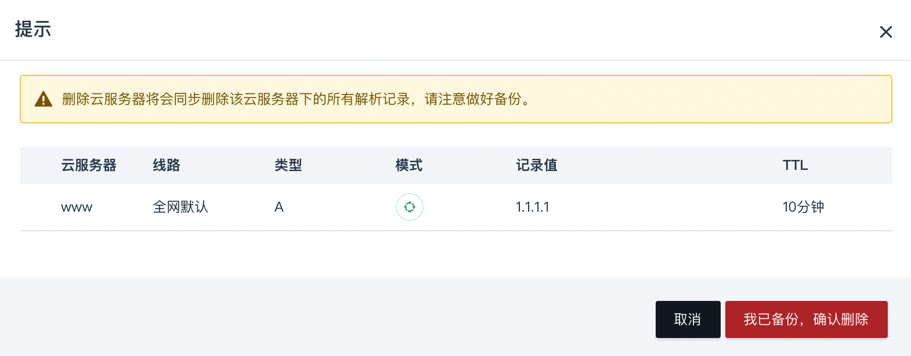
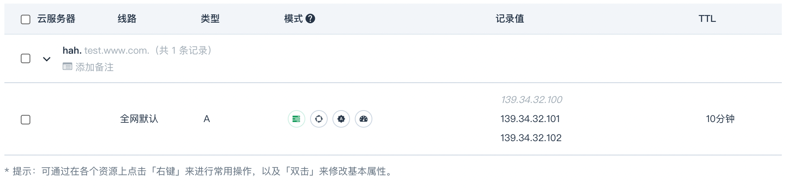
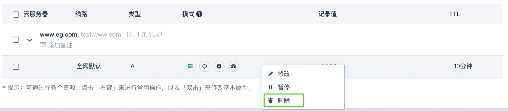
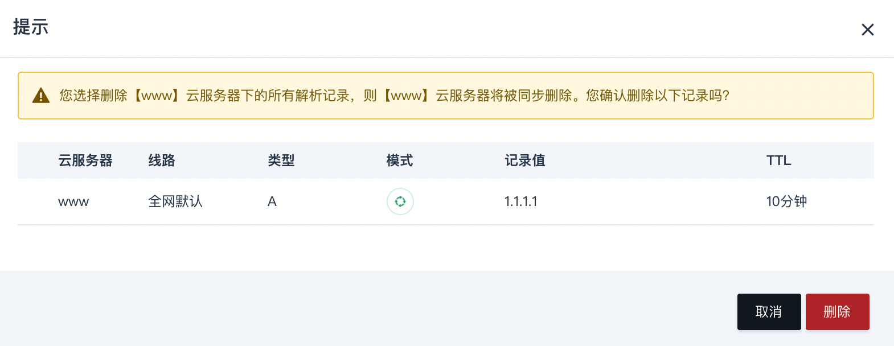

本小节主要介绍如何管理解析记录，包括修改解析记录、删除解析记录。

## 修改解析记录

1. 登录 QingCloud 管理控制台。
2. 选择**产品与服务** > **网络服务** > **DNS 服务**，进入域名列表页。
3. 点击域名名称，进入域名解析记录页面。
4. 鼠标移至记录值会出现暂停按钮，可暂停单个解析值。

   

5. 操作后该记录值会更新为暂停状态，再次移动鼠标到记录值则会出现启用按钮，点击可启用解析。

   

6. 解析记录模式列支持实时切换解析模式。

7. 在解析记录上双击，或单击右键选择 **修改** 按钮，可修改该条解析：

   

8. 单击右键选择 **暂停** （或 **启用** ）按钮，还可按组暂停或启用整组解析。

## 删除解析记录

### 删除子域名解析记录

1. 登录 QingCloud 管理控制台。
2. 选择**产品与服务** > **网络服务** > **DNS 服务**，进入域名列表页。
3. 点击域名名称，进入域名解析记录页面。
4. 在选定主机名上单击右键，选择 **删除** 按钮，将删除该子域名的全部解析。

   

   > 请注意：子域名解析全部删除则无法恢复，为了保证您的解析数据安全，将需要您确认该子域名数据已备份。

5. 点击 **我已备份，确认删除**，将删除成功。
   

### 删除单组解析记录

1. 登录 QingCloud 管理控制台。
2. 选择**产品与服务** > **网络服务** > **DNS 服务**，进入域名列表页。
3. 点击域名名称，进入域名解析记录页面。
4. 点击主机名，将展开该子域名下的全部解析记录。

   

5. 在选定解析记录上单击右键，选择 **删除** 按钮。

   

6. 删除确认框点击 **删除** 按钮，将删除成功。

   

7. 点击左侧复选框多选，以批量删除。
