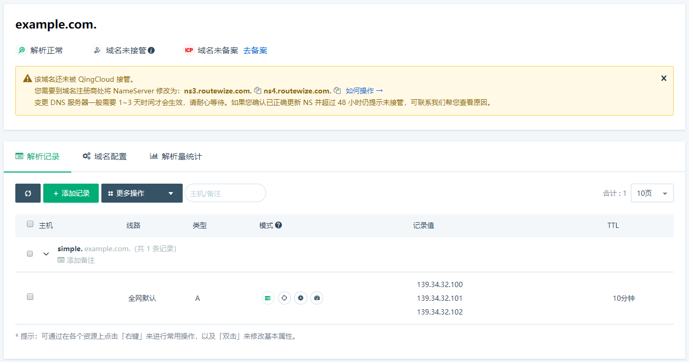

成功添加或修改解析记录后，您可以通过`nslookup`或`dig`等常见命令来验证域名解析是否生效。

> 您可以到互联网上搜索`nslookup`和`dig`命令的使用方法。
>
> 在您还未修改域名 DNS 服务器到 QingCloud DNS 之前，您**必须指定域名服务器**才能验证 QingCloud DNS 的解析效果。

以下为解析验证示例：

在 QingCloud DNS 管理面板配置 `simple.example.com` 解析记录如图所示。



> 注意上方页面提示 `example.com` 的域名服务器地址为**`ns3.routewize.com`** 和 **`ns4.routewize.com`**。

## 在 Windows 系统中执行

打开 Windows 命令行，执行如下nslookup命令。

`nslookup simple.example.com ns3.routewize.com`

返回如下结果，则检查与配置一致，表示验证通过。

```nslookup
名称:  simple.example.com
       Addresses:  139.34.32.100
          139.34.32.101
          139.34.32.102
```

## 在 Linux 或 Mac 系统中执行

在 Linux 或 Mac 系统中，请执行如下dig终端命令。

`dig @ns4.routewize.com simple.example.com`

返回如下结果，则检查与配置一致，表示验证通过。

```dig
;; ANSWER SECTION:
simple.example.com.600 IN A 139.34.32.100
simple.example.com.600 IN A 139.34.32.101
simple.example.com.600 IN A 139.34.32.102
```
> 注：Windows 上操作系统默认安装 `nslookup` ，若您需要在 Windows 中使用 `dig` 命令，您可以自行安装后使用。
