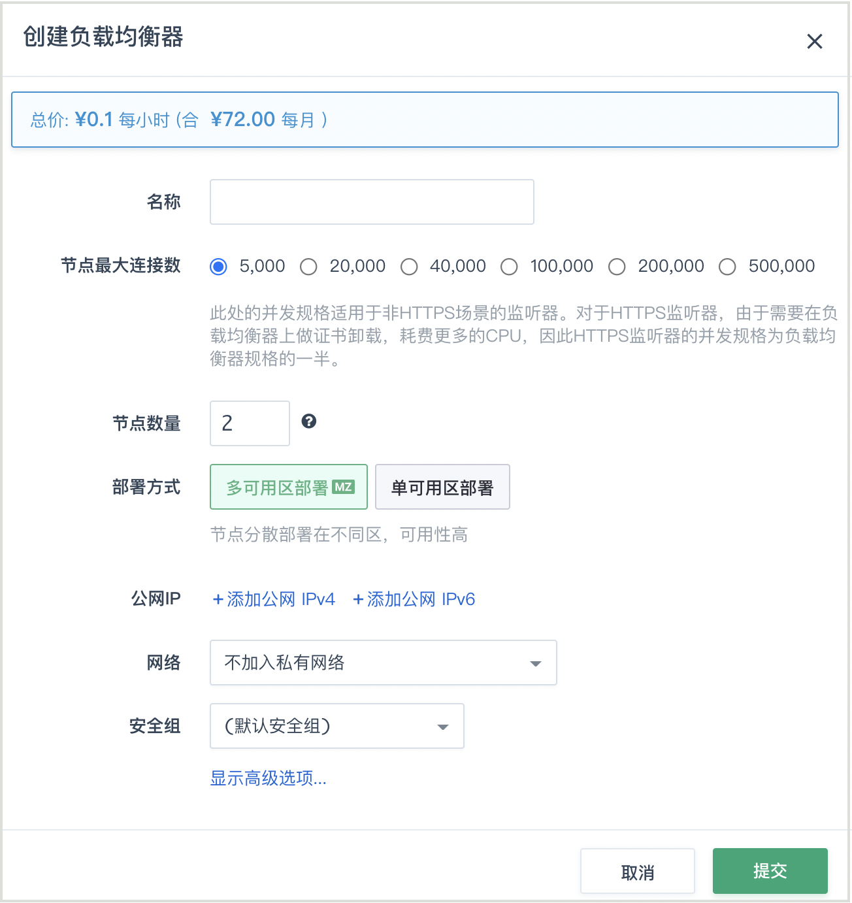

## 监听器

创建负载均衡器后，需要为负载均衡器配置监听器。监听器负责监听负载均衡器上的请求，根据负载均衡策略，分发流量到后端服务器处理。

### 监听协议类型


| 协议类型 | 协议说明                                                     | 适用场景                                                     |
| :------- | :----------------------------------------------------------- | :----------------------------------------------------------- |
| TCP      | 基于源地址的会话保持。数据传输快。                           | 适用于注重可靠性，对数据准确性要求高的场景，如文件传输、发送或接收邮件、远程登录。 |
| UDP      | 可靠性相对低数据传输快                                       | 适用于关注实时性而相对不注重可靠性的场景，如视频聊天、游戏、金融实时行情推送。 |
| HTTP     | 简单的请求-响应协议，通常运行在TCP之上                       | 需要对数据内容进行识别的应用，如Web应用、移动游戏等。        |
| HTTPS    | 加密传输数据，可以阻止未经授权的访问。加解密操作在负载均衡器上完成。 | 需要加密传输的应用 。                                        |


## 搭建基于HTTP协议的负载均衡

假设有两台云服务器位于基础网络中，每台云服务器上都已搭建好 HTTP 的 web server，监听 80 端口。 对这两台云服务器配置负载均衡器，搭建HTTP协议的负载均衡。

第一步：创建一个负载均衡器

首先，需要创建一个负载均衡器。在创建的对话框中，需要指定负载均衡器类型是公网还是私网。

*   公网负载均衡器需要绑定公网IP地址
*   私网负载均衡器需要选择网络ID (也可以选择私有网络 ID 里面的某个 IP 地址)

这里选择两个公网IP地址进行绑定，然后点击提交。

> 也可以在负载均衡器创建完成之后，通过 “绑定”/”解绑” 动作来动态地调整公网IP数目；
> 如果选择的负载均衡器集群是加入在某个私有网络的，可以通过网络 "加入私有网络"/"离开私有网络"来切换负载均衡器集群加入的私有网络 ID. 另外，加入私有网络时可以指定私有 IP 地址。



第二步：新建监听器

当负载均衡器创建完成后，需要新建一个 基于HTTP 协议的监听器。 首先，点击进入负载均衡器的详情页面，找到并点击 “创建监听器” 按钮。 如图所示，在弹出的对话框中，监听协议选择 “HTTP”，监听端口输入 “80”，负载方式选择 “轮询”，点击提交。

>添加监听器后请检查负载均衡器的防火墙规则，确保 80 端口流量可以通过，否则从外网无法访问。另外，也可以通过点击右边 “快捷方式” 里头的 “http” 协议进行快速设置


第三步：添加后端服务器

监听器添加完成之后，需要为监听器添加后端服务器。 首先，点击 HTTP 监听器下面的 “添加后端” 按钮。 在弹出的对话框中，”所在网络” 需要选择 “基础网络”， 然后从 “后端服务器” 的下拉菜单中选择我们已经配置好的 web server，”端口” 填 “80”， 然后点击提交。同理你可以添加另一台云服务器。


> 如果要添加私有网络云服务器作为后端，同样的，直接选择私有网络即可。

由于配置修改还没有被应用，所以后端服务器会显示不可用状态。 这时需要点击”创建监听器”旁边的”应用修改”按钮，使得修改生效。


> 在修改负载均衡器配置后，需要点击”应用修改”按钮使修改生效。


应用修改完成之后，后端服务器会成功被负载均衡器接管， 状态会恢复为 “活跃”。此时通过负载均衡器绑定的IP地址（例如 `http:///` ）就可以正常的访问了。


## 搭建基于HTTPS协议的负载均衡

假设 web server 云服务器还需要提供 HTTPS 协议的访问， 那么同样可以搭建一个 HTTPS 的负载均衡器来对 web server 进行负载均衡。 负载均衡器提供了原生的 HTTPS 协议支持，即后端云服务器只需要支持 HTTP 协议即可。 如果希望由后端云服务器承担 HTTPS 的卸载，那么可以通过 TCP 协议来实现类似的功能。

第一步：上传 SSL 服务器证书

进入负载均衡器的 “服务器证书” 页面，点击 “创建”，并将你的 “证书内容” 和 “私钥” 粘贴到对应的输入框中，点击 “提交”。 如下图所示：

>如果你需要上传证书链，也可以将所有证书链的内容粘贴于 “证书内容” 中。


[](../_images/create_lb_server_cert.png)

第二步：创建一个负载均衡器

因为一个负载均衡器可以新建多个监听器，所以可以在已创建的负载均衡器里添加新的监听器。因此，在本例里可以跳过第二步不再创建新的负载均衡器。

第三步：创建监听器

首先，点击进入负载均衡器的详情页面，找到并点击 “创建监听器” 按钮。 监听协议选择 “HTTPS”，监听端口选择 “443”，均衡方式选择 “轮询”， 在 “服务器证书” 处选择你上传的证书。点击提交。


>注解
>添加监听器后请检查负载均衡器的防火墙规则，确保 443 端口流量可以通过，否则从外网无法访问你的服务 你也可以通过点击右边”快速设置”里头的 “HTTPS” 协议进行快速设置。https监听器可以支持多张证书。


[](../_images/create_https_listener.png)

第四步：添加后端服务器

“网络”依旧选择 “基础网络”， 然后从 “云服务器” 的下拉菜单中选择已经配置好的 web server，”端口” 输入“80”，然后点击提交。


同理，如果还有其他后端云服务器，可以通过类似的操作依次添加。 在添加完成后，点击 “应用修改” 使配置生效。

> 如果要添加私有网络云服务器作为后端，直接选择私有网络。


## 搭建基于TCP协议的负载均衡

假设后端云服务器已经支持了 HTTPS 协议，并不需要负载均衡器本身来做 SSL 的卸载，那么可以使用 TCP 协议的负载均衡方式。 除此之外，数据库等服务也可以使用 TCP 协议进行负载均衡。

第一步：创建一个负载均衡器

因为一个负载均衡器可以新建多个监听器，所以可以在已创建的负载均衡器里添加新的监听器。因此，在本例里可以跳过第二步不再创建新的负载均衡器。

第二步：创建监听器

首先，点击进入负载均衡器的详情页面，找到并点击 “创建监听器” 按钮。监听协议选择 “TCP”，监听端口选择 “443”，均衡方式选择 “轮询”， 点击提交。


>添加监听器后请检查负载均衡器的防火墙规则，确保 443 端口流量可以通过，否则从外网无法访问您的服务


第三步：添加后端服务器


”网络” 中选择 “基础网络”， 在 “云服务器” 的下拉菜单中选择已经配置好的 web server，”端口” 输入 “443”，然后点击提交。


同理，如果还有其他 HTTPS 云服务器，你可以通过类似的操作依次添加， 注意在添加完成之后，不要忘记点击 “应用修改” 使配置生效。

>
> 如果要添加私有网络云服务器作为后端，直接选择私有网络。

## 搭建基于UDP协议的负载均衡

UDP协议多用于关注实时性而相对不注重可靠性的场景，如视频聊天和金融实时行情推送等。您可以添加一个UDP监听转发来自UDP协议的请求。

第一步：创建一个负载均衡器

因为一个负载均衡器可以新建多个监听器，所以可以在已创建的负载均衡器里添加新的监听器。因此，在本例里可以跳过第二步不再创建新的负载均衡器。

第二步：创建监听器

点击进入负载均衡器的详情页面，找到并点击 “创建监听器” 按钮。 监听协议选择 “UDP”，监听端口选择 “514”


UDP监听也支持选择端口范围，点击“使用端口组”，端口组范围填写“6000”-“7000”


第三步：添加后端服务器。


>使用限制：  UDP监听的20和65535端口为系统保留端口，目前不对外开放。


## 自定义转发策略

在上面的例子中，负载均衡器的后端都是对等的。如果后端不对等， 可以通过自定义转发策略来进行更高级的转发控制。

目前支持四种转发策略，分别是 “按域名转发” 、“按URL转发” 、“按源地址转发” 和 “按 HTTP Header 转发”。每种转发策略都可以配置多条规则，并可以自定义规则之间的匹配方式。


| 转发策略类型      | 策略说明                                                     | 适用场景                                               |
| :---------------- | :----------------------------------------------------------- | :----------------------------------------------------- |
| 按域名转发        | 按照域名来转发给后端服务器，例如：www.example.com 或者 ^example.com$ | 为多个域名提供负载均衡服务，后端server根据域名分组管理 |
| 按URL转发         | 按照URL转发给后端服务器，例如：^/static 或者 .css$           | 后端server根据url分组管理                              |
| 按源地址转发      | 按照源地址转发给后端服务器，例如：192.168.254.11             | 将重要/特殊客户网段的请求分配给专用服务器              |
| 按HTTP Header转发 | 按照HTTP Header内容转发给后端服务器，例如：Mozilla Chrome firefox | 不同的浏览器分组提供服务                               |


>当负载均衡器的监听协议为 HTTP 或者 HTTPS 时，支持转发策略配置; 当负载均衡器的监听协议为 TCP 时，不支持转发策略配置。

假设负载均衡器有两个后端，运行着两个不同域名的网站，域名分别为 “domain1.com” 和 “domain2.com”。 我们现在通过配置转发策略来将不同的域名的流量转发到不同的后端。


第一步：创建转发策略和转发规则

首先创建针对域名 “domain1.com” 的转发策略，为了方便查看，我们命名为 “domain1.com”，如图所示：

[](../_images/create_lb_policy_domain.png)

然后，为该策略创建一条 “按域名转发” 的规则，如图所示：

[](../_images/create_lb_policy_rule_domain.png)


>
>规则内容为 “domain1.com”, 表示匹配任何 “[*](#id4).domain1.com” 的域名的请求都会被转发，例如 “www.domain1.com” 和 “site1.domain1.com” 等。我们支持正则表达式（Perl Compatible Regular Expressions），例如你可以通过 “^domain1.com$” 来实现精确匹配或者通过“^/(?!api).domain1.com” 来匹配不以api开头的url。

同理，我们可以为 “domain2.com” 创建相应的转发策略和规则。


第二步：将转发策略与后端进行绑定

当为监听器添加域名为 “domain1.com” 的后端服务时，需要绑定对应的转发策略，即名称为 “domain1.com” 的转发策略，如图所示：

[](../_images/add_lb_backend_domain.png)

同理，添加域名为 “domain2.com” 的后端服务时，需要绑定名称为 “domain2.com” 的转发策略。

>当同一条转发策略与多个后端进行绑定时，满足策略的请求会根据监听器中配置的 “均衡方式” 均衡到多个后端，起到负载均衡的作用。


第三步：更新负载均衡器配置

后端添加完成之后，点击 “应用修改” 来更新负载均衡器的配置，最后的配置效果如图所示：

[](../_images/list_lb_backend_domain.png)


>
>这里可能还需要做的配置是，在域名解析商处，将这两个域名解析到负载均衡器对应的IP上。

这样，不同域名的请求将被转发到对应的后端，达到按域名转发的目的。

除了 “按域名转发” 之外，还可以配置更复杂的转发策略。例如，如果希望将 “site1.domain.com” 或者 “site2.domain.com”, 并且 URL 以 ”.jpg”,”.png” 或者 ”.gif” 结尾的请求都发给某个后端，那么可以创建如下策略：

创建策略，匹配方式选择 “匹配所有规则”，即所有规则之间是 “与” 的关系:

[](../_images/create_lb_policy_domain_and_url.png)

为该策略创建两条规则，分别为 “按URL转发” 和 “按域名转发”，多个域名或者多个 URL 的正则匹配可以通过空格分割，表示匹配任意一条即可：

[](../_images/create_lb_policy_rule_domain_and_url.png)

>
>当某个后端并没有和任何转发策略关联时，表示与后端所在监听器上其他转发策略都无法匹配的流量都会转发到该后端。如果该监听器上没有配置任何转发策略，则所有流量都会转发到该后端。


### 为转发策略指定优先级

当一个监听器绑定多条转发策略时，如果这些策略的规则之间出现了重叠，监听器会随机匹配，在一些复杂的转发控制场景下，这样的随机匹配会造成跟预期不符的转发情况。因此，需要为这些规则出现重叠的转发策略指定优先级。

[](../_images/create_lb_policy_domain.png)

负载均衡器会按照转发策略的优先级决定匹配后端的顺序。

>
>当规则重叠的转发策略，优先级也相同的情况下，仍然会出现随机匹配的情况。所以，在复杂的转发场景，请先做好规则匹配的规划。


### URL 重写

URL重写（英语：URL Rewriting）是一种REST的技术，它可以在负载均衡器中，针对用户所提供的URL进行转换后，再传入负载均衡器后端服务器进行处理。是针对[搜索引擎优化(SEO)](https://zh.wikipedia.org/wiki/%E6%90%9C%E5%B0%8B%E5%BC%95%E6%93%8E%E6%9C%80%E4%BD%B3%E5%8C%96)的重要手段,重写规则的内容符合[正则表达式](https://zh.wikipedia.org/zh-hans/%E6%AD%A3%E5%88%99%E8%A1%A8%E8%BE%BE%E5%BC%8F)语法。

例如： http://myhomer.vip/test1 

希望经过URL重写后，可以变成：

http://myhomer.vip/test3 

可以添加[重写规则](https://www.haproxy.com/documentation/aloha/10-0/traffic-management/lb-layer7/http-rewrite/#rewriting-http-urls)： `%[path,regsub(test,tset,i)]`


转发策略与重写配合使用：


## rsyslog 远端云服务器

此功能可以输出负载均衡器的日志流到指定的云服务器。配置之前，需要提供一台Linux (推荐ubuntu)云服务器，满足以下要求:

*   公网负载均衡器
    *   在 SDN 1.0区域，包括AP1/GD1/PEK1/PEK2（已下线）, 云服务器需要加入基础网络
    *   在 SDN 2.0区域，包括PEK3/SH1, 云服务器可以加入VPC或者基础网络，同时配置成负载均衡器的后端
*   私网负载均衡器, 云服务器和负载均衡器位于同一网络

按照下面步骤，配置 rsyslog：

第一步：修改 `/etc/rsyslog.conf`， 添加下面几行：

>
>UDPServerAddress 必须在 UDPServerRun 前面。

```
$ModLoad imudp
$UDPServerAddress 0.0.0.0
$UDPServerRun 514
```

第二步：创建 `/etc/rsyslog.d/haproxy.conf`， 内容如下：

```
local0.* /var/log/haproxy.log
```

第三步：重启服务

```
service rsyslog restart
```

>注解
>在这个云服务器的防火墙放行 udp 514 端口。

准备好云服务器以后，在青云控制台，右击负载均衡器，选择“配置rsyslog”，输入云服务器IP，并应用修改就可以生效。


日志格式请参考: [HAProxy文档 8.2.1 Default log format](https://www.haproxy.org/download/1.5/doc/configuration.txt)

## 负载均衡器术语解释

1.  **均衡方式**


**轮询**：依据后端服务器的权重，将请求轮流发送给后端服务器，常用于短连接服务，例如 HTTP 等服务。

**最少连接**：优先将请求发给拥有最少连接数的后端服务器，常用于长连接服务，例如数据库连接等服务。

**源地址**：将请求的源地址进行hash运算，并结合后端的服务器的权重派发请求至某匹配的服务器，这可以使得同一个客户端IP的请求始终被派发至某特定的服务器。该方式适合负载均衡无cookie功能的TCP协议。


2.  **会话保持**


会话保持可以将来自同一个客户端的请求始终发给同一个后端服务器，是通过 cookie 的方式来实现的。

**植入cookie**：由负载均衡器向客户端植入 cookie，这时你需要指定 cookie 的过期时间，不指定默认为不过期。

**植入cookie前缀**：cookie 由你的后端业务来植入和管理，负载均衡器会通过在该 cookie 前增加前缀来实现会话保持， 植入 cookie 前缀对后端服务是透明的，不影响后端服务的正常运行；这时你需要指定需要植入前缀的 cookie 名称。

**重写cookie**：cookie 由你的后端业务来植入和管理，负载均衡器会通过完全重写该 cookie 的值来实现会话保持， 重写 cookie 对后端服务是透明的，不影响后端服务的正常运行；这时你需要指定需要重写的 cookie 名称。

**后端cookie**：cookie 由你的后端业务来植入和管理，这时你需要指定会话保持的 cookie 名称和超时时间。


3.  **健康检查**


开启健康检测后，负载均衡器会根据你的配置定期检查后端服务的运行状态， 当某个后端服务出现异常时，会自动隔离该后端服务，并将请求转发给其他健康的后端服务，实现高可用性。

**健康检查方式**：


**TCP**：通过向后端服务器发送 TCP 包来检测后端服务

**HTTP**：通过向后端服务器发送 HTTP 请求来检测后端服务，你可以指定需要检测的 URI。负载均衡器会通过 HTTP 返回值是否为200来判断服务是否正常

**ICMP**：通过向后端服务器发送 ICMP Echo Request 请求（即 ping）来检查后端网络是否可达。

**UDP**：UDP 方式会 **结合** ICMP Echo Request 和 UDP port probe 两种方式来检查。

    * ICMP Echo Request: 参考上述 ICMP 方式。
    * UDP port probe: 发送一些UDP包。如果后端响应ICMP Destination Port Unreachable的包，则认为后端UDP端口没被监听；没有收到回包，认为端口是被监听着的。
    
    >注解：
    对于监听器为 UDP 端口组，且健康检查为 UDP 时，健康检查只会检测端口组的第一个端口。
    
    >注解：
    当使用UDP的健康检查方式时，要保证后端能够正确响应ICMP Echo Request（即返回ICMP Echo Reply包，icmp code: 0/0），并且能返回ICMP Destination Port Unreachable包，icmp code: 3/3）。
    如果后端有加载防火墙或者有其它防火墙策略，要保证其上行中相应的策略是放行的。


**健康检查选项**：


**检查间隔**：连续两次健康检查之间的时间间隔，单位为秒，范围为 `2 - 60s`

**超时时间**：等待健康检查请求返回的超时时间，检查超时将会被判定为一次检查失败，单位为秒，范围为 `5 - 300s`

**不健康阈值**：多少次连续检查失败之后，可以将后端服务屏蔽，范围为 `2 - 10次`

**健康阈值**：多少次连续检查成功之后，可以将后端服务恢复，范围为 `2 - 10次`


4.  **后端服务器权重**

当均衡方式为 “轮询” 时，你可以通过设置后端服务器的权重来让负载均衡器进行权重转发。 权重的范围为 `1 - 100`，数值越大权重越高。

5.  **后端服务器状态**


**活跃**：健康检查正常

**不可用**：健康检查失败

**异常**：处于健康和不健康的中间转换状态，一般持续时间很短，与你配置的 “健康检查选项” 相关


6.  **后端主备模式**

**工作后端**：正常提供服务的后端

**备用后端**：正常情况下不提供服务。只有在所有工作后端状态都为`不可用`时负载均衡会启用备用后端，并将负载转发给备用后端，以保障服务的持续运行。


7.  **附加 HTTP 头字段**


当监听协议为 HTTP/HTTPS 时，负载均衡器在转发 HTTP 请求时可以附加用户指定的 HTTP 头字段，后端服务器可以通过解析相应的头字段来获取字段内容。目前支持的附加头字段有：

**客户端真实IP**: 对应的HTTP 的头字段为 **X-Forwarded-For**。

**负载均衡器ID**: 对应的HTTP 的头字段为 **QC-LB-ID**。

**负载均衡器入口IP**: 对应的HTTP 的头字段为 **QC-LB-IP**。

**负载均衡器监听协议**: 对应的HTTP 的头字段为 **X-Forwarded-Proto**。


8.  **超时时间**

当客户端与负载均衡器的连接长期处于非活跃状态时，会被判断为连接超时，该连接会被主动中断。超时时间单位为秒，范围是 `10 - 86400s`，默认值是 `50s`。 如果你的连接都是长连接，那么你可能需要调整该配置。

9.  **附加选项**


**取消URL校验**: (仅HTTP/HTTPS)可以让负载均衡器接受不符合编码规范的 URL，例如包含未编码中文字符的 URL 等。

**获取客户端IP**: 也称为“透明代理”，可以把客户端的IP通过直接传递给后端。开启本功能后，负载均衡器对与后端是完全透明的。后端云服务器 TCP 连接得到的源地址是客户端的IP，而不是负载均衡器的IP。

注解

只有在负载均衡器要提供面向公网的服务时，才开启透明代理功能。如果是私网的负载均衡器，开启透明代理可能会导致客户端无法通过负载均衡器与服务端建立连接。

**数据压缩**:（仅HTTP/HTTPS）使用 gzip 算法压缩文本数据，以减少网络流量 。

**启用 HTTPS 重定向**: (仅HTTP) 将此监听器的 HTTP 请求重定向至此负载均衡器的 HTTPS 监听器。注：启用后，此监听器不支持添加后端。

**当所有后端不可用时直接拒绝 TCP 连接请求**: (仅TCP) 当所有后端不可用时，不再接受连接，而是直接拒绝 TCP 连接请求。

**禁用 HTTP 头字段 Proxy**: (仅HTTP/HTTPS) 为了安全起见，某些后端为 CGI 的 Web 应用需要在用户请求中禁用该字段来防止注入攻击。


10.  **加密选项**


**启用全部加密方式**:（仅HTTPS）

**禁用不安全的加密方式**:（仅HTTPS）禁用存在安全隐患的加密方式， 可能会不兼容低版本的客户端。

**启用兼容 IE 的加密方式**:（仅HTTPS）AES128 + EECDH : AES128 + EDH no-tls-tickets no-sslv3。


11.  **集群模式**

仅 Region 区域支持该属性。

**低延时**: 网络流量会优先转发到距离网关最近的负载均衡器节点，缩短网络传输距离，降低延时。

**高吞吐**: 网络流量会均衡地转发到所有的负载均衡器节点，充分利用所有节点的能力，提高吞吐率。

12.  **启用 HTTPS 重定向**

仅 HTTP 监听器，将此监听器的 HTTP 请求重定向至此负载均衡器的 HTTPS 监听器。注：启用后，此监听器不支持添加后端。

**重定向状态码**: 您可以自定义重定向操作返回的状态码：301/302/303/307/308


## 单节点性能参照

负载均衡集群创建时选择节点最大连接数和节点数量，负载均衡集群的能力 = 节点数 * 单节点能力

单节点能力参照下表


| 节点最大连接数 | 并发连接数 | 每秒新建连接数 | 转发率/PPS |
| :------------- | :--------- | :------------- | :--------- |
| 5000           | 5000       | 3000           | 20k        |
| 20000          | 20000      | 6000           | 40k        |
| 40000          | 40000      | 9000           | 80k        |
| 100000         | 100000     | 12500          | 125k       |
| 200000         | 200000     | 25000          | 250k       |
| 500000         | 500000     | 50000          | 500k       |