# 快速入门

## 总览

本指南旨在介绍 VPC 网络的主要属性、以及如何创建和几个主要管理功能入口等基本操作。

## 创建

如本文开头所说，在 VPC 网络内，您可以自定义 IP 地址范围，且由管理路由器来负责 VPN /隧道/ DNS /端口转发等管理功能，所以在创建 VPC 时，需要设置这两部分属性。

[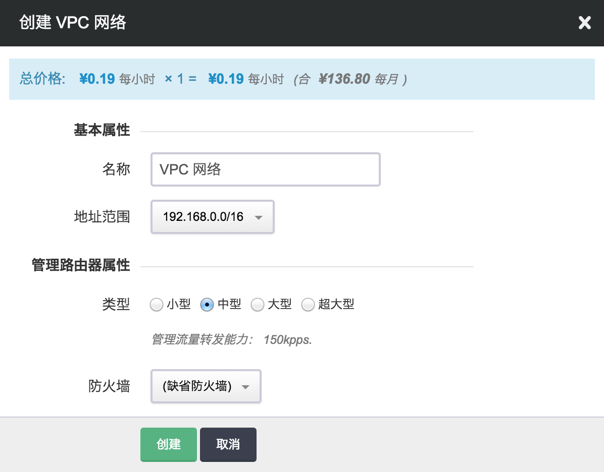](_images/create_vpc.png)

其中：

**地址范围**: VPC 网络的地址范围域，通常是一个 B 段地址；为 VPC 网络划分子网的时候，子网必须在这个地址范围内。

**类型**: VPC 网络的管理路由器类型，不同类型可支持的管理流量转发能力不同，可根据自己的业务特点及需求进行选择，对于已创建好的 VPC 网络来说，也可以在关闭 VPC 网络之后进行修改。

**防火墙**: VPC 网络的管理路由器的防火墙；每个 VPC 网络有一个管理路由器，这个路由器提供端口转发、隧道服务( [GRE 隧道](tunnel/gre) 、[IPSec 隧道](tunnel/ipsec) )、[VPN 服务](vpn) 等管理服务。当访问这些服务时，需要经过这个防火墙。VPC 网络里面的主机缺省没有防火墙，如果需要，也可以为每台主机加载独立的防火墙。

设置完成后点击“提交”，创建完成的 VPC 网络属性显示如下：

[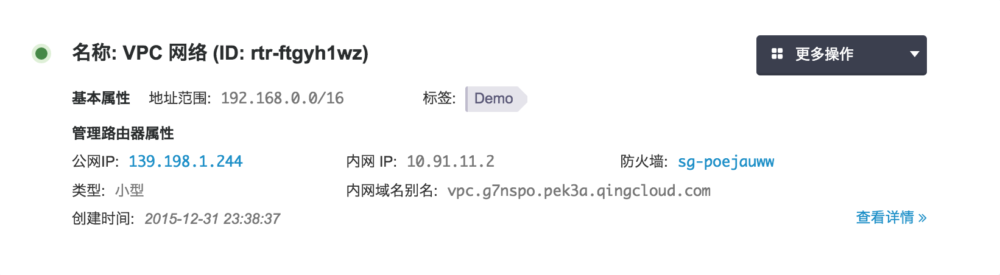](_images/vpc_list.png)

## 管理路由器

除在创建时指定的管理路由器类型及防火墙之外，管理路由器还包含以下几个属性，分别是：

**公网IP**: 管理路由器的公网 IP 地址，用于从公网访问端口转发、隧道服务( [GRE 隧道](tunnel/gre) 、[IPSec 隧道](tunnel/ipsec) )、[VPN 服务](vpn) 等管理服务。

**内网IP**: 管理路由器的内网 IP 地址，用于从青云内网访问管理服务。

**内网域名别名**: 管理路由器的内网域名别名。

**内网 DNS 服务**: 对 VPC 内部提供域名解析的服务，可以开启/关闭内网 DNS 服务。同时支持开启/关闭 PTR 解析类型-反向 DNS 解析。

可以通过点击每个属性旁边的图标进行添加、修改、删除等操作。针对 VPC 网络本身的基本操作，比如修改、开启、关闭、扩容和删除等则在“更多操作”的下拉菜单中可以找到。

点击创建好的 VPC 网络进入其详情页面，在此可以对 VPC 网络的私有网络和管理配置做进一步修改和调整。

## 私有网络

VPC 网络的私有网络指的是一个二层子网网段，通常是一个 C 段地址；你可以根据需要将一个 VPC 网络划分成多个子网，主机必须加入到子网里面使用。

[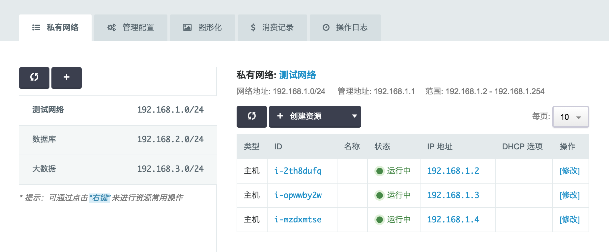](_images/vpc_vxnets.png)

*   VPC 网络中的子网可以是当前主账户名下的私有网络，也可以是子帐户名下的私有网络。
*   在私有网络的资源列表中可以直接添加主机、数据库和大数据资源。

## 管理配置

VPC 网络管理路由器功能主要包含端口转发、隧道服务([GRE 隧道](tunnel/gre) 、[IPSec 隧道](tunnel/ipsec) )、[VPN 服务](vpn)、网关过滤控制(ACL)、DNS 服务以及边界路由器等。

[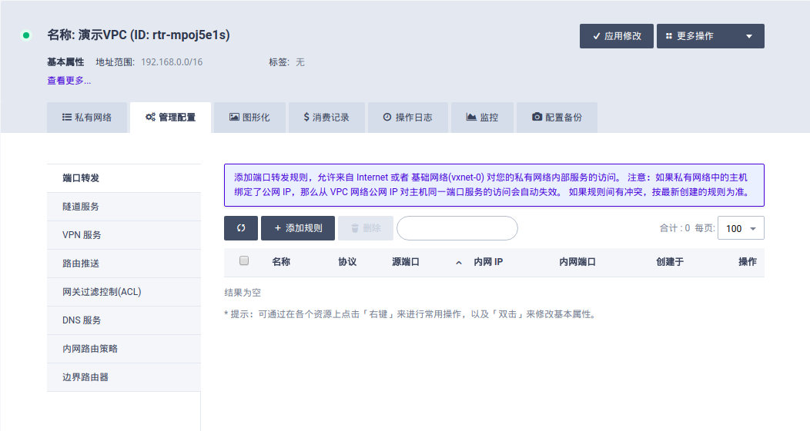](_images/vpc_settings.png)

当修改了VPC管理配置时，需要`应用修改`才可以生效。如果未应用修改，VPC详情也有上角将提醒您需要点击应用修改，使配置生效。

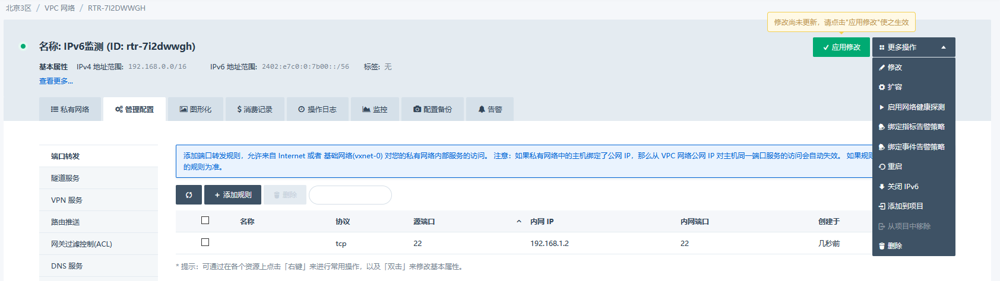

    
## 图形化

VPC网络支持图形化查看和编辑网络拓扑，让用户可以对整体网络可以一目了然，形成形象认知。

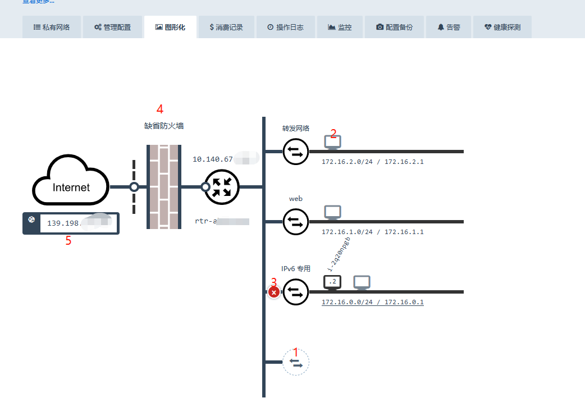

VPC拓扑中可以进行多种操作：
*  1.连接私有网络
*  2.创建/移除虚拟主机
*  3.断开私有网络
*  4.更换防火墙
*  5.绑定/解绑虚拟主机

## 消费记录

消费记录会统计当前VPC的历史消费信息

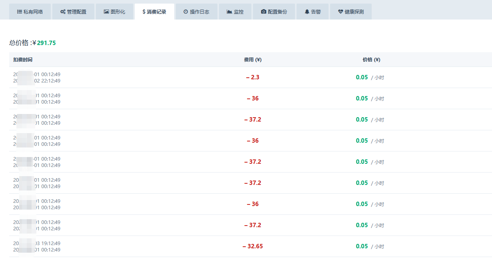

## 操作日志

操作日志会记录VPC的历史操作日志，当出现网络问题时可以通过操作日志排查是否与操作有关

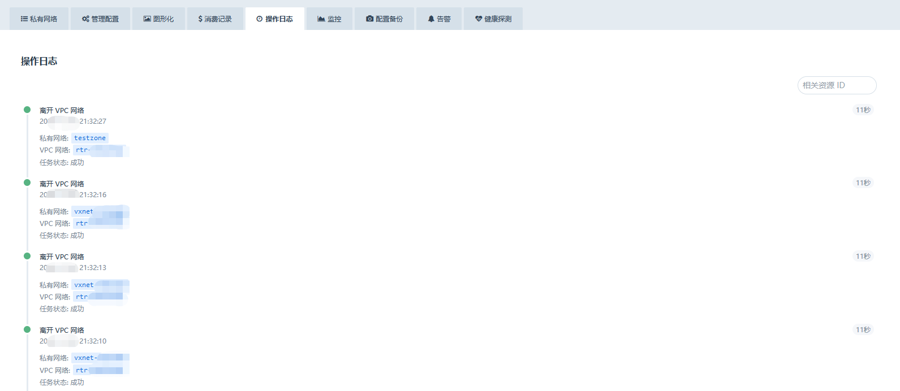

## 监控

监控页面记录当前VPC的历史流量监控，包括双向的带宽和PPS

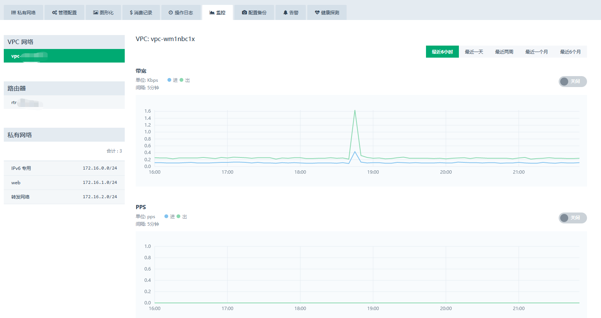

通过选择私有网络，可以看到单个私有网络的监控。切换到网卡监控页面，可以看到当前时刻的网卡的流量情况

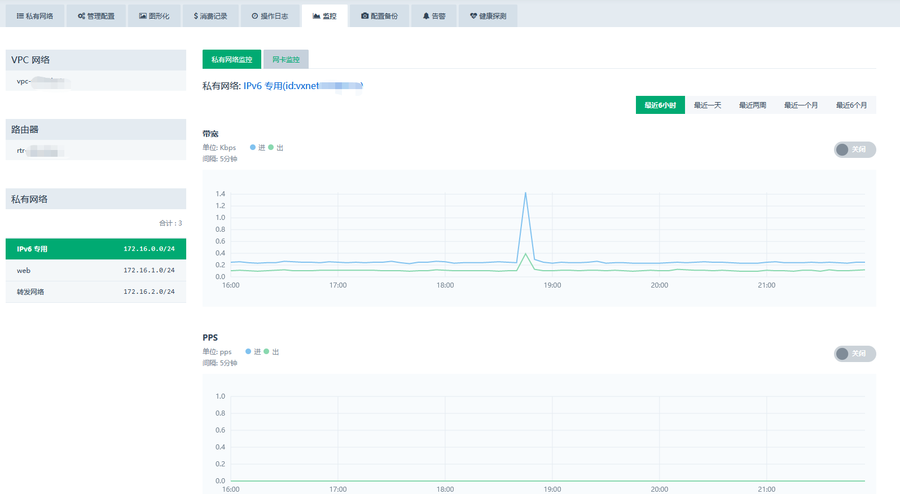

## 配置备份

VPC默认开启了自动配置备份功能，网络配置在修改时都将自动备份，用户可以在配置备份页面查看，也可以手动创建/删除备份。

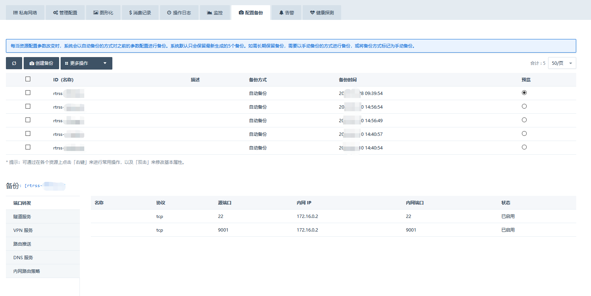

## 告警

用户可以在运维管理创建针对VPC的告警规则，并绑定给VPC，告警页面显示VPC绑定的告警规则及告警历史记录。

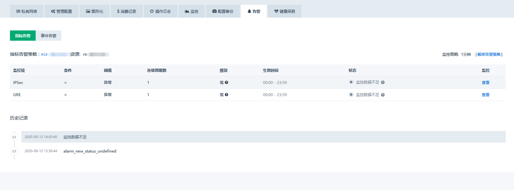

## 健康探测

用户可以在`更多操作`开启和关闭健康探测，开启后将定期刷新VPC内所有主机的网络情况，包括丢包率和延迟。

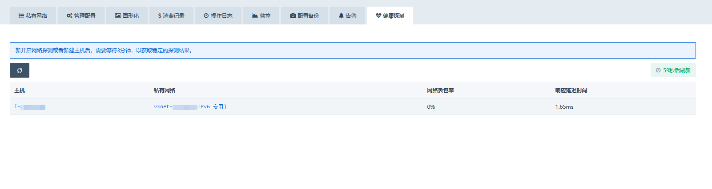

## 更多操作

更多操作包含一些未在界面中展示的，对VPC执行的整体操作，包含：
*  修改VPC名称/描述
*  扩大VPC规格
*  开启/关闭网络探测
*  开启/关闭IPv6
*  绑定/解绑高级策略
*  重启VPC网络
*  加入/离开项目
*  删除VPC

