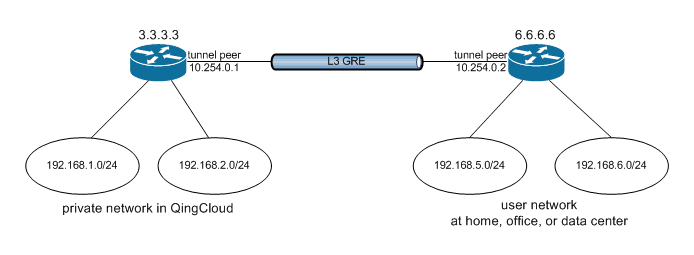
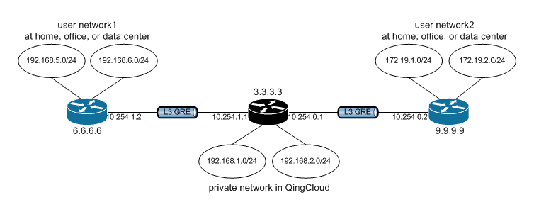
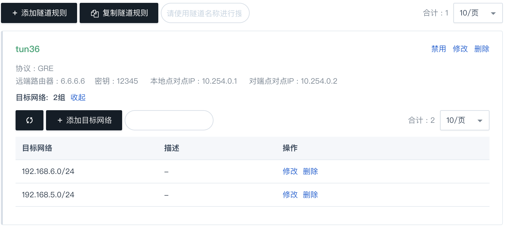
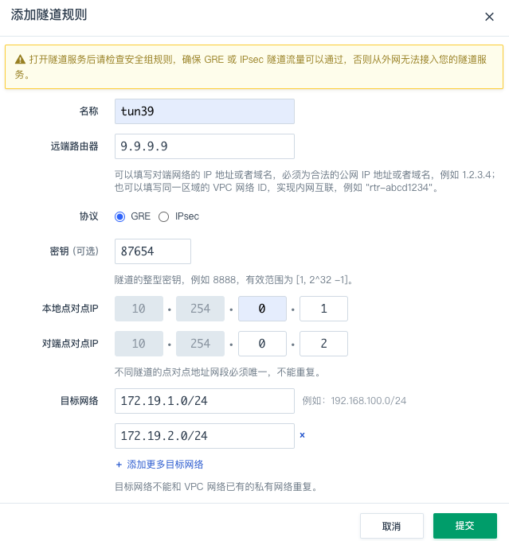
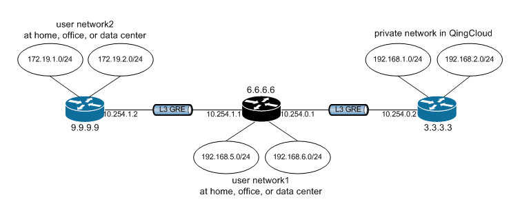

L3 over L3 是 GRE 最常见用法，得到了所有主流网络设备的支持，也得到了各种操作系统的支持。

GRE 隧道是一个很灵活的技术，可以用来组建各种网络拓扑，常见的树型、星型、总线型(串型)、环型和混合型均可实现。本指南不会全部描述，因为配置方法都是一样的。以下选择三种拓扑结构来做描述。

## 简单的对连拓扑

如下图所示，假设您在青云中的路由器使用的公网 IP 是 3.3.3.3，您自己数据中心的路由器使用的公网 IP 是 6.6.6.6，这两个路由器背后各连接有两个私有网络，它们将通过 GRE 隧道连接在一起。



### 1. 在青云中的操作

登录 WEB 控制台，点击左边导航条中的“网络”，在右边主显示区域 “路由器” 项下点击您的路由器，进入其详情页，切换至“隧道服务”页签，然后点击“添加隧道规则”。

在弹出的对话框里，填写以下项目:

* 协议: 默认为 GRE 协议
* 名称: 为该隧道起个名字，比如 tun36
* 远端路由器 IP: 在本例中为您数据中心路由器的公网 IP 6.6.6.6
* 密钥: 一个两端共同使用的约定整型数字，比如 12345
* 本地点对点 IP: 隧道在青云路由器这边的地址，比如 10.254.0.1
* 对端点对点 IP: 隧道在您数据中心的地址，比如 10.254.0.2
* 目标网络: 在本例中为您数据中心的两个私有网络 192.168.5.0/24、192.168.6.0/24


确认无误后，点击“提交”，然后点击页面上方的“应用修改”按钮，以完成路由器的配置更新。这样就完成了在青云这端的隧道配置。

另外，还需要去该路由器使用的防火墙规则中打开 GRE 协议。并记得 应用更改 。

### 2. 在您数据中心设备上的操作

因为隧道的对称性，还需要在您自己数据中心的路由器上进行隧道配置，具体配置方法取决于您使用的网络设备，请查询厂商的手册。这里给一个 Huawei 路由器的配置过程，供参考:

```
[Quidway] interface Tunnel 0/0/0
[Quidway-Tunnel0/0/0] ip address 10.254.0.2 255.255.255.0
[Quidway-Tunnel0/0/0] tunnel-protocol gre
[Quidway-Tunnel0/0/0] source 6.6.6.6
[Quidway-Tunnel0/0/0] destination 3.3.3.3
[Quidway-Tunnel0/0/0] gre key 12345
[Quidway-Tunnel0/0/0] quit
[Quidway] ip route-static 192.168.1.0 255.255.255.0 Tunnel0/0/0
[Quidway] ip route-static 192.168.2.0 255.255.255.0 Tunnel0/0/0
```

## 青云作为中心节点的星型拓扑

如下图所示，假设您在青云中的路由器使用的公网 IP 是 3.3.3.3，您自己有两个数据中心，它们对外路由器使用的公网 IP 分别是 6.6.6.6、9.9.9.9，这三个路由器背后各连接有两个私有网络，它们将通过 L3 GRE 隧道连接在一起。



上图中，黑色的路由器表示是这个星型网络的中心节点，蓝色的路由器表示接入节点。

### 1. 在青云中的操作

参照 简单的对连拓扑 一节中“1.在青云中的操作”的部分，创建一条到 6.6.6.6 的隧道后，在“隧道服务”标签页中点击“添加隧道规则”按钮，可以新建一条到 9.9.9.9 的隧道。



在弹出的对话框里，填写以下项目:

* 协议: 默认为 GRE 协议
* 名称: tun39
* 远端路由器 IP: 9.9.9.9
* 密钥: 87654
* 本地点对点 IP: 10.254.0.1
* 对端点对点 IP: 10.254.0.2
* 目标网络: 172.19.1.0/24、172.19.2.0/24

确认无误后，点击“提交”，然后点击页面上方的“应用修改”按钮，以完成路由器的配置更新。这样就完成了在青云这端的隧道配置。

如下图所示：



另外，还需要去该路由器使用的防火墙规则中打开 GRE 协议。并记得 应用更改 。

### 2. 在您数据中心设备上的操作

因为隧道的对称性，还需要在您自己数据中心的这两台路由器上进行相应的隧道配置，具体配置方法取决于您使用的网络设备，请查询厂商的手册。

## 青云作为接入节点的星型拓扑

如下图所示，网络构成与 青云作为中心节点的星型拓扑 一节相同，唯一的不同之处是，这次 6.6.6.6 是中心节点，青云网络(3.3.3.3)的身份是一个接入节点。为了醒目，依然用黑色的路由器表示是这个星型网络的中心节点，蓝色的路由器表示接入节点。



参照 简单的对连拓扑 一节中“1.在青云中的操作”的部分，创建一条到 6.6.6.6 的隧道。即完成了在青云中的操作。

剩余的各条隧道均需要在您自己数据中心的这两台路由器上进行相应的配置，具体配置方法取决于您使用的网络设备，请查询厂商的手册。


## 使用限制


|隧道类型    | GRE    |
|:----|:----|:----|:----|
|单 VPC 可并存的隧道数量   | 800    |