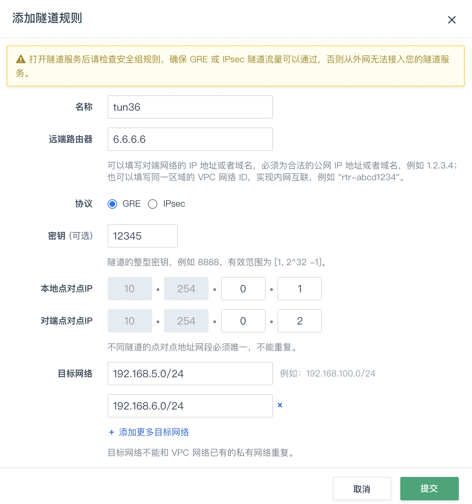

L3 over L3 是 GRE 最常见用法，得到了所有主流网络设备的支持，也得到了各种操作系统的支持。

GRE 隧道是一个很灵活的技术，可以用来组建各种网络拓扑，常见的树型、星型、总线型(串型)、环型和混合型均可实现。本指南不会全部描述，因为配置方法都是一样的。以下选择三种拓扑结构来做描述。

## 简单的对连拓扑

如下图所示，假设您在青云中的 VPC 使用的公网 IP 是 3.3.3.3，您自己数据中心的 网络使用的公网 IP 是 6.6.6.6，这两个网络节点下各连接有两个私有网络（子网），它们将通过 GRE 隧道连接在一起。


### 1. 在青云中的操作

1. 登录 [QingCloud 管理控制台](https://console.qingcloud.com/login)，选择**产品与服务** > **网络服务** > **VPC 网络**，进入 VPC 列表页面。

2. 找到您的 VPC 网络，点击 VPC 网络名称，进入详情页。

3. 切换至**管理配置**页签，然后点击**隧道服务** > **添加隧道规则**。

4. 在弹出的对话框里，填写配置以下参数，点击**提交**。

   

   * 名称: 为该隧道起个名字，比如 tun36。
   * 远端路由器 IP: 在本例中为您数据中心路由器的公网 IP： 6.6.6.6。
   * 协议: 默认为 GRE 协议。
   * 密钥: 一个两端共同使用的约定整型数字，比如 12345。
   * 本地点对点 IP: 隧道在青云路由器这边的地址，比如 10.254.0.1。
   * 对端点对点 IP: 隧道在您数据中心的地址，比如 10.254.0.2。
   * 目标网络: 在本例中为您数据中心的两个私有网络 192.168.5.0/24、192.168.6.0/24。

   

5. 点击页面上方的**应用修改**，完成 VPC 网络的配置更新。

6. 前往 VPC 使用的安全组规则中打开 GRE 协议，完成后点击**应用修改** 。

### 2. 在您数据中心设备上的操作

因为隧道的对称性，还需要在您自己数据中心的路由器上进行隧道配置，具体配置方法取决于您使用的网络设备，请查询厂商的手册。这里给一个 Huawei 路由器的配置过程，供参考:

```
[Quidway] interface Tunnel 0/0/0
[Quidway-Tunnel0/0/0] ip address 10.254.0.2 255.255.255.0
[Quidway-Tunnel0/0/0] tunnel-protocol gre
[Quidway-Tunnel0/0/0] source 6.6.6.6
[Quidway-Tunnel0/0/0] destination 3.3.3.3
[Quidway-Tunnel0/0/0] gre key 12345
[Quidway-Tunnel0/0/0] quit
[Quidway] ip route-static 192.168.1.0 255.255.255.0 Tunnel0/0/0
[Quidway] ip route-static 192.168.2.0 255.255.255.0 Tunnel0/0/0
```

## 青云作为中心节点的星型拓扑

如下图所示，假设您在青云中的 VPC 网络使用的公网 IP 是 3.3.3.3，您自己有两个数据中心，它们对外使用的公网 IP 分别是 6.6.6.6、9.9.9.9，这三个 VPC 网络背后各连接有两个私有网络，它们将通过 L3 GRE 隧道连接在一起。


上图中，黑色的路由器表示是这个星型网络的中心节点，蓝色的路由器表示接入节点。

### 1. 在青云中的操作

1. 在 VPC 详情页的**管理配置**标签页中，参照简单的对连拓扑中 [1.在青云中的操作](#1-在青云中的操作) 的部分，创建一条到 6.6.6.6 的隧道。

   

2. 再次点击**隧道服务** > **添加隧道规则**，新建一条到 9.9.9.9 的隧道。

3. 在弹出的对话框里，填写以下项目:

   

   * 名称: tun39
   * 远端路由器 IP: 9.9.9.9
   * 协议: 默认为 GRE 协议
   * 密钥: 87654
   * 本地点对点 IP: 10.254.0.1
   * 对端点对点 IP: 10.254.0.2
   * 目标网络: 172.19.1.0/24、172.19.2.0/24

4. 确认无误后，点击**提交**，然后点击页面上方的**应用修改**，以完成 VPC 网络的配置更新。

5. 前往 VPC 网络使用的安全组规则中打开 GRE 协议。完成后点击**应用修改** 。

### 2. 在您数据中心设备上的操作

因为隧道的对称性，还需要在您自己数据中心的网络中进行相应的隧道配置，具体配置方法取决于您使用的网络设备，请查询厂商的手册。

## 青云作为接入节点的星型拓扑

如下图所示，网络构成与青云作为中心节点的星型拓扑一节相同，唯一的不同之处是，这次 6.6.6.6 是中心节点，青云网络（3.3.3.3）的身份是一个接入节点。为了醒目，依然用黑色的路由器表示是这个星型网络的中心节点，蓝色的路由器表示接入节点。


参照[简单的对连拓扑](#简单的对连拓扑)中[在青云中的操作](#1-在青云中的操作)部分，创建一条到 6.6.6.6 的隧道，即完成了在青云中的操作。

剩余的各条隧道均需要在您自己数据中心的网络中进行相应的配置，具体配置方法取决于您使用的网络设备，请查询厂商的手册。

## 使用限制

单个 VPC 可并存的GRE隧道数量为800。

