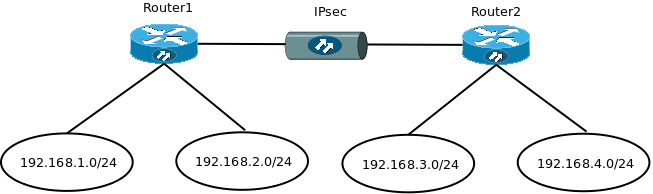
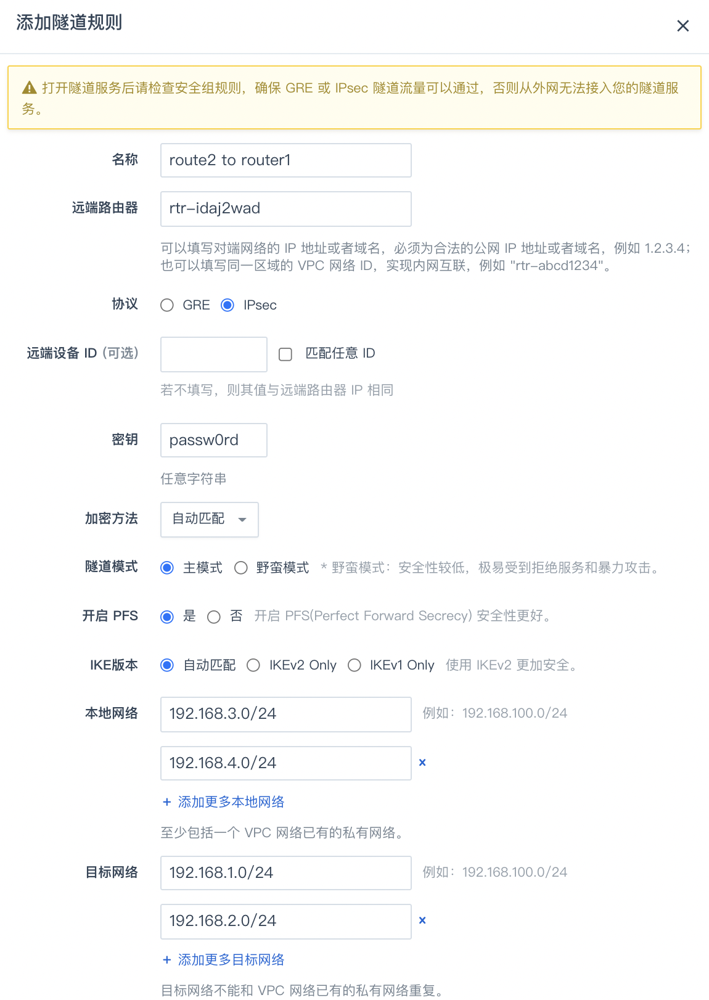
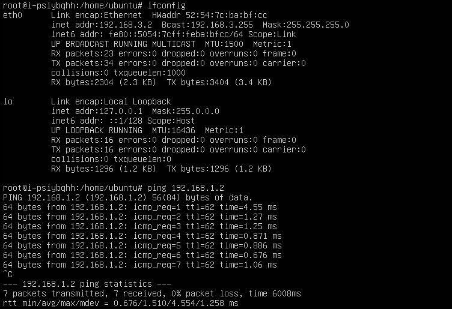

IPsec 是一种加密的隧道技术，通过使用加密的安全服务在不同的网络之间建立保密而安全的通讯隧道。本指南通过介绍简单的内网对连拓扑来介绍 IPsec 的使用方式， 其他更高级的连接拓扑和 GRE 隧道类似，可参见 [GRE 隧道指南](../gre)，在此不再赘述。

## 简单的内网对连拓扑

如下图所示，假设您在青云中有两个路由器，位于同一区域，分别为 router1 和 router2，这两个路由器背后各连接有两个私有网络，它们将通过 IPsec 隧道连接在一起。



### 1. 配置 router1 的 IPsec 隧道

登录 WEB 控制台，点击左边导航条中的“计算与网络”，在 “路由器” 项下点击您的路由器，进入其详情页，切换至“隧道服务”页签，然后点击“添加隧道规则”。

在弹出的对话框里，填写以下项目:

* 名称: 为该隧道起个名字，比如 “router1 to router2”
* 协议: 选择 IPsec
* 远端路由器: 因为是内网互连，在本例中填入远端路由器 ID 即可，如果是公网互连，则需要填入远端路由器的公网 IP 或是域名；如果对端没有固定IP，可填 0.0.0.0，部分设备还必须点选使用 野蛮模式 进行互连
* 密钥: 一个两端共同约定的密钥，可以为任意字符串
* 本地网络: 至少包括一个路由器已有的私有网络。在本例中该路由器的两个私有网络 192.168.1.0/24、192.168.2.0/24
* 目标网络: 在本例中为远端路由器的两个私有网络 192.168.3.0/24、192.168.4.0/24
* 远端设备ID: 接勃对端设备的ID标识符，默认值和“远端路由器”同，如果不确认，可勾选匹配任意ID
* 隧道模式: 默认主模式，当点选 野蛮模式 的时候请务必心中有知“野蛮模式安全性较低，极易受到拒绝服务和暴力攻击”
* 健康检查IP: 用于健康检查的目标地址，必须处于目标网络中且可以 ping 通，也可以同时添加 ip 和端口，例如 192.168.200.2 或者 192.168.200.2:80；检查IP可以添加多个，也可以为空


确认无误后，点击“提交”，然后点击页面上方的“应用修改”按钮，以完成路由器的配置更新。这样就完成了在该路由器的隧道配置。

> 需要在该路由器使用的防火墙规则中打开 IPsec 协议需要的端口和协议，分别为 UDP 500, UDP 4500, AH 和 ESP。并记得 “应用更改” 。

### 2. 配置 router2 的 IPsec 隧道

由于隧道的对称性，在路由器 router2 上也需要有对应的配置。在弹出的隧道配置对话框里，填写以下项目:

* 名称: 为该隧道起个名字，比如 “router2 to router1”
* 协议: 选择 IPsec
* 远端路由器: 因为是内网互连，在本例中填入远端路由器 ID 即可，如果是公网互连，则需要填入远端路由器的公网 IP 或是域名
* 密钥: 一个两端共同约定的密钥，可以为任意字符串
* 本地网络: 在本例中该路由器的两个私有网络 192.168.3.0/24、192.168.4.0/24
* 目标网络: 在本例中为远端路由器的两个私有网络 192.168.1.0/24、192.168.2.0/24



确认无误后，点击“提交”，然后点击页面上方的“应用修改”按钮，以完成路由器的配置更新。这样就完成了在该路由器的隧道配置。

另外，还需要去该路由器使用的防火墙规则中打开 IPsec 协议需要的端口和协议，分别为 UDP 500, UDP 4500, AH 和 ESP。并记得”应用更改” 。

### 3. 测试连通性

在完成两个路由器的隧道配置之后，我们可以利用两个路由器对应的云服务器进行连通性测试，如下图所示：



### 4. 和物理设备做 IPsec 互联

以上例子是青云路由器之间做 IPsec 互联。青云路由器也可以和具有 IPsec 功能的物理设备（路由器、防火墙等）做互联。

以下是现阶段青云路由器 IPsec 的支持参数，支持参数自动匹配、自动协商。

```
MODE:               main[主模式]/aggrmode[野蛮模式]
TYPE:               tunnel
IKE:                ikev1(默认)/ikev2
IKE encrypt:        AES(默认)/3DES
ESP encrypt:        AES（默认）/3DES/DES/CAST/BLOWFISH/CAMELLIA/SERPENT/TWOFISH
IKE SA lifetime:    3600s
IPsec SA lifetime:  28800s
HASH:               MD5/SHA1(默认)/SHA2
DH-GROUP:           2/5/14（默认）/15/16/17/18/22/23/24
PFS:                up
NAT-Traversal:      up
AUTH:               PSK
DPDDelay:           15s
```

通常在物理设备上需要显式地定义 IPsec 的 加密集(encryption和HASH)、DH group、lifetime、access-list、路由、NAT豁免等。

如果对接的物理设备在内网，需要在青云路由器的 IPsec 配置 “对端设备ID”，通常填写所对接内网的网关IP。

假设本地私有网络为 192.168.1.0/24，青云私有网络为 192.168.100.0/24，本地公网地址为 88.88.88.88，青云路由器公网地址为 99.99.99.99。

以 Cisco ASA 设备为例，使用 cli 进行配置，主要包含了 crypto-map、access-list、psk、tunnel 的配置文本:

```
ASA(config)# access-list my_nat extended permit ip 192.168.1.0 255.255.255.0 192.168.100.0 255.255.255.0
ASA(config)# access-list cisco-to-qingcloud extended permit ip 192.168.1.0 255.255.255.0 192.168.100.0 255.255.255.0
ASA(config)# nat (inside) 0 access-list my_nat

ASA(config)# crypto ipsec transform-set ESP-3DES-MD5 esp-3des esp-md5-hmac
ASA(config)# crypto ipsec security-association lifetime seconds 28800
ASA(config)# crypto ipsec security-association lifetime kilobytes 4608000

ASA(config)# crypto map my_map 1 match address cisco-to-qingcloud
ASA(config)# crypto map my_map 1 set pfs
ASA(config)# crypto map my_map 1 set peer 99.99.99.99
ASA(config)# crypto map my_map 1 set transform-set ESP-3DES-MD5
ASA(config)# crypto map my_map interface outside
ASA(config)# crypto isakmp enable outside
ASA(config)# crypto isakmp policy 10
ASA(config-isakmp)# authentication pre-share
ASA(config-isakmp)# encryption 3des
ASA(config-isakmp)# hash md5
ASA(config-isakmp)# group 2
ASA(config-isakmp)# lifetime 3600
ASA(config)# crypto isakmp nat-traversal 60

ASA(config)# tunnel-group 99.99.99.99 type ipsec-l2l
ASA(config)# tunnel-group 99.99.99.99 ipsec-attributes
ASA(config-tunnel-ipsec)# pre-shared-key *****
```

以 H3C Router 设备为例，使用 cli 进行配置，主要包含了 transform-set、policy、profile、proposal、psk、acl 的配置文本:

```
#
acl number 3100
 rule 10 permit ip source 192.168.1.0 0.0.0.255 destination 192.168.100.0 0.0.0.255

#
ipsec transform-set tran1
 esp encryption-algorithm aes-cbc-128
 esp authentication-algorithm sha1
 pfs dh-group14

#
ipsec policy map1 10 isakmp
 transform-set tran1
 security acl 3100
 remote-address 99.99.99.99
 ike-profile profile1
 sa duration time-based 28800

#
ike profile profile1
 keychain keychain1
 local-identity address 88.88.88.88
 match remote identity address 99.99.99.99 255.255.255.255
 proposal 1

#
ike proposal 1
 encryption-algorithm 3des-cbc
 dh group14
 sa duration 3600
#
ike keychain keychain1
 pre-shared-key address 99.99.99.99 255.255.255.255 key cipher *****
```

> 依物理设备的品牌和型号，IPsec 的配置方法会存在差异性。请参阅设备的用户手册确定正确的配法。


## 使用限制


|隧道类型    | IPSec    |
|:----|:----|:----|:----|
|单 VPC 可并存的隧道数量   | 800    |