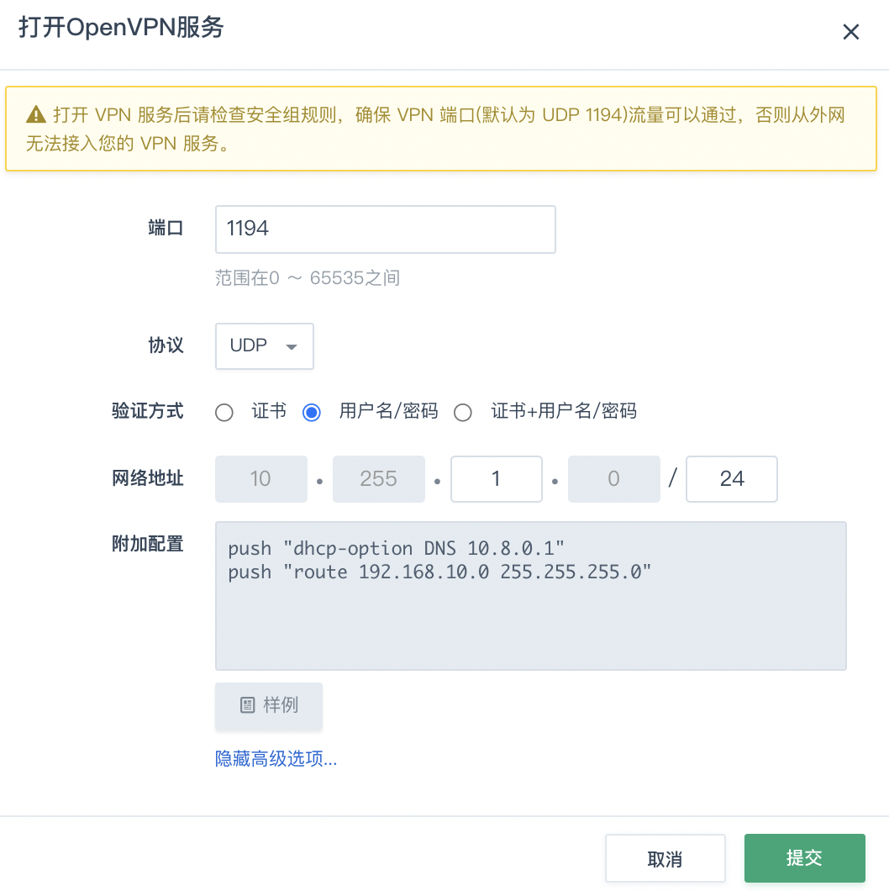
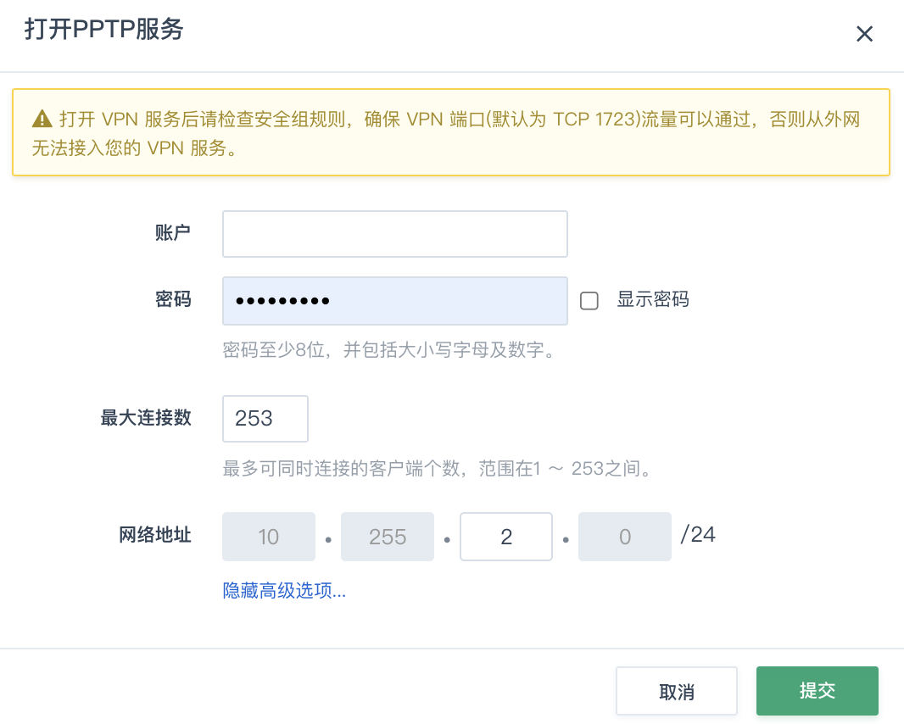
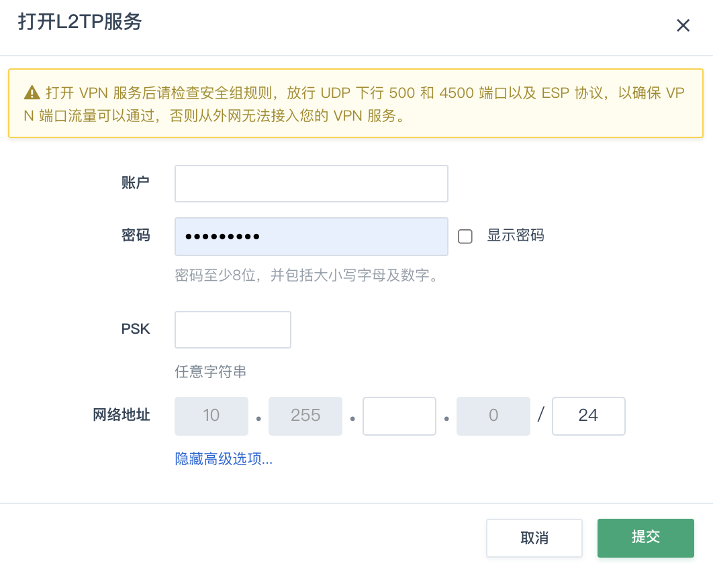

目前青云支持 OpenVPN / PPTP / L2TP-IPsec 协议。

## 操作场景

本篇指南旨在介绍如何远程拨入青云中您的私有网络。如果您希望将您自己的数据中心或办公、家庭网络与青云中您的私有网络连接在一起，建议您使用 [GRE 隧道](../tunnel/gre)形成公私兼顾的混合云（hybrid cloud）。

假设您当前位于办公网络，本地网络地址是 ``192.168.1.0/24`` ，下面我们的任务是将青云中的两个网络与您的本地网络连接。

> **说明**：
>
> 因为涉及到网络间互联，所以各个网络必须使用不同的网络地址， 否则地址就冲突了。如果存在地址冲突，您可以将青云私有网络与路由器断开、再重新连接至路由器， 在对话框中重新指定一个网络地址给予您的青云私有网络。


## OpenVPN 服务

### 启动 OpenVPN 服务

1. 登录 [QingCloud 管理控制台](https://console.qingcloud.com/login)，选择**产品与服务** > **网络服务** > **VPC 网络**，进入 VPC 列表页面。

2. 找到您的 VPC 网络，点击 VPC 网络名称，进入详情页。

3. 切换至**管理配置**页签，然后在左侧点击 **VPN 服务**。

4. 点击 **Open VPN** 后面的**打开**，弹出**打开 OpenVPN 服务**对话框。

5. 配置 OpenVPN 参数，点击**提交**。

   

   多数情况下，直接使用缺省配置即可，但建议您点开高级选项检查一下各项配置，尤其是 VPN 网络地址不能跟您的本地网络存在冲突。

   OpenVPN 提供了多种验证方式，除默认的**证书**验证方式，还提供**用户名/密码**和 **证书+用户名/密码**验证方式。 若使用包含 “用户名/密码” 的验证方式，还需要添加对应的可授权账户列表。

6. 点击页面上方的**应用修改**， 更新路由器的配置。

7. 前往 VPC 网络使用防安全组规则中打开 OpenVPN 服务器的运行端口，如本例中，需要打开 UDP 下行 1194 端口。完成后点击**应用更改**。

### 配置 OpenVPN 客户端

启用 OpenVPN 隧道服务后，将出现**下载证书**的按钮， 点击该按钮，即可得到文件名类似 ``rtr-xxxxxxxx-certs.zip`` 的 zip 包， 里面有配置 OpenVPN 客户端的必备证书，密钥文件和客户端配置文件样例：

* rtr-xxxxxxxx.crt: SSL 客户端证书
* rtr-xxxxxxxx.key: SSL 客户端私钥
* rtr-xxxxxxxx.takey: OpenVPN TLS Auth 密钥
* yunify-ca.crt: 青云 CA 根证书

> **说明**：
>
> 以上四个文件是必需的配置文件，此外我们还在 zip 包中准备了不同操作系统下的配置文件样例，可作为参考。

#### Windows

1. 下载 OpenVPN Windows 安装包，并安装它。缺省情况下，OpenVPN 将被安装到 ``C:\Program Files\OpenVPN`` 目录中。（按照默认选项安装即可。如非必要，请勿自主勾选选项） 推荐使用OpenVPN官方客户端2.3.6和以上版本. 下载地址在： [https://openvpn.net/get-open-vpn/](https://openvpn.net/get-open-vpn/) 安装程序包括服务器和客户端。安装时选择”OpenVPN GUI”模块即可安装客户端。

2. 将前面 zip 包中的配置文件放入  ``C:\Program Files\OpenVPN\config`` 目录中。

3. 将以下内容保存到 ``C:\Program Files\OpenVPN\config`` 目录中，文件名任意， 扩展名为 .ovpn ，比如可以叫做 ``rtr-xxxxxxxx.ovpn``

   ```
   client
   dev tun
   proto <udp>
   remote <your-router-eip> 1194
   resolv-retry infinite
   nobind
   persist-key
   persist-tun
   ca yunify-ca.crt
   cert <rtr-xxxxxxxx.crt>
   key <rtr-xxxxxxxx.key>
   tls-auth <rtr-xxxxxxxx.takey> 1
   cipher AES-256-CBC
   comp-lzo
   mssfix 1400
   ```

   
   
   > **说明**：
   >
   > 请将以上文件中的``<xxx>`` 部分替换成您的配置。如:
   > ``remote <your-router-eip> 1194`` 替换为 ``remote 117.121.XXX.XXX 1194``。可参考 zip 包里带的 windows sample 配置样例。
   
   至此，您可以连接 VPN 了。

#### Linux

以 Ubuntu Linux 为例子来描述，其他的 Linux 分发版都是类似的做法。

1. 安装 OpenVPN。

   ```
   $ sudo apt-get install openvpn
   ```

2. 将前面 zip 包中的配置文件放入 ``/etc/openvpn`` 目录中。

3. 将以下配置保存到 ``/etc/openvpn`` 目录中，文件名任意，扩展名为 ``.conf``， 比如可以叫做 ``rtr-xxxxxxxx.conf``

   ```
   client
   dev tun
   proto <udp>
   remote <your-router-eip> 1194
   resolv-retry infinite
   nobind
   user <nobody>
   group <nogroup>
   persist-key
   persist-tun
   ca yunify-ca.crt
   cert <rtr-xxxxxxxx.crt>
   key <rtr-xxxxxxxx.key>
   tls-auth <rtr-xxxxxxxx.takey> 1
   cipher AES-256-CBC
   comp-lzo
   mssfix 1400
   ```

   > **说明**：
   >
   > - 请将以上文件中的``<xxx>`` 部分替换成您的配置。如:
   >   ``remote <your-router-eip> 1194`` 替换为 ``remote 117.121.XXX.XXX 1194``。可参考 zip 包里带的 windows sample 配置样例。
   >
   > - user / group 请分别查询您本地 Linux 系统的 ``/etc/password`` 和 ``/etc/group`` 文件。

4. 连接 VPN。

   ```
   $ sudo service openvpn start
   ```

   

### Mac

1. 客户端以 [Tunnelblick](https://code.google.com/p/tunnelblick/) 为例， 先下载安装 Tunnelblick 。

2. 将前面 zip 包中的配置文件解压到同一目录中，其中 .ovpn 是 VPN 配置文件， 可根据需要做调整，样例如下

   ```
   client
   dev tun
   proto <udp>
   remote <your-router-eip> 1194
   resolv-retry infinite
   nobind
   user nobody
   group nogroup
   persist-key
   persist-tun
   ca yunify-ca.crt
   cert <rtr-xxxxxxxx.crt>
   key <rtr-xxxxxxxx.key>
   tls-auth <rtr-xxxxxxxx.takey.key> 1
   cipher AES-256-CBC
   comp-lzo
   mssfix 1400
   ```
   
   > **说明**：
   >
   > - user / group 可查询您本地系统的 ``/etc/passwd`` 和 ``/etc/group`` 文件。
   >
   > - 请将以上文件中的``<xxx>`` 部分替换成您的配置。如:
   >   ``remote <your-router-eip> 1194`` 替换为 ``remote 117.121.XXX.XXX 1194``。
   
3. 在 Tunnelblick 面板中添加配置，或双击 .ovpn 文件便可将配置添加到 Tunnelblick，然后就可以连接了。

#### 用户名/密码验证

如果您的 OpenVPN 开启了 “用户名/密码” 登录方式，你需要在连接的时候提供用户名和密码输入，如果希望通过配置文件来解决， 您可以修改客户端的配置文件中的 “auth-user-pass password.txt” ，通过一个独立的文件，例如 “password.txt” 来保持用户名/密码信息。

> **说明**：
>
> 如果是 Mac 系统，不需要 password.txt 文件，配置中 auth-user-pass 后面也不需要写文件名，只保留 “auth-user-pass” ，会在连接 VPN 时提示输入账号密码，并支持保存到 Mac 系统的 Keychain 中。

样例如下：
```
client
dev tun
proto <udp>
remote <your-router-eip> 1194
resolv-retry infinite
nobind
user nobody
group nogroup
persist-key
persist-tun
ca yunify-ca.crt
cert <rtr-xxxxxxxx.crt>
key <rtr-xxxxxxxx.key>
tls-auth <rtr-xxxxxxxx.takey.key> 1
auth-user-pass password.txt
cipher AES-256-CBC
comp-lzo
mssfix 1400
```
password.txt 文件样例如下，用户名和密码分为两行存放。
```
<user_name>
<password>
```

## PPTP 服务

### 启动 PPTP 服务

1. 登录 [QingCloud 管理控制台](https://console.qingcloud.com/login)，选择**产品与服务** > **网络服务** > **VPC 网络**，进入 VPC 列表页面。

2. 找到您的 VPC 网络，点击 VPC 网络名称，进入详情页。
3. 切换至**管理配置**页签，然后在左侧点击 **VPN 服务**。
4. 点击 **PPTP** 后面的**打开**，弹出**打开 PPTP 服务**对话框。

5. 配置 VPN 用户名和密码，点开高级选项检查一下各项配置，注意 VPN 网络地址不能跟您的本地网络存在冲突。

   

6. 点击**提交**，然后点击页面上方的**应用修改**， 以更新配置。

7. 前往**安全** > **安全组**，在 VPC 网络使用的安全组规则中，设置允许 PPTP 服务器运行端口通过， 即 TCP 下行 1723 端口; 同时还需要允许 GRE 协议。设置完成后，点击**应用更改** 。

### 配置 PPTP 客户端

#### Windows XP

1. 初次连接的用户，可以先通过以下步骤创建新的网络连接：

   1. 单击**开始**，选择**控制面板**，单击**网络和Internet连接**。

   2. 选择**创建一个到您的工作位置的网络连接**。

   3. 选择**虚拟专用网络连接**，然后单击**下一步**。

   4. 输入公司名（自定义即可），然后单击**下一步**。

   5. 设置服务器地址为路由器的公网地址，单击**下一步**。

   6. 勾选**在我的桌面上添加一个到此连接的快捷方式**，然后单击 **完成**。

2. 若 VPN 网络连接已经创建，只需要在桌面上点击该网络连接，输入 VPN 连接的用户名和密码， 然后点击**连接**即可。

3. 连接 VPN 之后，默认情况下本地默认网关会指向 VPN 服务器，即所有流量都会通过 VPN 服务器。 如果您不需要，可按如下步骤禁用：

   1. 点击 VPN 连接中的**属性**，选择**网络。**

   2. 选择**TCP/IP** 并点击**属性**。

   3. 在常规项中点击**高级**，去勾选**在远程网络上使用默认网关** ，点击**确定**。

   4. 断开并重新连接 VPN。

4. 禁用之后，你需要手动配置路由规则才能访问私有网络里的云服务器，具体操作如下：

   1. 点击**开始**菜单，选择**运行**，输入`cmd`，并点击**确定**，进入命令行界面。

   2. 输入命令`ipconfig`，查看当前 VPN 的地址（10.255开头），例如是 “10.255.1.2” ，并假设你需要访问的私有网络地址是“192.168.1.0/24”。

   3. 添加路由规则 `route add 192.168.1.0 mask 255.255.255.0 10.255.1.2`。

   4. 测试是否可以正常访问 “192.168.1.0/24” ，例如 `ping 192.168.1.1`。

#### Windows 7

1. 初次连接的用户，可以先通过以下步骤创建新的网络连接：

   1. 单击**开始**，选择 **控制面板**，单 **网络和Internet**，单击**网络和共享中心**。

   2. 选择**设置新的连接或网络**，选择**连接到工作区**，单击**下一步**。
   3. 选择**使用我的 Internet 连接(VPN)**。

   4. 在 **Internet 地址** 处输入路由器的公网IP，**目标名称**可以自定义，单击**下一步**。
   5. 输入 VPN 连接的用户名和密码，点击**连接**即可完成。

2. 若 VPN 网络连接已经创建，只需点击桌面右下角的网络连接处，选择并点击相应的网络连接，在界面上输入 VPN 连接的用户名和密码， 然后点击**连接**即可。

3. 连接 VPN 之后，默认情况下你本地默认网关会指向 VPN 服务器，即所有流量都会通过 VPN 服务器。 如果您不需要，可按如下步骤禁用：
   1. 右键对应的 VPN 连接，选择**属性**。

   2. 选择**网络** 中的**TCP/IPv4**，然后点击**属性**。

   3. 在常规项中点击**高级**，将**在远程网络上使用默认网关** 前面的勾选去掉，点击**确定**。

   4. 断开并重新连接 VPN。

4. 禁用之后，你需要手动配置路由规则才能访问私有网络里的云服务器，具体操作是：
   1. 点击**开始**菜单，找到 **所有程序** > **附件** > **命令提示符**，右键 **以管理员身份运行**，进入命令行界面。
   2. 输入命令`ipconfig`，查看当前 VPN 的地址（10.255开头），例如是10.255.1.2；并假设你需要访问的私有网络地址是192.168.1.0/24。

   3. 添加路由规则 `route add 192.168.1.0 mask 255.255.255.0 10.255.1.2`。

   4. 测试是否可以正常访问 “192.168.1.0/24 ，例如 `ping 192.168.1.1`。

#### Linux

以 Ubuntu Linux 为例子来描述，其他的 Linux 分发版都是类似的做法。

1. 安装 PPTP 客户端：

   ```
   $ sudo apt-get install pptp-linux
   ```

   

2. 修改 /etc/ppp/chap-secrets 文件，配置验证所需的用户名和密码，字符串之间用 “\t” 分隔：

   ```
   <user_name>   pptpd   <password>        *
   ```
   
   > **说明**：
   >
   > 请将以上文件中的 ``<xxx>`` 替换成您的配置。如:
   > ``<user_name>   pptpd   <password>   *`` 替换为 ``guest   pptpd   passw0rd   *``。
   
3. 新建 ``/etc/ppp/peers/<tunnel>`` 文件，<tunnel> 是由你定义的一个隧道名称， 例如我们可以叫做 vpn，即这个文件为 ``/etc/ppp/peers/vpn``：

   ```
   pty "pptp <vpn_server_ip> --nolaunchpppd --nobuffer --loglevel 0"
   name <user_name>
   remotename pptpd
   require-mppe-128
   file /etc/ppp/options.pptp
   ipparam <tunnel>
   ```

   

   > **说明**：
   > 请将以上文件中的 ``<xxx>`` 部分替换成您的配置。释义如下：
   >
   > - ``<vpn_server_ip>`` ：路由器的公网IP；
   > - ``<user_name>`` ： VPN 连接的用户名；
   > - `<tunnel>` ：您定义的隧道名称，在本例中是 ``vpn``。

4. 启动 VPN 客户端。

   ```
   $ pon <tunnel> persist
   ```

   > **说明**：
   >
   > 请将以上命令行中的``<tunnel>`` 替换成你定义的隧道名称，在本例中是 vpn。

5. 配置路由规则。

   - 如果您希望通过 VPN 来访问路由器内部私有网络里的机器，你还需要手动配置路由规则， 假设你需要访问的私有网络的网络地址为 192.168.10.0/24，相应的路由配置为：

     ```
     $ ip route add 192.168.10.0/24 dev ppp0
     ```

     > **说明**：
     >
     > 命令中的 ppp0 为客户端连接的设备名，如果你只有一个 VPN 客户端正在运行，那默认设备一般都是 ppp0，
     > 如果不是，你可以通过 ifconfig 命令来进行查看。

   - 如果您希望在每次启动客户端之后能自动配置路由规则，则你可以将你需要的指令写成脚本，放置在 /etc/ppp/ip-up.d/ 下面。 例如，可以创建脚本文件 /etc/ppp/ip-up.d/add-route，内容为:

     ```
     #!/bin/sh
     ip route add 192.168.10.0/24 dev $1
     ```

6. 关闭 VPN 客户端。如果你想断开 VPN 连接，执行如下命令。

   ```
   $ poff <tunnel>
   ```

   > **说明**：
   >
   > 请将以上命令行中的 ``<tunnel>`` 替换成你定义的隧道名称，在本例中是 vpn。

## L2TP 服务

> **说明**：
>
> 由于苹果的系统 Mac OS 已不再支持 PPTP 隧道服务和客户端等配置项，若您使用的设备系统是 Mac OS，建议您参考本节内容，使用 L2TP 的方式使用 VPN 服务 。

### 启用 L2TP 服务

1. 登录 [QingCloud 管理控制台](https://console.qingcloud.com/login)，选择**产品与服务** > **网络服务** > **VPC 网络**，进入 VPC 列表页面。

2. 找到您的 VPC 网络，点击 VPC 网络名称，进入详情页。

3. 切换至**管理配置**页签，然后在左侧点击 **VPN 服务**。

4. 点击 **L2TP** 后面的**打开**，弹出**打开 L2TP 服务**对话框。

5. 配置 VPN 用户名、密码、PSK，点击高级选项检查一下各项配置，注意 VPN 网络地址不能跟您的本地网络存在冲突。

   

6. 点击**提交**，然后点击页面上方的**应用修改**， 以更新配置。

7. 前往**安全** > **安全组**，在 VPC 网络使用的安全组规则中，设置允许 L2TP 服务运行端口通过，完成后，点击**应用修改**。

   > 说明：
   >
   > - 如果您使用的是 L2TP-IPsec 连接方式（iPhone 默认名字为 L2TP），请放行 UDP 下行 500 和 4500 端口以及 ESP 协议。
   >
   > -  如果您使用的是 L2TP 连接方式，请放行 UDP 下行 1701 端口。

   

### 配置 L2TP 客户端

#### Linux

以 Ubuntu Linux 为例子来描述，其他的 Linux 分发版都是类似的做法。 安装此客户端分为L2TP、IPsec两个部分。

##### IPsec部分

1. 安装依赖包。

   ```
   $ sudo apt-get install openswan
   ```

   

2. 修改 ``/etc/ipsec.conf`` 配置。

   ```
   version 2.0
   config setup
       protostack=netkey
       nat_traversal=yes
       keep_alive=60
       virtual_private=
       oe=off
   
   conn %default
       rekey=yes
       authby=secret
       auto=start
       type=tunnel
       keyexchange=ike
       phase2=esp
       pfs=yes
       dpddelay=15
       dpdtimeout=60
       dpdaction=restart
   
   conn <l2tp_name>
       authby=secret
       type=transport
       pfs=no
       auto=start
       left=%defaultroute
       leftprotoport=17/1701
       right=<l2tp_server_ip>
       rightprotoport=17/1701
   ```

   

   > **说明**：
   > 请将以上文件中的 ``<xxx>`` 连部分替换成您的配置，释义如下:
   >
   > - ``<l2tp_server_ip>`` ：路由器的公网IP；
   > - ``<l2tp_name> ``：IPsec连接名（请自行命名）。

3. 修改 ``/etc/ipsec.secrets`` 配置。

   ```
   %any <l2tp_server_ip>: PSK "<psk>"
   ```

   > **说明**：
   > 请将以上文件中的 ``<xxx>`` 部分替换成您的配置，释义如下:
   >
   > - ``<l2tp_server_ip>`` ：路由器的公网IP；
   > - ``<psk> ``：预共享密钥。

4. 重启服务。

   ```
   $ sudo service ipsec restart
   ```

   > **说明**：
   >
   > 使用命令 ``ipsec auto status`` 检查连接是否正常建立。

##### L2TP 部分

1. 安装依赖包。

   ```
   $ sudo apt-get install xl2tpd ppp
   ```

2. 修改 ``/etc/xl2tpd/xl2tpd.conf`` 配置。

   ```
   [lac <lac_name>]
   lns = <l2tp_server_ip>
   refuse chap = yes
   refuse pap = yes
   require authentication = yes
   length bit = yes
   pppoptfile = /etc/ppp/<l2tp_name>
   ```

   
   
   > **说明**：
   > 请将以上文件中的 ``<xxx>`` 部分替换成您的配置，释义如下:
   >
   > - ``<lac_name>`` ：lac命名（请自行命名）；
   > - ``<l2tp_server_ip>`` ： 路由器的公网IP；
   > - ``<l2tp_name>`` ：ppp配置的文件名（请自行命名）。
   
3. 新建 ``/etc/ppp/<l2tp_name>`` 配置文件。

   ```
   +chap
   lock
   refuse-eap
   require-chap
   require-mschap
   require-mschap-v2
   noauth
   noccp
   nodefaultroute
   proxyarp
   name "<user_name>"
   password "<password>"
   ```

   

   > **说明**：
   > 请将以上文件中的 ``<xxx>`` 部分替换成您的配置。释义如下:
   >
   > - ``<user_name>`` ：用户名；
   >
   > - ``<password>`` ：密码。

4. 重启服务。

   ```
   $ sudo service xl2tpd restart
   ```

   

5. 建立连接，如果您想使用IPsec加密，请务必先完成IPsec部分的配置。

   ```
   $ sudo echo "c <lac_name>" > /var/run/xl2tpd/l2tp-control
   ```

   

   > **说明**：
   > 关闭连接使用: ``$ sudo echo “d <lac_name>” > /var/run/xl2tpd/l2tp-control``。
   >
   > 请将以上命令中的 ``<lac_name>`` 替换成第二步的<lac_name>的命名。

6. 添加路由。

   ```
   $ sudo ip route add <ip_network> dev <link_name>
   ```

   

   > **说明**：
   > 请将以上命令中的 ``<xxx>`` 部分替换成您的配置。释义如下:
   >
   > - ``<ip_network>`` ：路由器下的私有网络地址段;
   > - ``<link_name>`` ：ppp连接的网卡接口名字，通常以ppp开头。

## 使用限制


| VPN 类型    | OpenVPN    | PPTP    | L2TP    |
|:----|:----|:----|:----|
|单 VPC 可添加的 VPN 账户数量   | 63    | 254    | 254    |

