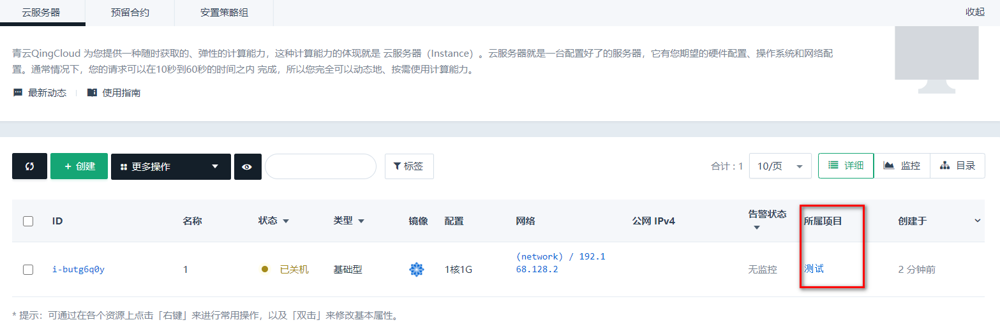
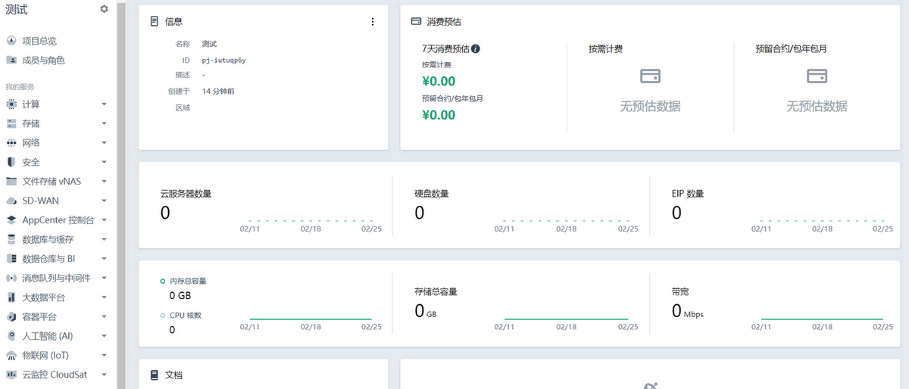

项目的作用包括资源分组、资源授权共享、用量消费统一查询等。本文档介绍在控制台如何对项目进行查看、创建、删除、修改、切换等操作。

## 项目列表

在控制台顶部的导航、选择 ”项目“ 查看项目列表。如需查看全部项目，选择”查看全部“，则可以列出所有有权限访问的项目。

在全部项目视图，可以浏览、创建、修改、删除项目。

## 创建项目

创建项目的入口有 2 处：

- 控制台顶部导航的项目切换视图，下拉列表有一个“创建新的项目”按钮。
- 顶部导航的“全部项目”入口，点击进入项目列表，列表上方有“新的项目”按钮。

这 2 处入口点击可以创建新项目：

一个新的项目，需要填写项目名称，选择标识项目的颜色，并给项目添加上用途描述。创建之后，创建者本人成为该项目的所有者，控制台也会直接进入新项目的总览页。如果您是第一次使用项目功能，新建项目后会弹出一个引导框，为您介绍项目的用途。

## 删除项目

项目的所有者可以删除项目，前提是项目已经被清空，即项目中不存在添加进来的资源、成员、角色等。删除的入口有 2 处：

- 全部项目的列表中，项目卡片右上角操作。
- 项目总览页基本信息卡片右上角操作。

注意：删除项目是不可逆操作，因此删除的操作要非常小心。

## 修改项目

项目创建后，仍然可以修改其名称、描述、颜色。具体的方法是在项目列表或项目总览页的卡片右上角。

## 切换项目

在导航栏顶部点击下拉框的项目名称，或者在全部项目列表中点击项目卡片，即可切换进入项目的总览页。除此之外，您还可以在“全部资源”视图，点击资源列表中的所属项目，直接进入该项目相应资源页面。如：点击云服务器列表中的项目名称，进入该项目的云服务器列表页。

## 项目总览

在项目总览页，您可以查看项目基本信息、消费预估、资源用量、项目告警信息，也可以找到项目相关文档的入口。其中：

* 基本信息：展示项目名称、ID、描述、成员数量、资源所在的区域、创建时间等信息。
* 消费预估：展示项目中的资源按当前的租约预估每日消费，这里的消费包含了项目所有区域、可用区的资源。
* 资源用量：展示项目使用的云服务器、硬盘、公网 IP的数量、使用容量、带宽等实时信息，辅助业务量分析。
* 项目告警：展示项目绑定了告警策略的资源，产生的告警信息。这里的告警包含了项目所有区域、可用区的资源。
* 项目文档：列出关于项目的常见操作的文档入口地址。

