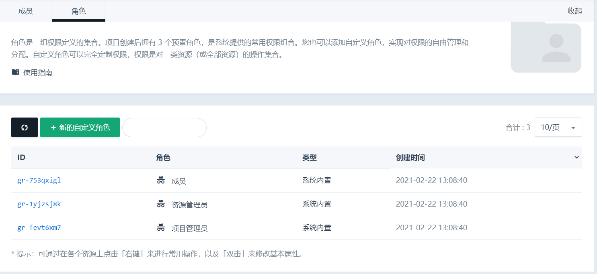
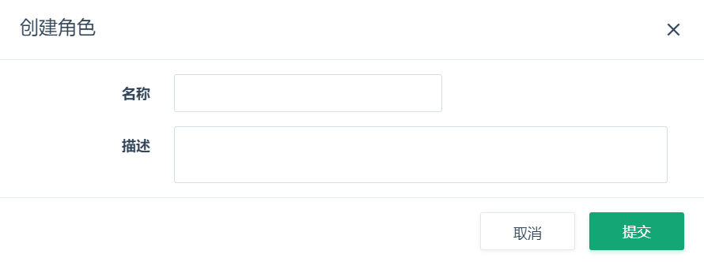
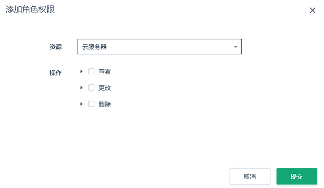
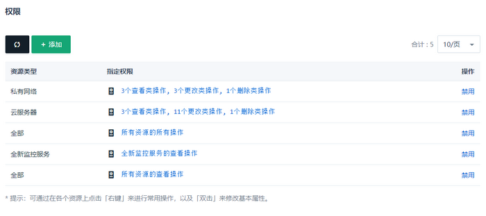
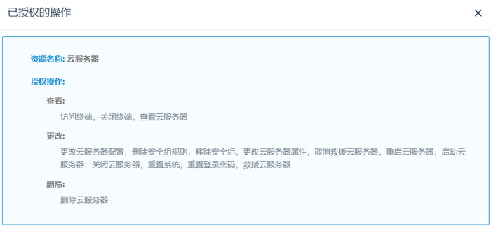
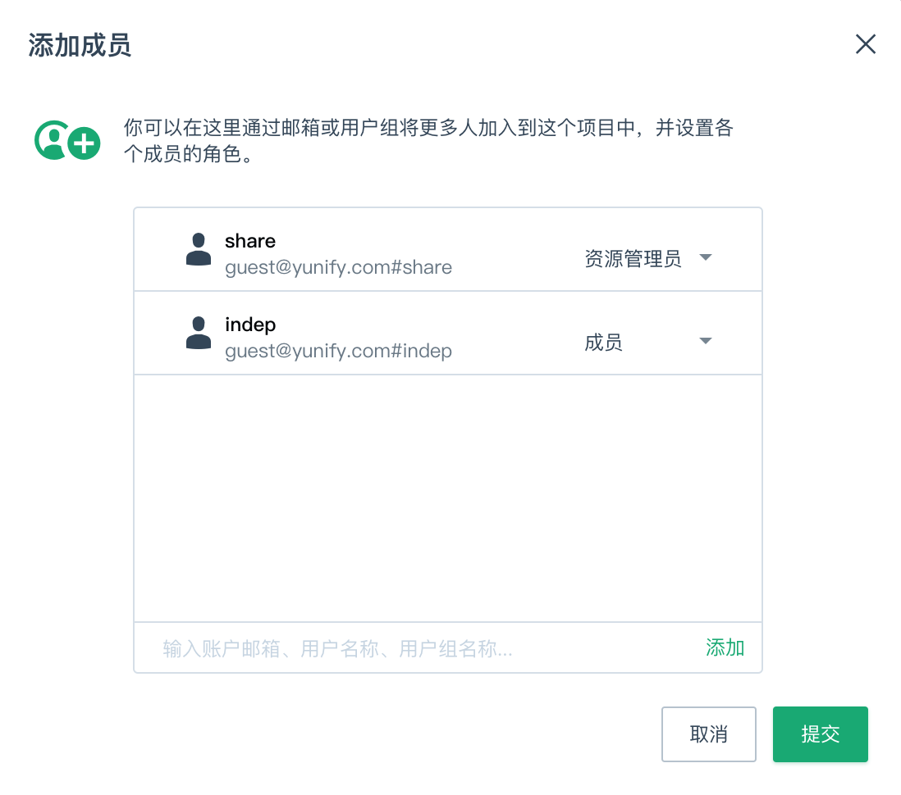
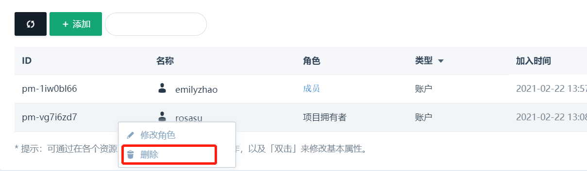
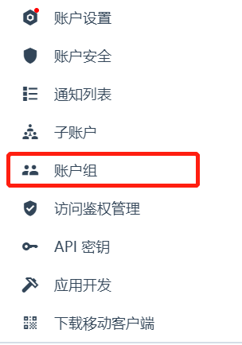

项目可以共享给其他账户管理和使用，包括子账户和其他独立账户。其他账户加入项目时，需要指定一个角色。成为项目成员后，该账户拥有角色所定义的权限范围。

## 角色

角色是一组权限定义的集合。项目创建后拥有 3 个预置角色，是系统提供的常用权限组合。您也可以添加自定义角色，实现对权限的自由管理和分配。

### 预置角色

预置角色包括：

* 项目管理员：拥有项目内所有实体（包括项目本身、项目内的资源）的所有操作。
* 资源管理员：拥有项目内所有资源的所有操作。
* 成员：拥有项目内所有资源的查看权限。

项目管理员通常用于项目的管理、维护；资源管理员不可以管理项目本身，可以作为运维人员；成员是只读的权限，不可以对资源操作，一般是项目的观察者。预置角色不可进行修改、删除，权限也不能调整。

“项目拥有者”是一个特殊角色，不属于预置角色，下文会提到区别。只有项目拥有者可以删除项目和给项目创建资源。

### 自定义角色

如果预置角色灵活度不能满足项目的要求，可以创建自定义角色。在角色列表页点击“+新的自定义角色”，即可创建角色。

新的角色有 2 组默认的权限，包括所有资源的查看操作、监控的查看操作。这些权限可以被禁用或删除，您也可以新增权限，详细操作见下一节。

### 权限

自定义角色可以完全定制权限，权限是对一类资源（或全部资源）的操作集合。资源类型和操作类型的范围如下：

* 资源类型：包括云服务器、镜像、密钥、网卡等计算资源；路由器/VPC、负载均衡器、私有网络、公网 IP 等网络资源；硬盘、备份等存储资源；防火墙、证书等安全资源；数据库与缓存、大数据、AppCenter 集群等 PaaS 资源；监控、定时器、告警策略等运维管理类资源。
* 操作类型：包括查看、更改、删除等 3 大类操作。

这些选项可以帮助您创建细粒度的权限组合。例如：

点击一个权限组合，可以看到详细的操作列表，例如上图中云服务器的权限组合：

## 成员

项目创建后，创建者默认成为项目的第一个成员，角色是“项目拥有者”。项目拥有者不是预置角色，它是一个特殊角色，不可以赋予其他账户，而预置角色可以赋予任何其他账户。“项目拥有者”拥有最高权限，包括删除项目、创建资源到项目。

### 添加成员

当项目需要共享给其他账户时，您可以给项目添加成员。新成员会以选中的角色添加到项目中。

添加新成员时，您可以输入账户的邮箱、名称，也可以添加一个账户组到成员列表中。

### 修改成员角色

成员角色决定该账户访问项目时所拥有的权限，这个成员的名称、角色是可以修改的。修改成员的名称、角色要求您具有项目的操作权限，或者您是项目的拥有者。

在项目列表中右键 - 修改，即可更改成员的名称或角色。

### 删除成员

如果不再共享项目给某个账户，可以取消对该账户的授权。方法是在成员列表中右键 - 删除，将成员从项目中移除即可。

### 账户组

项目的成员可以是子账户、其他独立账户，也可以是一个账户组。账户组是当前账户定义和管理的一组账户的集合，用来对一组账户统一操作。这个集合里的账户，可以是独立账户和子账户。账户组的入口，在顶部导航账户头像的下方。

账户组的操作请参考 [账户组](../security/resource_group.html#%E7%94%A8%E6%88%B7%E7%BB%84)
