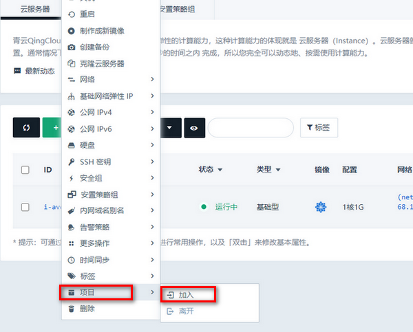
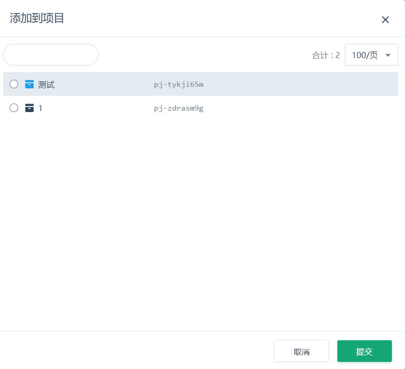
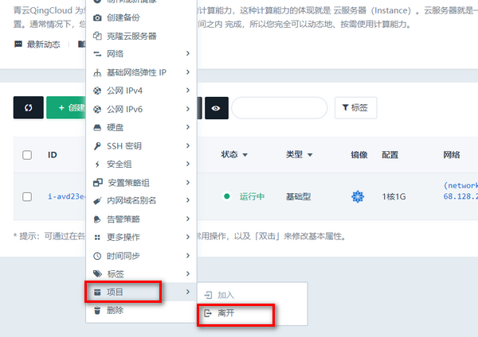

项目的基础功能是资源分组，即将多种类型的资源聚集到一个项目中来查看和管理。加入某个项目的资源，可以在控制台顶部导航，或全部项目列表切换到该项目查看。此外，所有的资源都会在“全部资源”这个视图中展示，因此未加入项目的资源可以在这里使用和管理。若您不使用项目功能，您可以在“全部资源”视图下正常使用青云控制台的所有功能和特性。

## 将资源添加到项目

“全部资源”视图下，您可以在资源列表将资源添加到一个项目中。对于一些复用型资源（如密钥、防火墙），可以添加到多个项目中。以云服务器为例，列表中的“所属项目”列指示了云服务器目前加入的项目。如果没有加入任何项目，可以在这一行“右键 - 项目 - 加入”，选择一个项目加入进去。

项目列表中列举了当前的项目，选择一个目标项目提交确认后，即可加入进去。

## 在项目中创建资源

由于涉及到计费和资源从属关系，只有项目的所有者可以在项目中创建资源，也只有项目所有者可以将资源添加到项目中去。当您被共享了一个项目，您可以在相应的角色范围内进行操作，但不能新建资源，也不能将自己的资源加入到这个项目。如果是您自己的项目，您可以在项目视图内创建资源。创建的资源自动从属于这个项目，相关的用量、消费统计也将纳入这个项目中。

## 在项目中使用资源

项目中使用资源的方式与“全部资源”相同，切换到具体的资源视图中即可。需要注意的是，项目是全局概念，多个区域、可用区的资源都可以添加到项目中。因此如果资源在不同区域、可用区，请先在左侧的区域选择列表切换到相应的区域。

## 将资源从项目移除

从项目中移除资源，有两种方式：

- 在项目的视图中，选择资源列表的具体资源，“右键 - 从项目中删除”。
- 在全部资源视图中，选择资源列表的具体资源，“右键 - 项目 - 离开”。

## 项目支持的资源类型

不是所有的资源类型都能够添加到项目中，目前大部分的资源类型都可以添加到项目中。有些产品本身是共享的方式来使用的，不适合加入具体的项目中，例如对象存储、CDN、PCDN 等。

我们推荐加入到项目中管理的资源类型，是适合于做分组、与其他分组没有交叉关系的资源，例如云服务器、硬盘、数据库、大数据服务、AppCenter 集群等各种资源。有一些资源可以加到项目中，但这些资源可能在某种程度上复用，例如 VPC、私有网络。是否加入到项目中，将取决您的实际使用场景。
