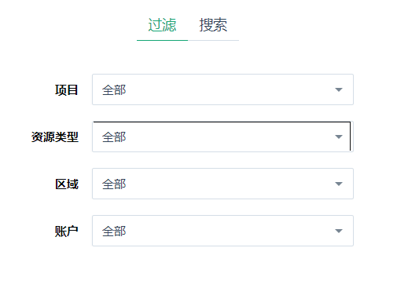
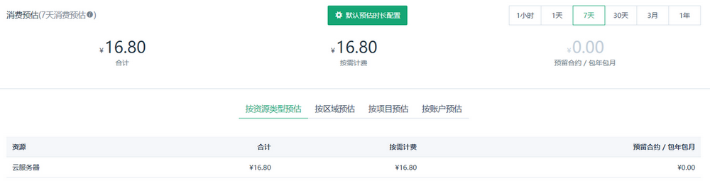
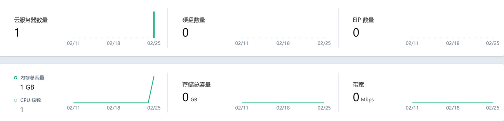

项目将资源聚集起来，除了在操作上起到隔离与授权作用外，还可以在统计上组合计算。对项目的组合统计，包括消费查询、消费预估和用量统计。

## 消费查询

消费查询是账户级别的操作，在顶部导航 - 费用 - 消费明细可以找到入口。目前消费统计支持时间段选择、项目/资源类型/区域/账户的过滤，在查询的结果中，支持按项目、资源类型、区域、账户来分组查看。

查询结果分为图表、表格两个部分，其中图表是可视化的分组信息，展示的是排名靠前的数据信息，可以用柱状、折线两种图形查看；表格是查询的细节资源列表，或全部分组结果的展示。查询结果可以导出为文档下载。

### 时间选择

消费查询支持常用的按月、季度、年查询，也支持完全自定义的跨年、跨月查询。按月查询时，结果图表按天展示；按季度查询时，图表按周展示；其他情况按月展示。

### 类型过滤

查询时可以按项目、资源类型、区域、账户来过滤，也可以用搜索来精确指定一个具体的资源的消费情况。

### 按类型分组

查询的结果展示的是汇总信息，如 2018 年 7 月的查询结果，图表中列出当月每日消费量，并给出平均日消费和最高日消费。如果想按项目、资源类型、区域、账户来查看，可以用分组查看功能。

注意：分组查询显示的是产生消费最多的 4 组消费额，所有分组数值在下方表格中。

### 图表切换

默认的查询结果，以柱状图形式展示。如果想要切换为折线图，可以在图表右上角切换。

### 表格信息

结果区域上半部分是图表，下半部分是表格。不同分组情况下，表格显示的内容不同。

* 若分组是总消费，表格显示每个产生消费的资源在查询周期内的消费数额。
* 若分组是项目、资源类型、区域、账户，则分别展示每个组在查询周期内的消费数额。这里比上方图表的数据更完整。

### 内容导出

在消费查询结果区域右上角，可以导出查询结果。导出的结果内容与分组有关。

* 若分组是总消费，导出 2 个 sheet。sheet1 是每个周期产生的消费数额，sheet2 是各资源的消费明细。
* 若分组是项目、资源类型、区域、账户，则分别导出每个组的消费明细。明细的单位与查询日期跨度有关。

## 消费预估

消费预估是系统根据客户当前产生消费的资源租约，计算出的每小时、每天、每月、每年预估数额。并可以按项目、资源类型、账户、区域来分组给出预估数值。

## 用量统计

项目的总览页给出了项目最近一段时间云服务器、硬盘、EIP 等常用资源的数量，以及消耗的 CPU/内存、存储容量、公网带宽等实时用量的统计，作为项目当前资源消耗的一个参考。通过用量统计，您可以看到某个项目最近一段时间的资源使用趋势。

