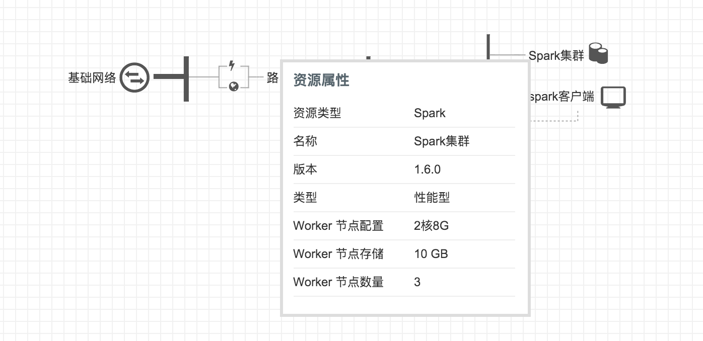

创建好的模板，在编排模板列表中可以看到。点击模板进入详情页，左侧是模板基本信息，右侧是模板的拓扑结构图。由于模板不能编辑，这里只能查看资源属性和资源价格。鼠标移动到资源上方可以看到基本信息，逻辑关系也体现在拓扑图中。

**基于模板新建**

对模板可以修改基本属性，以及删除操作。还可以基于该模板继续创建新模板。在模板列表右键，或详情页左侧信息区右上角操作列表，可以找到该按钮。点击该按钮，会进入模板编辑页面，并将模板的配置导入当前编辑的模板中。

## 应用模板

模板的另一个操作是“应用模板”，点击该按钮，系统将按模板中的配置，生成具有相同配置的一整套资源。资源生成之后开始计费，因此您需要先通过资源价格按钮了解该模板应用之后产生的新资费。

注解

应用模板时可以填写一个名称，若填写了该名称，则新生成的资源都继承此名称。这样可以方便地区分新生成的资源。

应用模板之后，系统开始按依赖关系创建资源。创建的过程，您可以控制台右上角的实时任务中看到。如果资源较多，或者有层次和依赖关系，可能需要数分钟或更多的时间，请耐心等待。创建资源时如果配额不足、余额不足或其他原因导致的失败，整个创建过程回滚，阶段性创建的资源也会回收。

在已创建的编排中可以看到应用模板的历史记录，以及成功、失败状态。点击进入详情页，可以看到该编排的创建流程输出信息。如果失败的话，失败原因会列在创建过程中，如图：

如果创建成功，详情页会列明生成资源的列表，以供管理和查看：

注解

模板是在各区域间共享的，但应用模板生成的编排实例，以及编排中的资源，是属于某一个区域的。因此查看模板列表各区域所见相同，但已生成编排是不同的。