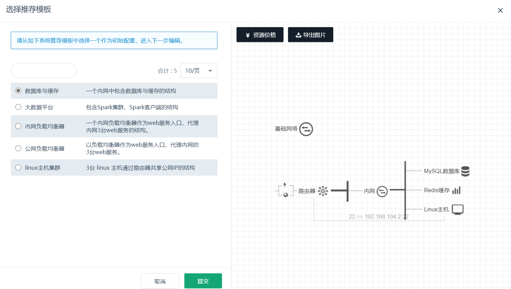
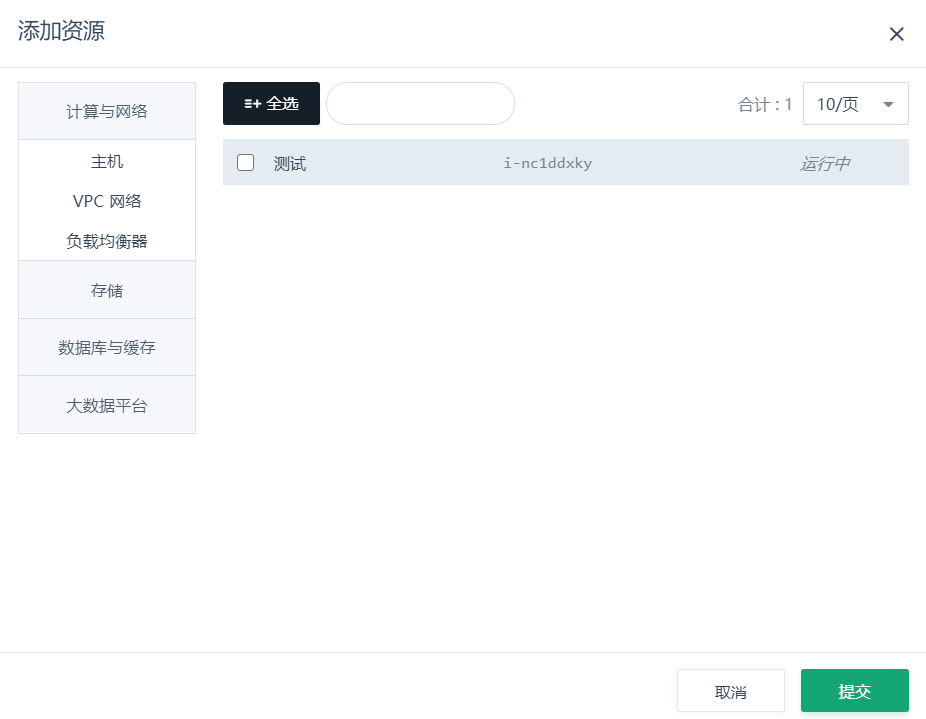
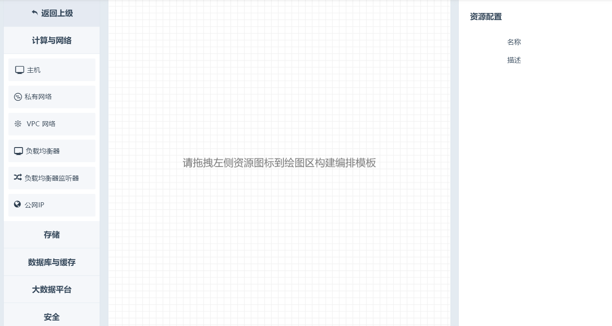

用户有 5 种方式创建一个新模板：

- 以系统推荐模板作为样本创建。
- 从当前的资源抽取拓扑结构创建。

- 跨区跨用户账号导入已创建过的编排模版。

- 从无到有手动创建。

- 将已经创建的模板作为样本创建。

其中最后一种方法可以作为创建过程中保存、再修改的方式，后文再详细说明。点击“创建模板”按钮，进入引导页面，提供前 4 种方式的入口。

**使用系统推荐模板创建**

如果您对青云平台还不太熟悉，或者对业务的资源需求不太了解，可以先从系统推荐的模板开始创建。这里系统推荐了几种常见业务所需要的青云平台资源配置以及资源间的关系。点击不同的模板，可以预览它的拓扑关系，并查看每一种资源的基本配置，还可以查看到这个组合的资源价格。

选择其中一个模板进入编辑页面，您可以直接提交生成属于自己的模板，也可以修改配置、增减资源以满足自己的要求，这些修改不会影响到原模板。

注解

云服务器、关系型数据库等可能需要密码的资源，基于推荐模板创建时，是不包含密码的。因此您需要重新定义密码，否则提交模板不成功。

**从当前资源抽取模板**

如果希望抽取当前的资源的属性作为配置，并进一步复制出资源，您可以从当前资源抽取模板。抽取的对象是您名下的实体资源，如云服务器、路由器 / VPC、负载均衡器、共享存储、数据库和大数据平台等。硬盘、公网IP、防火墙这些附属资源不能单独选择，而是作为实体资源的关联资源提取出来。提取之后，您可以继续对该模板进行编辑，不影响被提取的资源。

资源编排的模板是跨区域共享的，您可以从某个区域的资源抽取一份模板，并将其在其他区域应用生成编排，就实现了跨区域复制资源结构。若模板依赖的资源，例如自有镜像在新区域不存在，请先迁移镜像。

注解

有的资源之间有依赖关系，如私有网络内的云服务器依赖其挂载的路由器/VPC，必须同时将依赖资源也选择上，否则创建不成功。

**导入模版**

如果您希望与其他用户共享已有的资源模版，或者在青云云平台的跨区迁移等业务场景中，需要快速高效地导入已有的资源模版，可选择使用导入模版功能。在使用该类方式之前，需要先导出已创建的资源模版，导出入口位于模版详情页内，基本属性版块的下拉框内，如下图所示：

导出的资源模版为 JSON 文件，并保存在本地。按照创建模版的第四种方式，可从本地导入模版直接使用，导入成功之后即完成了一次模版创建。

**手动创建模板**

在熟悉资源编排功能之后，手动创建模板是最常用的创建方式。在这里您可以根据构想的资源组合，从无到有地生成资源以及资源之间的关系。资源的组合遵循实际依赖关系，如私有网络必须挂载在路由器 / VPC 内，硬盘必须挂载在云服务器或 Virtual SAN / VNAS 下，公网IP 只能绑定到云服务器、路由器 / VPC 或负载均衡器等。

模板编辑界面分为3个区域：选择区、绘图区、配置区，各区域的作用和操作说明如下：

一、选择区：

*   按资源分类，可以切换并选择不同的资源。
*   鼠标选中一种资源拖拽到绘图区释放，即可向模板中添加资源。
*   如果释放在绘图区空白区域，则添加到基础网络中；如果释放在某个资源上，则添加到该资源。
*   由于资源有依赖关系，如果添加的目标资源不满足依赖，绘图区右上角会给出提示。

二、绘图区：

*   已添加到模板的资源，可以在这里查看拓扑关系。
*   您可以用鼠标滚轮放大或缩小绘图区资源，也可以拖拽绘图区到某处以操作可视区域外资源。
*   点击一个资源，包括实体资源以及附属资源，在配置区会展示该资源的配置。
*   选择一个资源，拖拽到绘图区右上角红框内，可以移除该资源。
*   右键选择一个资源，可以选择删除资源操作；云服务器支持复制功能，可以在右键中找到该按钮。
*   绘图区上方有操作栏，您可以刷新该模板、清空模板、查看模板当前价格、提交模板。

三、配置区：

*   配置区可以看到选中资源的配置，并对它进行修改。
*   鼠标移动到某配置项，右侧出现编辑按钮，点击进入编辑操作。您也可以双击这一行进入编辑。
*   资源之间的关联关系，如路由器端口转发、负载均衡器后端等，需要从绘图区提取资源；相应的输入框后边有提取器，点击提取器后，点击绘图区资源即可提取资源。

下边从功能上举例各种操作的方法，以供参考。这些操作适用于每一种创建模板的方式：

**添加资源**

从选择区中拖动资源到绘图区，即可添加资源。如果释放在空白区，则添加到基础网络中；如果释放在某个资源上，则添加到该资源。

注解

如果释放的资源不能作为待添加资源的载体，绘图区右上方会给出提示，此次添加操作不成功。

**删除资源**

有2种方法可以删除资源：拖拽资源到绘图区右上角，或右键点击删除按钮。需要注意的是，如果删除了一个资源，其挂载和附属的资源也会删除。例如删除了路由器，则挂载的私有网络都会删除；删除了私有网络，加入该网络的云服务器等资源都会删除。

拖拽删除方式：

右键删除方式：

**复制资源**

云服务器是最常用资源，而且常需要批量创建，在右键操作中提供了复制功能。右键点击云服务器，选择复制按钮，弹出复制数量的输入框。输入要复制的数量后，相同配置的云服务器会加入模板。

*   如果云服务器在基础网络中，那么复制出的新云服务器也在基础网络中；
*   如果云服务器在私有网络中，那么新云服务器也在该私有网络中；
*   如果云服务器指定了私有网络IP，那么新云服务器会获得同一网段的不同IP。

注解

数据库、缓存、大数据等 PAAS 服务是作为一个整体提供的，本身就是集群，您可以修改节点数，这里不支持复制功能。

**配置资源**

在绘图区中点击资源，配置区会展示该资源的配置。有的配置是可以修改的，有的不能修改。可以修改的配置项，鼠标移动上去后，会出现编辑按钮。点击编辑按钮，或双击该配置项，进入该配置项或一组关联配置项的编辑。

资源的配置，与该类资源申请创建界面中支持的配置是相似的。加入了私有网络的资源，如果私有网络打开了 DHCP 选项，可以给资源手动指定私有网络IP。如果您输入的 IP 与当前模板中已指定的 IP 有冲突，提交时会提示您。如果不确定哪些 IP 已经配置过，您可以点击“自动填充”按钮，系统会为该资源分配未使用过的 IP。

**提取资源**

有些关联配置，需要指定目标资源到配置项中，例如选择路由器端口转发的目标IP、选择负载均衡器的后端资源、选择共享存储的挂载硬盘等。这些目标资源的输入框后边，都有一个提取器，点击提取器后，点击绘图区中的资源，即可提取到输入框中。

注解

待提取的资源有依赖关系，如路由器选择的转发 IP，需要在其挂载的私有网络中。如果点击了不属于该路由器管理的资源，绘图区右上角会提示。

**绘图区的缩放和拖拽**

为方便您的查看和编辑，绘图区是可以缩放和拖拽的。用鼠标滚轮即可放大和缩小绘图区；选择绘图区空白区域拖拽，即可调整模板在绘图区的位置。

**刷新模板**

由于模板中的资源支持自由拖拽、释放，绘图区本身也可以缩放和拖拽，因此您操作中可能需要将资源归位。这时点击操作栏中的“刷新”按钮，即可重新绘制模板。

**清空模板**

如果您想放弃当前的模板重新绘制，可以清空模板。这样加入模板的所有资源都会删除，进入手动创建模板的初始状态。

**资源价格**

您可以在模板编辑的过程中，随时查看加入模板的计费资源价格。此处会按资源的类型、配置归类，统计出不同配置资源的数量，并根据该区域的资源单价计算出总价。

注解

模板本身是不计费的，这里统计的是资源在生成之后的价格，应用模板会生成模板中的资源。

**提交模板**

完成编辑之后，您可以点击“提交模板”按钮，将此模板创建到系统中。需要注意的是，模板在创建之后是不能修改的，但可以以某个模板为蓝本创建新模板。因此如果您的模板创建到了一半需要保存，可以直接提交，下一次基于该模板创建即可。

